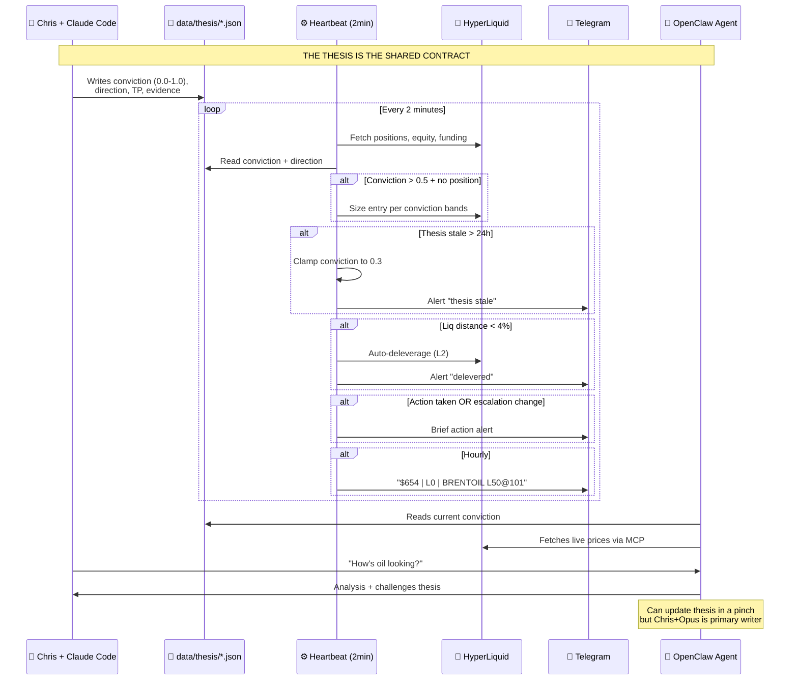
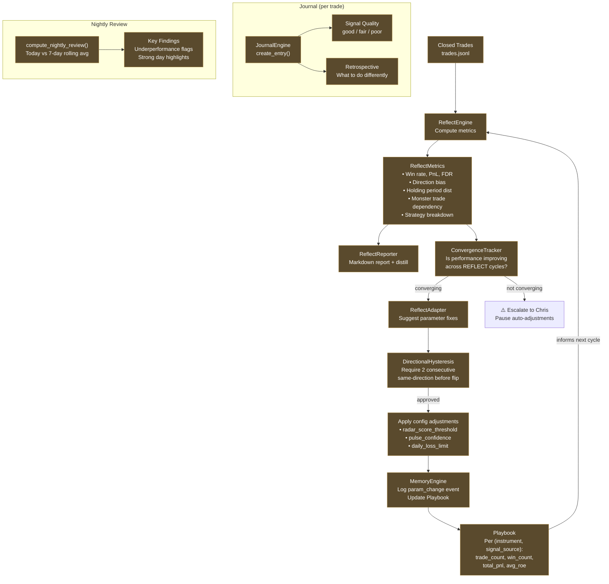
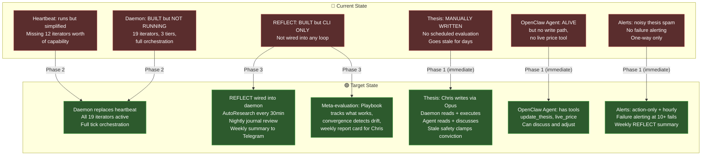
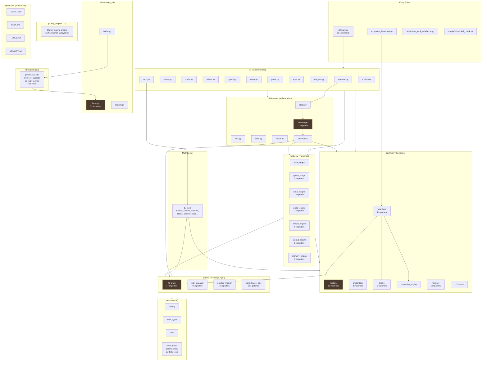
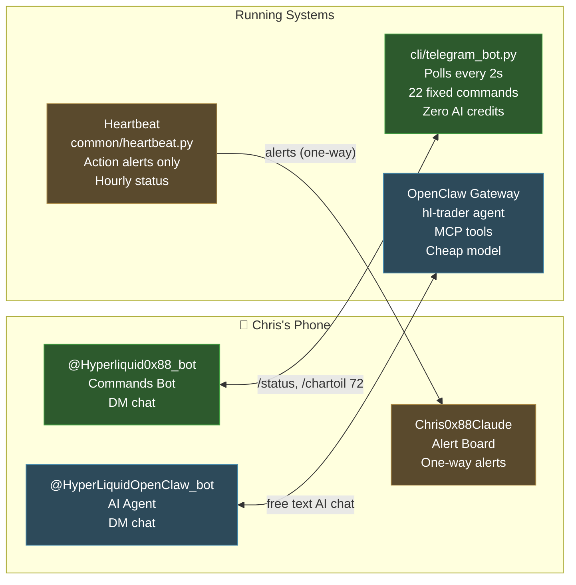

# HyperLiquid Trading System — Complete Architecture

## System Overview

```mermaid
graph TB
    subgraph HUMAN["👤 CHRIS (Human)"]
        CC["Claude Code (Opus)<br/>Manual sessions<br/>Writes thesis, reviews system"]
        TG_READ["Reads Telegram alerts"]
        TG_CMD["Sends /commands"]
        TG_CHAT["Chats with AI agent"]
    end

    subgraph EXCHANGE["🏦 HyperLiquid Exchange"]
        HL_API["HL REST API<br/>/info endpoint"]
        HL_TRADE["HL Trading API<br/>Orders, leverage, stops"]
        MAIN_ACCT["Main Account (0x80B5)<br/>Oil, Gold, Silver<br/>xyz clearinghouse"]
        VAULT_ACCT["Vault (0x9da9)<br/>BTC Power Law<br/>default clearinghouse"]
    end

    subgraph RUNTIME["⚙️ Running Processes (macOS)"]
        HB["Heartbeat<br/>launchd, every 2min<br/>common/heartbeat.py"]
        CMD_BOT["Commands Bot<br/>background process<br/>cli/telegram_bot.py"]
        VR["Vault Rebalancer<br/>launchd, hourly<br/>scripts/run_vault_rebalancer.py"]
    end

    subgraph OPENCLAW["🦞 OpenClaw Gateway"]
        GW["Gateway (localhost:18789)<br/>Routes Telegram DMs"]
        OC_AGENT["hl-trader Agent<br/>Cheap model via OpenRouter<br/>Workspace: agent-cli/openclaw/"]
        MCP["MCP Server (hl-trading)<br/>17 tools<br/>cli/mcp_server.py"]
    end

    subgraph DATA["📁 Shared State (filesystem)"]
        THESIS["data/thesis/*.json<br/>Conviction, direction, TP<br/>THE shared contract"]
        SIGNALS["data/research/signals.jsonl<br/>Trade signals log"]
        WORKING["data/memory/working_state.json<br/>ATR, prices, escalation"]
        JOURNAL_F["data/daemon/journal/<br/>Tick snapshots"]
        TRADES_F["data/research/trades/<br/>Trade records"]
        PLAYBOOK["data/apex/memory/<br/>Playbook + events"]
    end

    subgraph DAEMON_CODE["🔧 Daemon Engine (BUILT, NOT RUNNING)"]
        CLOCK["Clock Loop<br/>cli/daemon/clock.py"]
        CTX["TickContext<br/>cli/daemon/context.py"]
        subgraph ITERATORS["19 Iterators"]
            I_CONN["Connector"]
            I_ACCT["AccountCollector"]
            I_MKT["MarketStructure"]
            I_THESIS["ThesisEngine"]
            I_LIQ["Liquidity"]
            I_RISK["Risk"]
            I_XPROT["ExchangeProtection"]
            I_GUARD["Guard"]
            I_EXEC["ExecutionEngine"]
            I_REBAL["Rebalancer"]
            I_PROFIT["ProfitLock"]
            I_FUND["FundingTracker"]
            I_CAT["CatalystDeleverage"]
            I_RADAR["Radar"]
            I_PULSE["Pulse"]
            I_AUTO["AutoResearch"]
            I_JOURN["Journal"]
            I_MEM["MemoryConsolidation"]
            I_TG["Telegram"]
        end
    end

    subgraph META["📊 Meta-Evaluation (BUILT, NOT WIRED)"]
        REFLECT["ReflectEngine<br/>FIFO round-trips, win rate,<br/>PnL, fee drag, streaks"]
        CONVERGE["ConvergenceTracker<br/>Are adjustments helping?"]
        ADAPTER["ReflectAdapter<br/>Suggest config fixes"]
        HYSTER["DirectionalHysteresis<br/>Prevent oscillation"]
        JOURNAL_E["JournalEngine<br/>Trade quality, nightly review"]
        MEMORY_E["MemoryEngine<br/>Playbook, param changes"]
    end

    %% Human interactions
    CC -->|writes| THESIS
    CC -->|reviews| TRADES_F
    CC -->|reviews| PLAYBOOK
    TG_CMD --> CMD_BOT
    TG_CHAT --> GW
    TG_READ -.->|reads alerts| HB

    %% Heartbeat flow
    HB -->|fetches| HL_API
    HB -->|reads| THESIS
    HB -->|reads/writes| WORKING
    HB -->|places stops, TPs| HL_TRADE
    HB -->|alerts| TG_READ

    %% Commands Bot
    CMD_BOT -->|fetches| HL_API
    CMD_BOT -->|responds| TG_CMD

    %% Vault Rebalancer
    VR -->|trades| HL_TRADE
    VR -->|fetches| HL_API

    %% OpenClaw flow
    GW --> OC_AGENT
    OC_AGENT -->|calls| MCP
    MCP -->|fetches| HL_API
    MCP -->|reads| THESIS
    MCP -->|reads| SIGNALS

    %% Daemon (not running but designed)
    CLOCK --> CTX
    CTX --> I_CONN
    I_CONN -->|fetches| HL_API
    I_THESIS -->|reads| THESIS
    I_EXEC -->|conviction sizing| CTX
    I_REBAL -->|executes| HL_TRADE
    I_AUTO -->|writes| PLAYBOOK
    I_JOURN -->|writes| JOURNAL_F

    %% Meta-evaluation (not wired)
    REFLECT -->|analyzes| TRADES_F
    REFLECT --> CONVERGE
    CONVERGE --> ADAPTER
    ADAPTER --> HYSTER
    JOURNAL_E -->|records| JOURNAL_F
    MEMORY_E -->|accumulates| PLAYBOOK

    %% Styling
    classDef running fill:#2d5a2d,stroke:#4a4,color:#fff
    classDef built fill:#5a4a2d,stroke:#a84,color:#fff
    classDef broken fill:#5a2d2d,stroke:#a44,color:#fff
    classDef human fill:#2d4a5a,stroke:#48a,color:#fff
    classDef exchange fill:#4a2d5a,stroke:#84a,color:#fff

    class HB,CMD_BOT,VR running
    class CLOCK,CTX,I_CONN,I_ACCT,I_MKT,I_THESIS,I_LIQ,I_RISK,I_XPROT,I_GUARD,I_EXEC,I_REBAL,I_PROFIT,I_FUND,I_CAT,I_RADAR,I_PULSE,I_AUTO,I_JOURN,I_MEM,I_TG built
    class REFLECT,CONVERGE,ADAPTER,HYSTER,JOURNAL_E,MEMORY_E built
    class CC,TG_READ,TG_CMD,TG_CHAT human
    class HL_API,HL_TRADE,MAIN_ACCT,VAULT_ACCT exchange
```

## Execution Tiers

```mermaid
graph LR
    subgraph WATCH["WATCH Tier (observation only)"]
        W1["Connector"]
        W2["AccountCollector"]
        W3["MarketStructure"]
        W4["ThesisEngine"]
        W5["Liquidity"]
        W6["Risk"]
        W7["AutoResearch"]
        W8["MemoryConsolidation"]
        W9["Journal"]
        W10["Telegram"]
    end

    subgraph REBALANCE["REBALANCE Tier (+ position management)"]
        R1["ExecutionEngine<br/>Conviction → sizing"]
        R2["ExchangeProtection<br/>Liq-buffer SL"]
        R3["Guard<br/>Trailing stops"]
        R4["Rebalancer<br/>Strategy execution"]
        R5["ProfitLock<br/>Sweep 25% realized"]
        R6["FundingTracker<br/>Hourly cost accounting"]
        R7["CatalystDeleverage<br/>Pre-event risk reduction"]
    end

    subgraph OPP["OPPORTUNISTIC Tier (+ scanning)"]
        O1["Radar<br/>Setup scanner (5min)"]
        O2["Pulse<br/>Momentum detector (2min)"]
    end

    WATCH --> REBALANCE --> OPP

    classDef watch fill:#2d4a3a,stroke:#4a8,color:#fff
    classDef rebal fill:#4a3a2d,stroke:#a84,color:#fff
    classDef opp fill:#3a2d4a,stroke:#84a,color:#fff

    class W1,W2,W3,W4,W5,W6,W7,W8,W9,W10 watch
    class R1,R2,R3,R4,R5,R6,R7 rebal
    class O1,O2 opp
```

## Data Flow: The Thesis Contract

## Meta-Evaluation: The REFLECT Loop

## Current State vs Target State

## Module Map (224 files, 0 orphans)

## Telegram Interface Map

## File Inventory Summary

| Area | Files | Hub Nodes | Status |
|------|-------|-----------|--------|
| **cli/commands/** | 23 | main.py | ✅ All connected |
| **cli/daemon/** | 25 | context.py (21 importers) | 🟡 Built, not running as daemon |
| **modules/** | 35 | reflect_engine (6), guard_bridge (5) | 🟡 Built, partially wired |
| **common/** | 25 | models (39), credentials (8) | ✅ All connected |
| **parent/** | 6 | hl_proxy (17), risk_manager (9) | ✅ All connected |
| **execution/** | 6 | order_types (2) | ✅ All connected |
| **strategies/** | 22 | via sdk.base (32) | ✅ All connected |
| **quoting_engine/** | 13 | config (10) | ✅ Self-contained |
| **plugins/** | 6 | power_law | ✅ Connected |
| **scripts/** | 7 | entry points | ✅ All connected |
| **openclaw/** | 10 | workspace files | ✅ Connected to gateway |
| **TOTAL** | **224** | **0 orphans** | |
