# HyperLiquid Trading System — Architecture v2

*Updated 2026-04-02. See v1 for original daemon-centric design.*

## What Changed (v1 → v2)

The architecture shifted from daemon-first to **interface-first**. The Telegram bot became the primary product surface. The AI agent got real market intelligence. OpenClaw was bypassed for direct OpenRouter integration.

| v1 | v2 |
|----|-----|
| OpenClaw gateway routes AI chat | Direct OpenRouter from telegram_agent.py |
| AI sees prices only | AI sees positions, technicals, thesis, memory |
| 22 static commands | 25 commands + inline keyboards + model selector |
| No model choice | 19 models (10 free, 9 paid) switchable via /models |
| No retry on API errors | 3-retry exponential backoff on 429s |
| Chat history raw | Chat history sanitized (stale data stripped) |

## System Overview

```mermaid
graph TB
    subgraph HUMAN["Chris"]
        CC["Claude Code (Opus)\nWrites thesis, builds system"]
        TG["Telegram\n25 commands + AI chat"]
    end

    subgraph EXCHANGE["HyperLiquid"]
        HL_API["REST API /info"]
        HL_TRADE["Trading API"]
        MAIN["Main 0x80B5\nOil, Gold, Silver (xyz)"]
        VAULT["Vault 0x9da9\nBTC Power Law"]
    end

    subgraph RUNTIME["Running Processes"]
        HB["Heartbeat\nlaunchd 2min\nStops, alerts, escalation"]
        CMD_BOT["Commands Bot\ntelegram_bot.py\n25 handlers + AI router"]
        AI_AGENT["AI Agent\ntelegram_agent.py\nOpenRouter + live context"]
        VR["Vault Rebalancer\nlaunchd hourly"]
    end

    subgraph CONTEXT["AI Context Pipeline"]
        ACCT["Account + Positions\nboth clearinghouses"]
        SNAP["Market Snapshots\nbuild_snapshot + render\ntrend, S/R, ATR, BBands"]
        MEM["Memory + Learnings\nSQLite events, summaries"]
        THESIS_D["Thesis Data\nconviction, direction, TP/SL"]
        HARNESS["Context Harness\nrelevance-scored assembly\n3000 token budget"]
    end

    subgraph DATA["Shared State"]
        THESIS["data/thesis/*.json"]
        WORKING["data/memory/working_state.json"]
        MEMORY_DB["data/memory/memory.db"]
        HISTORY["data/daemon/chat_history.jsonl"]
        MODEL_CFG["data/config/model_config.json"]
    end

    CC -->|writes| THESIS
    TG <-->|commands| CMD_BOT
    TG <-->|free text| AI_AGENT
    CMD_BOT -->|routes AI msgs| AI_AGENT

    AI_AGENT --> HARNESS
    ACCT --> HARNESS
    SNAP --> HARNESS
    MEM --> HARNESS
    THESIS_D --> HARNESS
    HARNESS -->|system prompt injection| AI_AGENT
    AI_AGENT -->|OpenRouter API| MODELS["19 Models\n10 free + 9 paid"]

    HB -->|fetches| HL_API
    HB -->|reads| THESIS
    HB -->|places stops| HL_TRADE
    HB -->|alerts| TG

    CMD_BOT -->|fetches| HL_API
    VR -->|trades| HL_TRADE

    AI_AGENT -->|sanitized history| HISTORY
    AI_AGENT -->|reads model| MODEL_CFG

    classDef running fill:#2d5a2d,stroke:#4a4,color:#fff
    classDef context fill:#2d4a5a,stroke:#48a,color:#fff
    classDef data fill:#5a4a2d,stroke:#a84,color:#fff

    class HB,CMD_BOT,AI_AGENT,VR running
    class ACCT,SNAP,MEM,THESIS_D,HARNESS context
    class THESIS,WORKING,MEMORY_DB,HISTORY,MODEL_CFG data
```



## AI Agent Context Pipeline (NEW in v2)

Every message to the AI agent triggers a fresh context build:

```
User message → telegram_bot.py (polling loop)
  → handle_ai_message() in telegram_agent.py
    → _build_system_prompt()     # AGENT.md + SOUL.md
    → _build_live_context()      # Fresh data pipeline:
        → _fetch_account_state_for_harness()
            → HL API: clearinghouseState (native + xyz)
            → Extracts: equity, positions (coin, size, entry, uPnL, lev, liq)
        → _fetch_market_snapshots()
            → build_snapshot() per market (candle-based technicals)
            → render_snapshot(detail="brief")
            → Produces: flags, support/resistance, BBands, volume POC, mech levels
            → Also loads thesis data (conviction, direction, TP/SL)
        → build_multi_market_context() via context_harness
            → Relevance-scored block assembly (3000 token budget)
            → Tiers: CRITICAL (account, positions, snapshots) > RELEVANT (memory, learnings)
    → _load_chat_history(20)
        → _sanitize_assistant_history()  # Strip stale data claims
    → _call_openrouter()
        → Headers: Authorization + HTTP-Referer + X-Title (required for free models)
        → 3-retry exponential backoff on 429
        → Model from data/config/model_config.json
    → Response sent to Telegram
```

**What the AI sees per message (~450 tokens)**:
```
ACCOUNT: $699.51 equity
POSITIONS:
  xyz:BRENTOIL SHORT 38.6 @ $104.98 | uPnL -$121.28 | 20x | liq $114.33
TIME: 2026-04-02 Thursday 08:34 UTC
=== xyz:BRENTOIL @ 108.1 ===
FLAGS: above_vwap_1h
SUPPORT: 97.96(volume_poc/4t/+9.4%), 104.5(bollinger/2t/+3.3%)
RESIST: 108.2(volume_poc/3t/+0.1%)
MECH: SL=104.7 TP=113.8 entry=97.96
THESIS (BRENTOIL): LONG conviction=0.8 TP=$120 — energy infrastructure war
RECENT: [supply notes, market data from last 7d]
LEARNINGS: [operational lessons, geopolitical context]
```

## Telegram Command Map (v2)

```
TRADING (6)             CHARTS (5)              AGENT CONTROL (3)
  /status                 /chartoil [hrs]         /authority
  /position               /chartbtc [hrs]         /delegate ASSET
  /market [coin]          /chartgold              /reclaim ASSET
  /pnl                    /watchlist
  /price (+ 24h change)   /powerlaw             VAULT (2)
  /orders                                         /rebalancer
                                                  /rebalance
SYSTEM (9)
  /models    ← NEW: inline keyboard model selector
  /memory    ← REBUILT: 6-section system health
  /health
  /diag
  /bug [text]
  /todo [text]
  /feedback [text]
  /guide
  /help

AI CHAT: any free text → OpenRouter with live context
```

## OpenRouter Integration

```
API Key:     ~/.openclaw/agents/default/agent/auth-profiles.json
Model List:  _CURATED_MODELS in telegram_agent.py (18 models)
             + auto-merge from ~/.openclaw/.../models.json
Active Model: data/config/model_config.json
Headers:     Authorization + HTTP-Referer + X-Title (REQUIRED for free)
Rate Limits: Free = 20 RPM / ~200/day. Paid = unlimited.
Retry:       3x exponential backoff (2s, 4s, 8s) on 429
Docs:        docs/openrouter_setup.md
```

## Single-Instance Enforcement

All long-running processes enforce single-instance (pacman pattern):

1. Read PID file → SIGTERM old process → wait → SIGKILL if needed
2. `pgrep` scan for orphaned processes by command name → force kill
3. Write own PID → run → cleanup PID on exit

Applies to: `telegram_bot.py`, heartbeat, vault rebalancer.

## Data Flow: Thesis Contract (unchanged from v1)

```
Chris + Opus → writes thesis (conviction, direction, TP, evidence)
                   ↓
Heartbeat (2min) → reads thesis → sizes position → places stops
                   ↓
AI Agent → reads thesis → discusses with Chris → challenges constructively
```

## Module Map

| Area | Files | Status |
|------|-------|--------|
| cli/commands/ | 23 commands | All connected |
| cli/telegram_bot.py | 25 TG handlers + AI router + inline keyboards | Running |
| cli/telegram_agent.py | OpenRouter integration + context pipeline | Running |
| cli/daemon/ | 19 iterators, 3 tiers | Built, not running |
| modules/ | 7 engines (reflect, guard, radar, pulse...) | Built, partially wired |
| common/ | 25 utilities (models, heartbeat, thesis, memory...) | All connected |
| parent/ | Exchange layer (hl_proxy, risk_manager) | All connected |
| strategies/ | 22 strategies via sdk.base | All connected |
| openclaw/ | Agent workspace (AGENT.md, SOUL.md, TOOLS.md) | Active (direct mode) |

## Build Phases (Updated)

### Phase 1.5: Agent Tool-Calling (NEXT)
Give the AI agent CLI tool-calling via subprocess (pacman pattern):
- Restricted tool list: `hl status`, `hl market`, `hl trade` (with approval)
- Security at CLI layer (governance limits), not agent layer
- Agent can fetch richer data on demand beyond pre-injected context
- No full computer control — just our verified command set

### Phase 2: Daemon Switch
- Replace heartbeat with full daemon (19 iterators)
- All existing heartbeat functionality preserved
- Add AutoResearch, Journal, MemoryConsolidation iterators

### Phase 3: REFLECT Loop
- Wire ReflectEngine into daemon
- Nightly journal review, weekly report card
- Convergence tracking

### Phase 4: Self-Improving
- Playbook accumulates what works
- DirectionalHysteresis prevents oscillation
- Meta-evaluation suggests parameter adjustments
