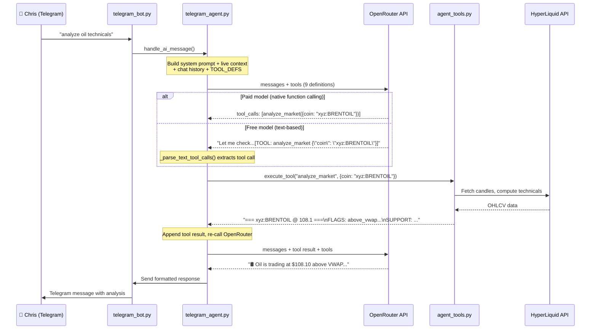
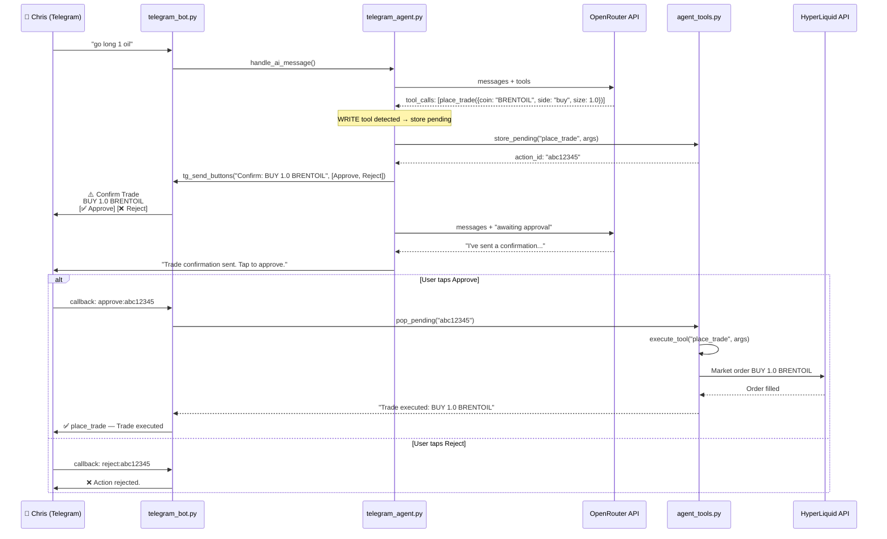
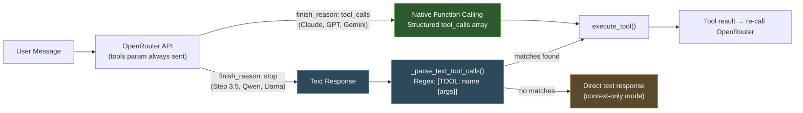
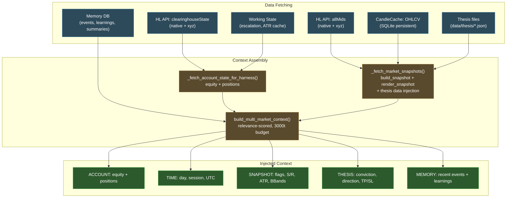
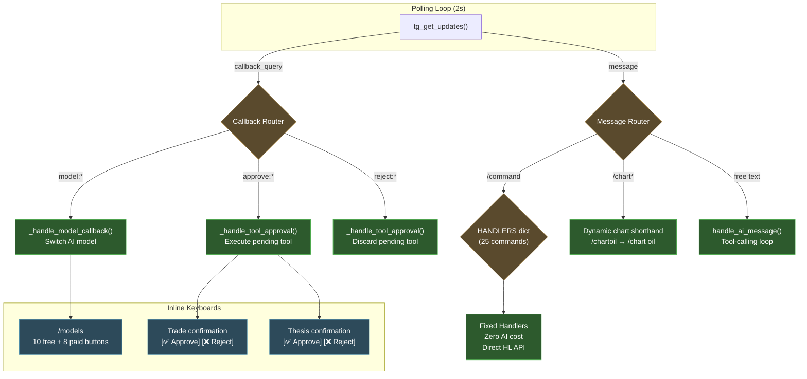
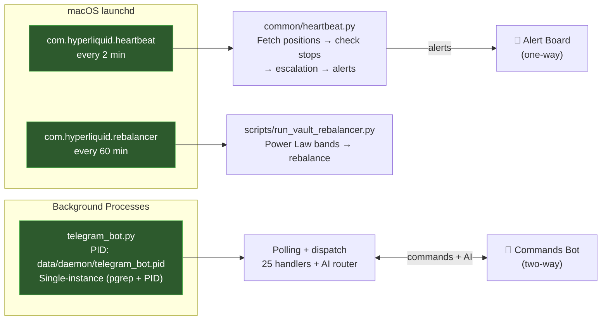
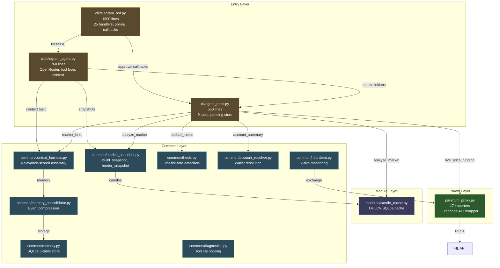
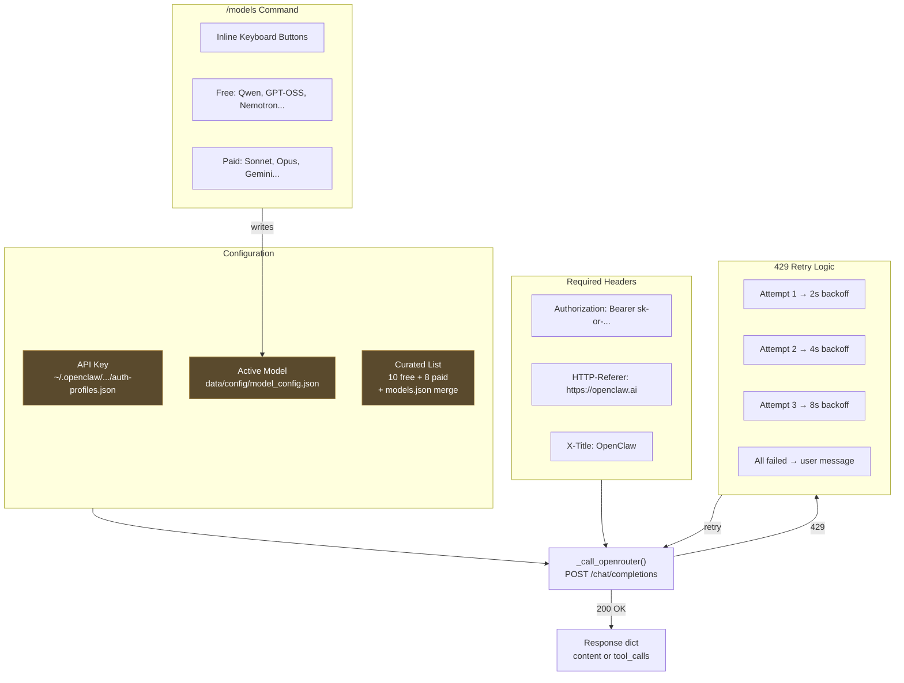

# HyperLiquid Trading System — Architecture v3

*Updated 2026-04-02. v1: daemon-centric. v2: interface-first. v3: agentic tool-calling.*

## Changelog

| Version | Date | Shift |
|---------|------|-------|
| v1 | 2026-03 | Daemon with 19 iterators, REFLECT pipeline, 4-phase plan |
| v2 | 2026-04-02 AM | Interface-first: rich context, model selector, formatting overhaul |
| v3 | 2026-04-02 PM | Agentic: 9 tools (7 read, 2 write), dual-mode calling, approval gates |

## System Overview

```mermaid
graph TB
    subgraph HUMAN["👤 Chris"]
        CC["Claude Code (Opus)<br/>Writes thesis, builds system"]
        TG["📱 Telegram<br/>25 commands + AI chat"]
    end

    subgraph EXCHANGE["🏦 HyperLiquid Exchange"]
        HL_API["REST API /info<br/>allMids, clearinghouseState<br/>metaAndAssetCtxs"]
        HL_TRADE["Trading API<br/>Orders, leverage, stops"]
        MAIN["Main 0x80B5<br/>Oil, Gold, Silver (xyz)"]
        VAULT["Vault 0x9da9<br/>BTC Power Law"]
    end

    subgraph BOT["⚙️ Telegram Bot (telegram_bot.py)"]
        POLL["Polling Loop<br/>2s interval, single-instance"]
        HANDLERS["25 Command Handlers<br/>/status /price /chart /models<br/>/memory /orders /pnl ..."]
        CALLBACKS["Callback Handler<br/>model: approve: reject:"]
    end

    subgraph AGENT["🤖 AI Agent (telegram_agent.py)"]
        HANDLE["handle_ai_message()<br/>Tool-calling loop (max 3)"]
        SYSPROMPT["System Prompt<br/>AGENT.md + SOUL.md"]
        CONTEXT["Live Context Builder<br/>_build_live_context()"]
        HISTORY["Chat History<br/>sanitized, last 20 msgs"]
        OR_API["OpenRouter API<br/>429 retry, required headers"]
    end

    subgraph TOOLS["🔧 Agent Tools (agent_tools.py)"]
        subgraph READ_TOOLS["READ — auto-execute"]
            T1["market_brief<br/>deep market analysis"]
            T2["account_summary<br/>equity + positions"]
            T3["live_price<br/>current prices"]
            T4["analyze_market<br/>full technicals"]
            T5["get_orders<br/>open orders"]
            T6["trade_journal<br/>trade history"]
            T7["check_funding<br/>funding, OI, volume"]
        end
        subgraph WRITE_TOOLS["WRITE — require approval"]
            T8["place_trade<br/>⚠️ inline keyboard"]
            T9["update_thesis<br/>⚠️ inline keyboard"]
        end
        PENDING["Pending Actions<br/>in-memory, 5min TTL"]
    end

    subgraph CONTEXT_PIPE["📊 Context Pipeline"]
        ACCT["Account + Positions<br/>both clearinghouses"]
        SNAP["Market Snapshots<br/>trend, S/R, ATR, BBands<br/>volume POC, flags"]
        THESIS_D["Thesis Data<br/>conviction, direction, TP/SL"]
        MEM["Memory + Learnings<br/>SQLite events, summaries"]
        HARNESS["Context Harness<br/>3000 token budget<br/>relevance-scored tiers"]
    end

    subgraph MODELS_SEL["🤖 Model Selection"]
        MODEL_CFG["data/config/model_config.json"]
        CURATED["18 curated models<br/>10 free + 8 paid"]
        OR_MODELS["models.json merge"]
    end

    subgraph RUNTIME["⚙️ Other Processes"]
        HB["Heartbeat<br/>launchd 2min<br/>Stops, alerts, escalation"]
        VR["Vault Rebalancer<br/>launchd hourly"]
    end

    subgraph DATA["📁 Shared State (filesystem)"]
        THESIS_F["data/thesis/*.json"]
        WORKING["data/memory/working_state.json"]
        MEMORY_DB["data/memory/memory.db"]
        HISTORY_F["data/daemon/chat_history.jsonl"]
        CANDLE_DB["data/candles/candle_cache.db"]
    end

    subgraph LIBS["📚 Shared Libraries"]
        LIB_CTX["common/context_harness"]
        LIB_SNAP["common/market_snapshot"]
        LIB_THESIS["common/thesis"]
        LIB_MEM["common/memory_consolidator"]
        LIB_ACCT["common/account_resolver"]
        LIB_CANDLE["modules/candle_cache"]
        LIB_PROXY["parent/hl_proxy"]
    end

    %% Human → Bot
    CC -->|writes| THESIS_F
    TG <-->|commands| POLL
    POLL --> HANDLERS
    POLL --> CALLBACKS

    %% Bot → Agent
    POLL -->|free text| HANDLE

    %% Agent internals
    HANDLE --> SYSPROMPT
    HANDLE --> CONTEXT
    HANDLE --> HISTORY
    HANDLE -->|messages + tools| OR_API

    %% Tool calling (dual-mode)
    OR_API -->|"native tool_calls<br/>(paid models)"| HANDLE
    OR_API -->|"[TOOL: name {args}]<br/>(free models)"| HANDLE
    HANDLE -->|READ tools| READ_TOOLS
    HANDLE -->|WRITE tools| PENDING
    PENDING -->|"[Approve] [Reject]"| CALLBACKS
    CALLBACKS -->|approved| WRITE_TOOLS

    %% Context pipeline
    CONTEXT --> ACCT
    CONTEXT --> SNAP
    CONTEXT --> THESIS_D
    CONTEXT --> HARNESS
    HARNESS --> MEM

    %% Tools → Libraries
    T1 --> LIB_CTX
    T2 --> LIB_ACCT
    T3 --> LIB_PROXY
    T4 --> LIB_SNAP
    T4 --> LIB_CANDLE
    T7 --> LIB_PROXY
    T8 --> LIB_PROXY
    T9 --> LIB_THESIS

    %% Libraries → Exchange
    LIB_PROXY --> HL_API
    LIB_PROXY --> HL_TRADE
    LIB_CANDLE --> CANDLE_DB
    LIB_MEM --> MEMORY_DB
    LIB_THESIS --> THESIS_F

    %% Context pipeline → Data
    ACCT --> HL_API
    SNAP --> LIB_CANDLE
    SNAP --> LIB_SNAP
    THESIS_D --> THESIS_F
    MEM --> MEMORY_DB
    HISTORY --> HISTORY_F

    %% Model selection
    OR_API --> MODEL_CFG
    MODEL_CFG --> CURATED
    CURATED --> OR_MODELS

    %% Other processes
    HB -->|fetches| HL_API
    HB -->|reads| THESIS_F
    HB -->|places stops| HL_TRADE
    HB -->|alerts| TG
    VR -->|trades| HL_TRADE

    %% Handlers → Exchange
    HANDLERS -->|fetches| HL_API

    %% Styling
    classDef running fill:#2d5a2d,stroke:#4a4,color:#fff
    classDef tools fill:#2d4a5a,stroke:#48a,color:#fff
    classDef write fill:#5a2d2d,stroke:#a44,color:#fff
    classDef data fill:#5a4a2d,stroke:#a84,color:#fff
    classDef libs fill:#3a3a5a,stroke:#66a,color:#fff

    class POLL,HANDLERS,CALLBACKS,HANDLE,CONTEXT,OR_API,HB,VR running
    class T1,T2,T3,T4,T5,T6,T7 tools
    class T8,T9,PENDING write
    class THESIS_F,WORKING,MEMORY_DB,HISTORY_F,CANDLE_DB,MODEL_CFG data
    class LIB_CTX,LIB_SNAP,LIB_THESIS,LIB_MEM,LIB_ACCT,LIB_CANDLE,LIB_PROXY libs
```

## Tool-Calling Architecture (NEW in v3)

## Dual-Mode Tool Calling

The system supports two tool invocation paths, chosen automatically:

## AI Context Pipeline

Every message triggers a fresh context build (~450 tokens):

## Telegram Command & Callback Architecture

## Process Architecture

## File Dependency Map

## OpenRouter Integration

## Infrastructure Health Assessment

| Area | Status | Notes |
|------|--------|-------|
| **Import chains** | ✅ CLEAN | Zero circular deps, all lazy imports correct |
| **Orphaned files** | ✅ ZERO | Every .py file has at least one importer |
| **Data flow** | ✅ COMPLETE | User → Bot → Agent → Tools → HL API fully traced |
| **Config files** | ✅ ALL REFERENCED | 4 configs, all loaded by code |
| **Process management** | ✅ ROBUST | PID + pgrep single-instance, SIGTERM/SIGKILL |
| **Error handling** | ✅ GRACEFUL | 429 retry, tool fallback, context-only degradation |
| **Security** | ✅ LAYERED | WRITE tools gated by approval buttons, 5min TTL |
| **Test coverage** | ⚠️ GAP | agent_tools.py, telegram_agent.py untested |
| **Chat history** | ✅ SANITIZED | Stale data stripped before LLM injection |
| **Context budget** | ✅ BOUNDED | 3000 tokens, relevance-scored tiers |

## Module Inventory

| Area | Files | Key Nodes | Status |
|------|-------|-----------|--------|
| cli/commands/ | 23 | main.py | ✅ All connected |
| cli/ (bot+agent+tools) | 8 | telegram_bot.py | ✅ Running, agentic |
| cli/daemon/ | 25 | context.py (21 importers) | 🟡 Built, not running |
| modules/ | 41 | candle_cache, radar, pulse | ✅ Used by tools |
| common/ | 31 | context_harness, market_snapshot | ✅ All connected |
| parent/ | 7 | hl_proxy (17 importers) | ✅ All connected |
| execution/ | 7 | order_types | ✅ Connected |
| strategies/ | 25 | via sdk.base (32 importers) | ✅ Connected |
| openclaw/ | 10 | AGENT.md, SOUL.md | ✅ Active (direct mode) |
| **TOTAL** | **~230** | **0 orphans** | |

## Build Phases

### ✅ Phase 1: Foundation (DONE)
Heartbeat, thesis contract, conviction engine, single-instance processes.

### ✅ Phase 1.5: Agentic Interface (DONE — this session)
- 25 Telegram commands with consistent registration
- `/price` with 24h change arrows, `/models` with inline keyboards
- OpenRouter with required headers, 429 retry, 18 curated models
- Rich AI context: positions, technicals (S/R, ATR, BBands), thesis, memory
- 9 agent tools with dual-mode calling (native + text-based)
- WRITE tool approval gates via Telegram buttons
- Chat history sanitization, single-instance enforcement

### Phase 2: Daemon Switch (NEXT)
- Replace heartbeat with full daemon (19 iterators, 3 tiers)
- All existing heartbeat functionality preserved
- Add AutoResearch, Journal, MemoryConsolidation iterators
- Daemon writes thesis updates automatically

### Phase 3: REFLECT Loop
- Wire ReflectEngine into daemon
- Nightly journal review, weekly report card to Telegram
- Convergence tracking — is performance improving?

### Phase 4: Self-Improving
- Playbook accumulates what works per (instrument, signal)
- DirectionalHysteresis prevents oscillation
- Meta-evaluation suggests parameter adjustments
- Weekly REFLECT summary to Chris
