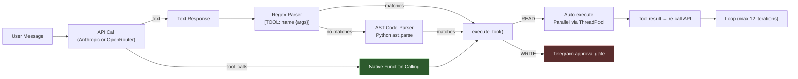
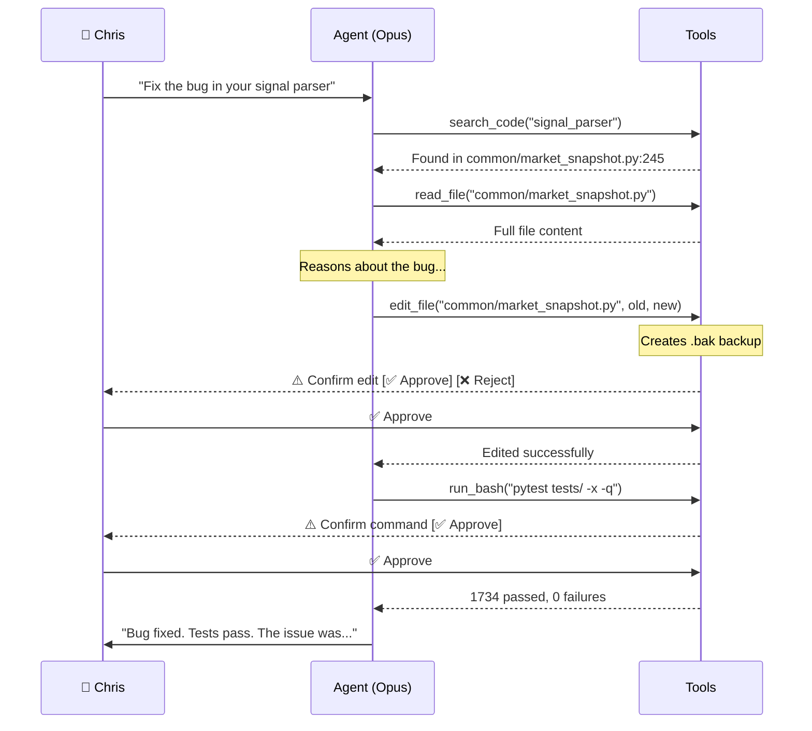

# v4: Embedded Agent Runtime — Self-Improving Trading System

**Date:** 2026-04-05
**Status:** Implemented
**Supersedes:** v3 Agentic tool-calling (2026-04-02), v2 Interface-first, v1 Daemon-centric
**ADR:** [009-embedded-agent-runtime](../../wiki/decisions/009-embedded-agent-runtime.md)

---

## 1. Problem

The v3 system had a basic tool-calling loop (3 iterations, 3000-char caps) with no planning, no streaming, no context management, no parallel execution, and no memory persistence. The agent couldn't read its own code, search the web, or modify itself. Free models couldn't reliably use structured tools. The system was a chatbot with functions, not an agent.

**Goals:**
- Full agent embedded inside the app — reads code, searches web, persists memory, modifies itself
- Model-agnostic — works with any provider (Anthropic, OpenRouter, any OpenAI-compatible)
- Self-improving — agent can propose code edits, user approves via Telegram
- Claude Code-quality prompts and architecture without Claude Code's dependencies
- Streaming responses to Telegram (no 30s silence)
- Context compaction (unlimited conversation length)
- Memory consolidation (learnings persist across sessions)

**Non-goals:**
- MCP server (removed intentionally — direct Python function calls are faster)
- OpenClaw gateway (reversed — bot catches messages first)
- Framework adoption (no LangChain, no Pydantic AI — extend what exists)
- Anthropic-specific API features (must work with any model)

---

## 2. Architecture: Embedded Runtime

### 2.1 System Overview

```mermaid
graph TB
    subgraph HUMAN["👤 CHRIS (Human-in-the-Loop)"]
        CC["Claude Code (Opus)<br/>Manual sessions<br/>Writes thesis, reviews system"]
        TG_READ["Reads Telegram alerts"]
        TG_CMD["Sends /commands"]
        TG_CHAT["Chats with AI agent"]
    end

    subgraph EXCHANGE["🏦 HyperLiquid Exchange"]
        HL_API["HL REST API<br/>/info endpoint"]
        HL_TRADE["HL Trading API<br/>Orders, leverage, stops"]
        MAIN_ACCT["Main Account<br/>Oil, Gold, Silver<br/>xyz clearinghouse"]
        VAULT_ACCT["Vault<br/>BTC Power Law<br/>default clearinghouse"]
    end

    subgraph RUNTIME["⚙️ Running Processes (macOS)"]
        HB["Heartbeat<br/>launchd, every 2min"]
        CMD_BOT["Telegram Bot<br/>cli/telegram_bot.py"]
        AI_AGENT["Embedded Agent Runtime<br/>cli/agent_runtime.py"]
        VR["Vault Rebalancer<br/>launchd, hourly"]
    end

    subgraph AGENT_CORE["🧠 Agent Runtime (v4 — Claude Code Port)"]
        SYSPROMPT["System Prompt Builder<br/>agent/AGENT.md + SOUL.md + Memory"]
        STREAMING["SSE Streaming Parser<br/>Real-time Telegram output"]
        COMPACT["Context Compactor<br/>Auto-summarize at limit"]
        DREAM["autoDream Consolidator<br/>24h + 3 sessions trigger"]
    end

    subgraph DATA["📁 Shared State (filesystem)"]
        THESIS["data/thesis/*.json<br/>Conviction, direction, TP"]
        AGENT_MEM["data/agent_memory/<br/>MEMORY.md + topic files"]
        CANDLE_DB["data/candles/candle_cache.db"]
        HISTORY_F["data/daemon/chat_history.jsonl"]
    end

    CC -->|atomic writes| THESIS
    TG_CMD --> CMD_BOT
    TG_CHAT --> AI_AGENT

    AI_AGENT --> SYSPROMPT
    AI_AGENT --> STREAMING
    AI_AGENT --> COMPACT
    AI_AGENT --> DREAM

    CMD_BOT -->|fetches| HL_API
    AI_AGENT -->|tools| HL_API
    AI_AGENT -->|tools| HL_TRADE
    HB -->|fetches + alerts| HL_API
    VR -->|trades| HL_TRADE

    classDef running fill:#2d5a2d,stroke:#4a4,color:#fff
    classDef agent fill:#5a2d5a,stroke:#a4a,color:#fff
    classDef data fill:#5a4a2d,stroke:#a84,color:#fff

    class CMD_BOT,HB,VR running
    class AI_AGENT,SYSPROMPT,STREAMING,COMPACT,DREAM agent
    class THESIS,AGENT_MEM,CANDLE_DB,HISTORY_F data
```



### 2.2 What Was Ported From Claude Code

| Component | Claude Code Source | Python Port | LOC |
|-----------|-------------------|-------------|-----|
| System prompt | `constants/prompts.ts` | `agent_runtime.py` — 7 static sections | ~200 |
| Parallel tools | `StreamingToolExecutor.ts` | `execute_tools_parallel()` — ThreadPoolExecutor | ~150 |
| SSE streaming | `services/api/claude.ts` | `stream_and_accumulate()` — SSE parser | ~100 |
| Context compaction | `services/compact/autoCompact.ts` | `should_compact()` + `build_compact_messages()` | ~80 |
| Memory dream | `services/autoDream/autoDream.ts` | `should_dream()` + `build_dream_prompt()` | ~70 |

### 2.3 Tool-Calling Architecture



### 2.4 22 Agent Tools

| Category | Tools | Type |
|----------|-------|------|
| **Trading** | status, live_price, analyze_market, market_brief, check_funding, get_orders, trade_journal, thesis_state, daemon_health | READ |
| **Trading writes** | place_trade, update_thesis | WRITE |
| **Codebase** | read_file, search_code, list_files | READ |
| **Web** | web_search | READ |
| **Memory** | memory_read, memory_write | READ / WRITE |
| **System** | edit_file, run_bash | WRITE |
| **Introspection** | get_errors, get_feedback | READ |

### 2.5 Self-Improvement Loop



---

## 3. Key Decisions

| Decision | Rationale |
|----------|-----------|
| Python function tools, not MCP | Direct calls are faster, no subprocess overhead, no approval gaps |
| Model-agnostic (no extended thinking API) | Must work with OpenRouter free models, not just Anthropic |
| Prompt-level reasoning (`<thinking>` tags) | Any model can do this, not locked to one provider |
| Parallel READ, sequential WRITE | Safety — concurrent reads are fast, writes need ordering |
| .bak backup before edit_file | Agent can rollback if tests fail |
| 12 iteration cap | Enough for complex research, safety against infinite loops |
| 12K char tool results | Opus has 200K context — 3K was crippling for code reading |
| Dream after 24h + 3 sessions | Prevents memory rot without burning tokens every message |

---

## 4. File Map

```
agent-cli/
├── agent/
│   ├── AGENT.md              ← System prompt (trading rules, tools, formatting)
│   └── SOUL.md               ← Response protocol (safety, confidence levels)
├── cli/
│   ├── agent_runtime.py      ← Core runtime (prompt, parallel, streaming, compact, dream)
│   ├── telegram_agent.py     ← Telegram adapter (API calls, message routing)
│   └── agent_tools.py        ← 22 tool definitions + dispatch
├── common/
│   ├── tools.py              ← Tool implementations (pure functions → dicts)
│   ├── tool_renderers.py     ← Compact AI output formatting
│   └── code_tool_parser.py   ← AST parser for free model code blocks
├── data/
│   └── agent_memory/
│       ├── MEMORY.md          ← Index (auto-loaded into system prompt)
│       └── {topic}.md         ← Topic files (agent writes these)
└── tests/
    ├── test_agent_runtime.py  ← 19 tests: prompt, parallel, SSE, compact, dream
    └── test_agent_tools_general.py ← 21 tests: security, round-trips, introspection
```

---

## 5. What v4 Adds Over v3

| Capability | v3 | v4 |
|-----------|----|----|
| Tool iterations | 3 | 12 |
| Tool result cap | 3,000 chars | 12,000 chars |
| Parallel execution | ❌ | ✅ ThreadPoolExecutor |
| Streaming to Telegram | ❌ | ✅ SSE + editMessageText |
| Context compaction | ❌ | ✅ Auto-summarize at limit |
| Memory persistence | Chat history only | MEMORY.md + topic files + dream |
| Codebase access | ❌ | ✅ read_file, search_code, list_files |
| Web search | ❌ | ✅ DuckDuckGo |
| Self-modification | ❌ | ✅ edit_file + run_bash with approval |
| Error introspection | ❌ | ✅ get_errors, get_feedback |
| System prompt quality | Hand-written | Claude Code patterns ported |
| Model support | OpenRouter only | Anthropic direct + OpenRouter |
| Backup on edit | ❌ | ✅ .bak files |

---

## 6. Evolution Timeline

| Version | Date | Innovation | Tests |
|---------|------|-----------|-------|
| v1 | 2026-03 | Daemon-centric: 19 iterators, REFLECT pipeline | ~800 |
| v2 | 2026-04-02 AM | Interface-first: Telegram bot, rich AI context | ~1200 |
| v3 | 2026-04-02 PM | Agentic: 9 tools, dual-mode parsing, approval gates | ~1459 |
| v3.2 | 2026-04-04 | Interactive menu, write commands, protection chain | ~1631 |
| **v4** | **2026-04-05** | **Embedded agent runtime, 22 tools, self-improving** | **1734** |
