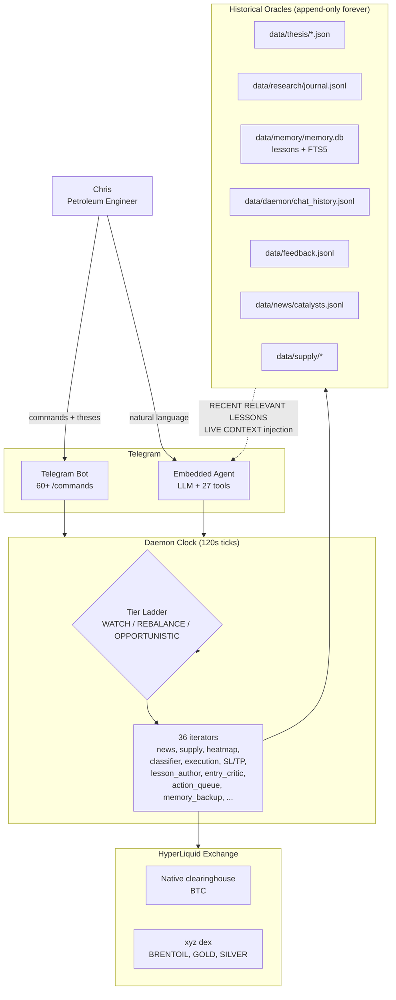

# HyperLiquid Bot — Home

> *Markets are dumb. ~80% of trades are bots reacting to known information,
> not forecasting. A petroleum engineer trying to forecast the fundamental
> gets killed by bots that don't read the supply ledger. **The arbitrage:
> be early on the obvious thing, then fade the bot overcorrection when it
> lands.*** — Chris, 2026-04-09 (the founding insight of this project)

## What this project is

A **personal trading instrument** for one petroleum engineer trading real
capital on HyperLiquid. Three roles in one system:

1. **Portfolio copilot** — Chris brings the thesis (domain edge), system
   executes with discipline
2. **Research agent** — Hunts catalysts, challenges thesis, recalls past
   trades via lesson corpus
3. **Risk manager** — Autonomous stops/take-profits, drawdown circuit
   breakers, ruin prevention

**Read the vision**: [[NORTH_STAR]] · **Read the current plan**: [[MASTER_PLAN]]

## System map (mermaid)

## Start exploring

| Entry point | What you'll find |
|---|---|
| [[architecture/Overview]] | System architecture narrative — how the pieces fit |
| [[architecture/Package-Map]] | Directory layout + responsibilities |
| [[architecture/Tier-Ladder]] | WATCH / REBALANCE / OPPORTUNISTIC autonomy ladder |
| [[architecture/Authority-Model]] | Per-asset delegation via `common/authority.py` |
| [[architecture/Data-Flow]] | How a trade flows end-to-end from thesis to journal to lesson |
| [[architecture/Data-Discipline]] | P10 — preserve everything, retrieve sparingly, bound every read path |

## Index pages (auto-generated)

| Index | Count | Description |
|---|---|---|
| [[iterators/_index\|Iterators]] | 36 | Daemon iterators — pluggable per-tick processors |
| [[commands/_index\|Telegram Commands]] | 68 | `/commands` exposed via Telegram bot |
| [[tools/_index\|Agent Tools]] | 27 | Tools the embedded agent can call (READ auto, WRITE with approval) |
| [[data-stores/_index\|Data Stores & Configs]] | 22+ | Config files + data store schemas |
| [[plans/_index\|Plans]] | 20 | Active, parked, and archived workstreams |
| [[adrs/_index\|ADRs]] | 14 | Architecture Decision Records |

## Example deep-dive pages (hand-written)

- [[components/Trade-Lesson-Layer]] — the FTS5 corpus + BM25 retrieval + dream cycle pipeline
- [[components/Memory-Backup]] — one iterator, fully annotated, as the reference density standard (includes the 12-hour registration gap bug story)

## The big ideas

- **Preserve forever, retrieve sparingly** — [[architecture/Data-Discipline|P10]]
- **Delegated autonomy, not constant supervision** — [[architecture/Authority-Model]]
- **Markets are dumb** — the founding insight at the top of this page
- **L0–L5 self-improvement contract** — learn within bounds, never restructure without one human tap
- **Historical oracles** — chat history + feedback + todos + lessons live forever, correlated with market state

## Operations

- [[runbooks/Regenerate-Vault]] — how to keep this vault fresh
- [[runbooks/Obsidian-Setup]] — recommended Obsidian view settings
- **Memory.db restore drill** — see `docs/wiki/operations/memory-restore-drill.md` (the narrative version lives in the wiki, not the vault)

## The meta

- This vault is **auto-generated** by `scripts/build_vault.py` for the
  ~80% structural pages (iterators, commands, tools, configs, plans, ADRs)
- Hand-written pages (this one, architecture/*, runbooks/*, example
  deep-dives) are preserved across regenerations
- Per NORTH_STAR P2 (reality first, docs second): the auto-gen pages
  cannot drift from code. If they say an iterator is registered in
  WATCH tier, it's because `tiers.py` says so.
- The generator reads: `cli/daemon/iterators/`, `cli/telegram_bot.py`,
  `cli/telegram_commands/`, `cli/agent_tools.py` (TOOL_DEFS), `cli/daemon/tiers.py`,
  `cli/commands/daemon.py`, `data/config/`, `docs/plans/`, `docs/wiki/decisions/`

Run `python scripts/build_vault.py` after any significant codebase
change. See [[runbooks/Regenerate-Vault]].
