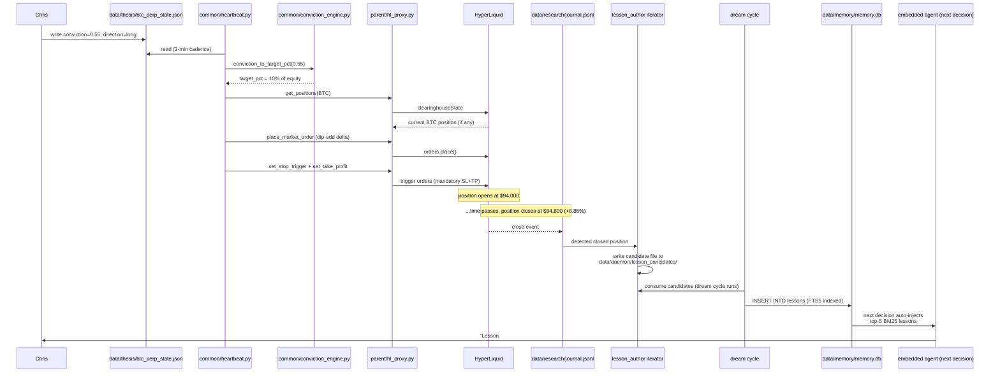

# Data Flow — One Trade, End-to-End

How a Chris thesis becomes a position with mandatory SL+TP, how the
position becomes a lesson in the corpus, and how that lesson influences
the next decision.

## The 8-stage trace



## Stage-by-stage detail

### Stage 1 — Thesis creation (human)
Chris opens `data/thesis/btc_perp_state.json` (via Claude Code, text
editor, or `/thesis` command) and writes:

```json
{
  "market": "BTC-PERP",
  "direction": "long",
  "conviction": 0.55,
  "thesis_summary": "Power law + debt monetization tailwind",
  "invalidation_conditions": ["Break below $88k weekly close"],
  "evidence_for": [...],
  "evidence_against": [...],
  "recommended_leverage": 1.0,
  "recommended_size_pct": 0.10,
  "take_profit_price": null,
  "notes": "Entered long Apr 2 as portfolio hedge..."
}
```

**Key fact**: the thesis JSON is the **shared contract** between Chris
and the daemon. Chris writes conviction + direction + reasoning; the
daemon reads it and executes with discipline.

### Stage 2 — Heartbeat tick (automatic, every 2 min)
`common/heartbeat.py` runs via macOS launchd every 2 minutes. It:
1. Loads `data/thesis/*_state.json` files via `common.thesis.ThesisState.load`
2. For each thesis, checks conviction → target % via
   `common.conviction_engine.conviction_to_target_pct(conviction, bands)`
3. Fetches current account state via `parent/hl_proxy.py:get_positions()`
4. Computes the dip-add / trim delta to hit target

**This stage only executes if**:
- Daemon tier ≥ REBALANCE (see [[Tier-Ladder]])
- Asset authority is `agent` (see [[Authority-Model]])
- `execution_engine` kill switch is enabled

### Stage 3 — Conviction → target size
Pure function in `common/conviction_engine.py`:

```python
def conviction_to_target_pct(conviction: float, bands: ConvictionBands) -> float:
    # 0.0 - 0.3: defensive, no adds
    # 0.3 - 0.5: small band (5-10% equity)
    # 0.5 - 0.7: medium band (10-20%)
    # 0.7 - 0.85: large band (20-35%)
    # 0.85 - 1.0: max band (up to 50%)
```

Druckenmiller-style — big position on high-conviction setups, small on
low-conviction. Stale theses (>14 days since last update) auto-clamp
to 0 so the daemon never trades on outdated reasoning.

### Stage 4 — Place order
`cli/daemon/iterators/execution_engine.py` calls
`parent/hl_proxy.place_market_order()` for the delta. For xyz perps
(BRENTOIL, GOLD, SILVER), the call includes `dex='xyz'` — missing this
is a recurring bug, documented in CLAUDE.md rule 3.

### Stage 5 — Mandatory SL + TP (no exceptions)
Immediately after the fill, `exchange_protection` iterator places:
- **Stop loss** — ATR-based (2.5×ATR below entry for longs)
- **Take profit** — from `thesis.take_profit_price` if set, else 5×ATR

Both must succeed. If either fails, `exchange_protection` alerts Chris
via Telegram — the position exists without full protection and needs
manual intervention.

**CLAUDE.md rule 5**: "Every position MUST have both SL and TP on
exchange. No exceptions."

### Stage 6 — Entry critique (optional, read-only)
On the next tick, `entry_critic` iterator detects the new position via
`ctx.positions` diff against its state file. It:
1. Gathers the signal stack (conviction, technicals, catalyst proximity,
   funding, OI, liquidity zones, cascades, bot classifier, liquidation
   cushion, sizing vs target, top 5 BM25 lessons)
2. Grades each axis deterministically
3. Posts a clean critique alert to Telegram
4. Appends the critique row to `data/research/entry_critiques.jsonl`

See [[iterators/entry_critic]] and [[commands/critique]].

### Stage 7 — Position closes → journal → candidate → lesson
When the position closes (SL/TP triggered, manual close, catalyst
deleverage, etc.):

1. `journal_engine` writes a closed-position row to
   `data/research/journal.jsonl` with entry/exit prices, PnL, ROE,
   holding time, thesis snapshot at open, etc.
2. `lesson_author` iterator detects the closed row via tail-read,
   writes a candidate file to `data/daemon/lesson_candidates/<entry_id>.json`
3. The dream cycle (memory_consolidation iterator, runs every
   24h+3 sessions) calls `_author_pending_lessons()` which hands the
   candidate to the embedded agent for structured post-mortem authoring
4. The agent writes a Lesson dataclass and `common/memory.py:log_lesson()`
   persists it to `data/memory/memory.db` lessons table (FTS5 indexed)
5. Candidate file is unlinked on success

See [[components/Trade-Lesson-Layer]] for the full pipeline deep dive.

### Stage 8 — Next decision: BM25 retrieval
On the next agent turn (Telegram message, heartbeat decision, etc.):

1. `cli/agent_runtime.py:build_system_prompt()` calls
   `build_lessons_section(limit=5)` which runs a BM25 query against
   `lessons_fts` for top-5 relevant past lessons
2. The top 5 are rendered into a `## RECENT RELEVANT LESSONS` section
   in the system prompt
3. The agent sees those lessons before it sees Chris's message
4. The agent can reference specific lesson ids in its reasoning
   ("Lesson #47 suggests avoiding scale-in within 6h of FOMC")

Per [[Data-Discipline]] P10: the lessons section is **hard-capped at 5
lessons** in `cli/agent_runtime.py`. No growth possible. The agent can
pull more via `search_lessons()` tool (capped at 20) or `get_lesson()`
(one row, body capped at 6KB).

## The feedback loop this closes

Stage 8 → Stage 1: Chris reads the agent's reasoning on the next
decision, notices it's citing Lesson #47, remembers the context,
updates his thesis accordingly. The loop is closed: past trades
inform future decisions automatically, without Chris having to
manually search or recall.

**This is the "learn from every trade" half of the Three Promises in
[[plans/NORTH_STAR|NORTH_STAR]].** The first half (capture every idea)
is the thesis writing surface; the third half (execute with
discipline) is the heartbeat + conviction engine + mandatory SL/TP.

## What's NOT in this flow

- **No AI in stages 1-5**. The trading core is pure Python and runs
  without an LLM at all. The agent only enters the picture in stages
  6 (entry critique — optional, deterministic grading) and 7-8 (lesson
  authoring via dream cycle and BM25 retrieval).
- **No cloud services**. Session-token auth to Anthropic, everything
  else local. See [[plans/NORTH_STAR]] P3 "Local-first, no rent."
- **No forecasting bets**. The oil_botpattern variant exploits bot
  overshoot; the BTC path executes Chris's conviction with discipline.
  Neither bets on "the market being right" per the founding insight.

## See also

- [[Overview]] — system architecture
- [[Tier-Ladder]] — which stages require which tier
- [[Authority-Model]] — which stages require delegation
- [[components/Trade-Lesson-Layer]] — stages 7-8 deep dive
- [[components/Conviction-Engine]] — stage 3 detail
- [[iterators/entry_critic]] — stage 6 detail
