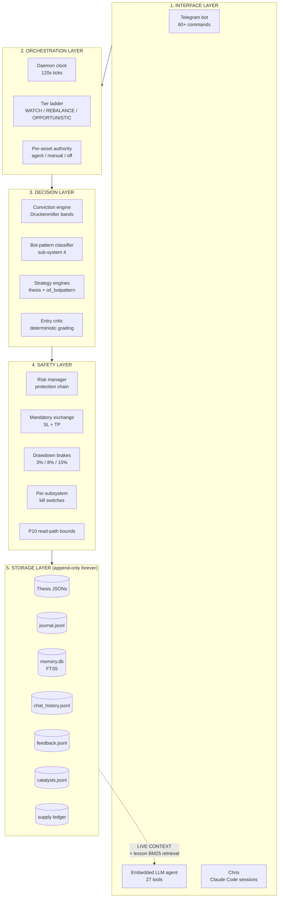

# Architecture Overview

A personal trading system for one user with three concurrent roles
(portfolio copilot, research agent, risk manager) sharing one process
tree. Everything is local-first, append-only, test-first, and built to
grow for years.

## The five layers (top to bottom)

## The three roles, one process tree

### 1. Portfolio copilot
Chris writes a thesis (conviction 0.0–1.0 + direction + reasoning) in
`data/thesis/*_state.json`. The heartbeat daemon reads it, maps
conviction to a target % of equity via the Druckenmiller-style ladder,
places or trims the position, and attaches mandatory exchange-side
SL/TP. Chris can set per-asset authority to `agent` (bot manages
execution autonomously), `manual` (bot is safety-net only), or `off`
(not watched).

**Read**: [[Authority-Model]], [[components/Conviction-Engine]]

### 2. Research agent
An embedded LLM agent (Claude via session token — no API keys, no
per-call cost) with 27 tools the agent can call. Every decision is
grounded in LIVE CONTEXT (current account state, prices, positions)
auto-injected into the system prompt, plus top-5 BM25-ranked past
lessons from the trade lesson corpus. The agent can write to files,
place trades, and update theses — WRITE tools require Chris's approval
via Telegram inline keyboard.

**Read**: [[tools/_index|Agent Tools Index]], [[components/Agent-Runtime]]

### 3. Risk manager
Autonomous safety layer that runs regardless of which strategy is
executing:
- Mandatory exchange-side SL + TP on every position (no exceptions)
- Protection chain state machine: `OPEN → COOLDOWN → CLOSED`
- Drawdown circuit breakers (3% daily / 8% weekly / 15% monthly)
- Liquidation cushion monitor
- Per-subsystem kill switches in `data/config/*.json` (default `false`
  for any risky new subsystem)

**Read**: [[components/Risk-Manager]], [[iterators/liquidation_monitor]]

## The two writers, one safety net

Two strategies can write positions concurrently, both obey the same
safety layer:

| Writer | Scope | Holding | Direction rule |
|---|---|---|---|
| **`thesis_engine`** | All approved markets | Long horizon (days to months) | Long-only on oil per `markets.yaml` |
| **`oil_botpattern`** | CL + BRENTOIL only | Tactical (≤24h on shorts) | **The ONLY place oil shorting is legal** — gated by dual kill switches |

Both write through `exchange_protection` which enforces SL+TP regardless
of which strategy emitted the order.

**Read**: [[iterators/thesis_engine]], [[iterators/oil_botpattern]],
[[plans/OIL_BOT_PATTERN_SYSTEM]]

## The historical-oracle corpus

Per NORTH_STAR P9 (historical oracles are forever) + P10 (preserve
everything, retrieve sparingly): every message, trade, catalyst, and
supply event lives on disk forever, and every read path that feeds an
agent prompt or a Telegram response has a hard cap.

**Read**: [[Data-Discipline]]

## Autonomy ladder

The daemon runs at one of three tiers at any given time. Each tier
activates a specific set of iterators. Chris promotes/demotes the tier
manually; kill switches are per-subsystem on top of the tier filter.

**Read**: [[Tier-Ladder]]

## The L0–L5 self-improvement contract

From `docs/plans/OIL_BOT_PATTERN_SYSTEM.md` §6 — load-bearing across
the entire system:

| Layer | What | Human in loop |
|---|---|---|
| L0 | Hard contracts (tests, SL+TP, schemas) | None — automatic |
| L1 | Bounded auto-tune of parameters within YAML min/max | None — automatic |
| L2 | Reflect proposals for structural changes | Chris — one tap |
| L3 | Pattern library growth | Chris — one tap |
| L4 | Shadow trading for ≥N closed trades before promotion | None — automatic |
| L5 | ML overlay | **Deferred until ≥100 closed trades** — wary of overfitting |

**The contract**: the system is allowed to LEARN automatically. The
system is not allowed to CHANGE STRUCTURE without one human tap.
Crossing that line is how trading systems blow up overnight.

## How new things get added safely

Every meaningful addition to the codebase follows the same pattern:

1. Plan doc in `docs/plans/` with a status (proposed / active / parked /
   archived) and resume condition
2. Kill switch in `data/config/<name>.json` with `enabled: false` for
   risky things
3. Iterator registered in `cli/daemon/tiers.py` under the appropriate
   tier(s)
4. **AND** registered in `cli/commands/daemon.py:daemon_start()` via
   `clock.register(<ClassName>())` — this is the step that was missed
   for `memory_backup` and caused a real bug, now documented as a
   recurring failure mode to watch
5. Tests in `tests/` before the commit — no skipping
6. Build-log entry in `docs/wiki/build-log.md` documenting the ship

The auto-generated iterator pages in this vault call out the registration
gap explicitly: if an iterator is in `tiers.py` but missing from
`daemon.py`, its vault page shows a **⚠️ REGISTRATION GAP** warning.

## See also

- [[Package-Map]] — directory layout + per-package responsibilities
- [[Tier-Ladder]] — the autonomy dial
- [[Authority-Model]] — per-asset delegation
- [[Data-Flow]] — end-to-end trace of one trade
- [[Data-Discipline]] — P10 read-path bounds
