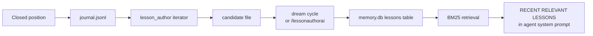

# Trade Lesson Layer

A complete learning loop: every closed trade becomes a verbatim
post-mortem, indexed in FTS5, retrieved by BM25 on every agent
decision. The agent sees its own past mistakes before making new ones.

**Status**: shipped end-to-end (2026-04-09). The smoke-test agent ran
a synthetic closed trade through every stage of the pipeline and
confirmed all 6 stages pass — details at the bottom of this page.

## The 6-stage pipeline



## Stage-by-stage

### 1. Closed position → journal.jsonl
When a position closes (SL/TP fires, manual close, catalyst
deleverage), `modules/journal_engine.py` writes a structured row to
`data/research/journal.jsonl` with:

```python
{
  "entry_id": "BTC-1775212212000",
  "instrument": "BTC",
  "direction": "long",
  "entry_price": 94000,
  "exit_price": 94800,
  "pnl": 800,
  "roe_pct": 0.85,
  "holding_ms": 14400000,
  "close_ts": 1775226612000,
  "signal_source": "thesis_driven",
  "close_reason": "take_profit_triggered",
  "thesis_snapshot": {...}
}
```

The `_is_closed_position` contract in `lesson_author` requires
exactly these fields — any schema drift breaks the pipeline silently.
The 2026-04-09 audit found 10 stale rows with the wrong schema
(`trade_id` / `timestamp_close` / `instrument`) that the iterator
silently skipped; they were quarantined to
`data/research/quarantine/journal_2026-04-09_pre-schema-realignment.jsonl.bak`.

### 2. lesson_author iterator → candidate file

**Source**: [[iterators/lesson_author]]

The iterator runs per-tick in WATCH tier. It tail-reads
`data/research/journal.jsonl` via a byte-offset state file at
`data/daemon/lesson_author_state.json`, parses new closed-position rows,
and writes a candidate file per close to
`data/daemon/lesson_candidates/<entry_id>.json`.

**The refuse-to-write-garbage rule** (from the Bug A pattern of
2026-04-08): if `entry_price`, `exit_price`, or `roe_pct` look broken
(zero prices, `|roe| > 1000`), the row is logged and skipped. No
candidate file is written. Prevents the case where a corrupt journal
row becomes a fake lesson.

Kill switch: `data/config/lesson_author.json` → `{"enabled": true}`
(default on).

### 3. Candidate file → dream cycle authors
The candidate file sits on disk until one of two things consumes it:

- **Automatic path**: the `memory_consolidation` iterator runs every
  24h+3 sessions and calls `_author_pending_lessons(max_lessons=3)`
  as part of the dream cycle (inside
  `cli/telegram_agent.py:762`). This drains up to 3 pending candidates
  per dream.
- **Manual path**: Chris runs `/lessonauthorai [N|all]` from Telegram
  (see [[commands/lessonauthorai]]). Calls the same
  `_author_pending_lessons()` function.

### 4. Dream cycle → memory.db lessons table
Inside `_author_pending_lessons()`, for each candidate:

1. `lesson_engine.build_lesson_prompt(request)` wraps the candidate
   content in a sentinel-marked prompt
2. `_call_anthropic` invokes Claude Haiku (default) with the prompt
3. Model returns a sentinel-wrapped structured response
4. `lesson_engine.parse_lesson_response(text)` parses strictly — any
   missing field or format drift raises, and the candidate stays in
   place for the next run (never silently fails)
5. Idempotency check: query memory.db for an existing lesson with
   the same `journal_entry_id` — skip if already authored
6. `common/memory.py:log_lesson(lesson)` INSERTs the row into
   `data/memory/memory.db` lessons table
7. The `lessons_ai` trigger fires automatically, inserting the
   summary + body_full + tags into `lessons_fts` (FTS5 virtual table)
8. Candidate file is unlinked on success

**Append-only**: a `lessons_append_only` trigger in memory.db blocks
UPDATE of the primary content fields (summary, body_full) after
INSERT. Status fields (reviewed_by_chris) CAN be updated — those
are Chris's curation marks, not the lesson content.

### 5. BM25 retrieval via search_lessons
Agent tool [[tools/search_lessons]] runs FTS5 BM25 queries:

```python
common_memory.search_lessons(
    query="oil short overshoot",
    market="BRENTOIL",
    direction="short",
    limit=5  # HARD-CAPPED at 20 per P10
)
```

BM25 ranks by relevance across `summary + body_full + tags`. Empty
query returns most-recent lessons by `trade_closed_at` (recency
fallback). Filter parameters are AND-combined. Rejected lessons
(`reviewed_by_chris = -1`) are hidden by default — Chris's way of
marking anti-patterns so they stop polluting retrieval while staying
in the corpus as historical evidence.

**P10 bounds**: default `limit=5`, hard ceiling `limit=20` (both in
the tool body AND in the JSON schema). See [[Data-Discipline]].

### 6. Prompt injection via build_lessons_section
`cli/agent_runtime.py:build_lessons_section(limit=5)` is called by
`cli/telegram_agent.py:_build_system_prompt()` on every agent turn.
It runs a recency-based `search_lessons(query="", limit=5)` and
renders the top 5 as a `## RECENT RELEVANT LESSONS` section in the
system prompt.

Each row in the section shows: id, date, market/direction,
signal_source/lesson_type, outcome, ROE%, and the one-line summary.
**body_full is NOT in the section** — the agent has to call
`get_lesson(id)` via tool if it wants the full post-mortem. This
keeps the injected section small (<4KB) regardless of corpus size.

**This is how past trades inform future decisions automatically.**
Chris doesn't have to ask the agent "have we seen this before?" —
the top 5 most relevant lessons are already in the system prompt.

## The schema

```sql
CREATE TABLE lessons (
    id                  INTEGER PRIMARY KEY AUTOINCREMENT,
    created_at          TEXT NOT NULL,
    trade_closed_at     TEXT NOT NULL,
    market              TEXT NOT NULL,
    direction           TEXT NOT NULL CHECK (direction IN ('long','short','flat')),
    signal_source       TEXT NOT NULL,
    lesson_type         TEXT NOT NULL,
    outcome             TEXT NOT NULL CHECK (outcome IN ('win','loss','breakeven','scratched')),
    pnl_usd             REAL NOT NULL,
    roe_pct             REAL NOT NULL,
    holding_ms          INTEGER NOT NULL,
    conviction_at_open  REAL,
    journal_entry_id    TEXT,
    thesis_snapshot_path TEXT,
    summary             TEXT NOT NULL,
    body_full           TEXT NOT NULL,
    tags                TEXT NOT NULL DEFAULT '[]',  -- JSON
    reviewed_by_chris   INTEGER NOT NULL DEFAULT 0   -- -1 reject, 0 unreviewed, 1 approved
);
CREATE VIRTUAL TABLE lessons_fts USING fts5(summary, body_full, tags, content='lessons', content_rowid='id');
```

## The Telegram surface

- [[commands/lessons]] — `/lessons [N]` list the most recent lessons
- [[commands/lesson]] — `/lesson <id>` view verbatim body; `/lesson approve|reject|unreview <id>` curate
- [[commands/lessonsearch]] — `/lessonsearch <query>` BM25 search
- [[commands/lessonauthorai]] — `/lessonauthorai [N|all]` manually trigger dream-cycle authoring

All four are registered via the 5-surface checklist (HANDLERS dict +
`_set_telegram_commands` + `cmd_help` + `cmd_guide` + handler
definition). Source: `cli/telegram_commands/lessons.py` (extracted
from `telegram_bot.py` in Wedge 1 of the monolith split).

## The end-to-end smoke test (2026-04-09)

A parallel agent ran a full pipeline verification against production
paths with a synthetic closed trade. Findings:

```
[x] Step 1: synthetic row written to journal.jsonl
[x] Step 2: lesson_author iterator picked it up → candidate file
[x] Step 3: dream cycle authored the lesson via Claude Haiku
[x] Step 4: lesson row landed in memory.db (id=47)
[x] Step 5: search_lessons returns it
[x] Step 6: build_lessons_section includes it in the system prompt
```

**All 6 stages pass.** The pipeline is production-ready. The next
real closed trade Chris opens will flow through this exact pipeline.

The synthetic row #47 was marked `reviewed_by_chris = -1` (rejected,
hidden from prompt injection) after the test so it's preserved for
traceability but doesn't pollute the corpus with fake data.

## What's still open

- **No real closed trades yet.** The pipeline works; it hasn't been
  run against a real $50 BTC vault trade yet. That's item #1 on the
  NORTH_STAR "next 10 things to ship" list.
- **Approval UI**: `/lesson approve <id>` works but there's no batch
  approval surface. Filed as a future enhancement.
- **Lesson quality metrics**: no dashboard yet showing lessons
  authored per week, approval rate, BM25 hit rate. Would feed the
  brutal review loop.

## See also

- [[iterators/lesson_author]] — the producer side
- [[iterators/memory_consolidation]] — the dream cycle consumer
- [[tools/search_lessons]] — BM25 retrieval tool
- [[tools/get_lesson]] — single-lesson fetch tool (body capped at 6KB)
- [[data-stores/config-lesson_author]] — kill switch
- [[Data-Discipline]] — P10 bounds on the retrieval surfaces
- `docs/wiki/build-log.md` 2026-04-09 entry — ship history + smoke test report
