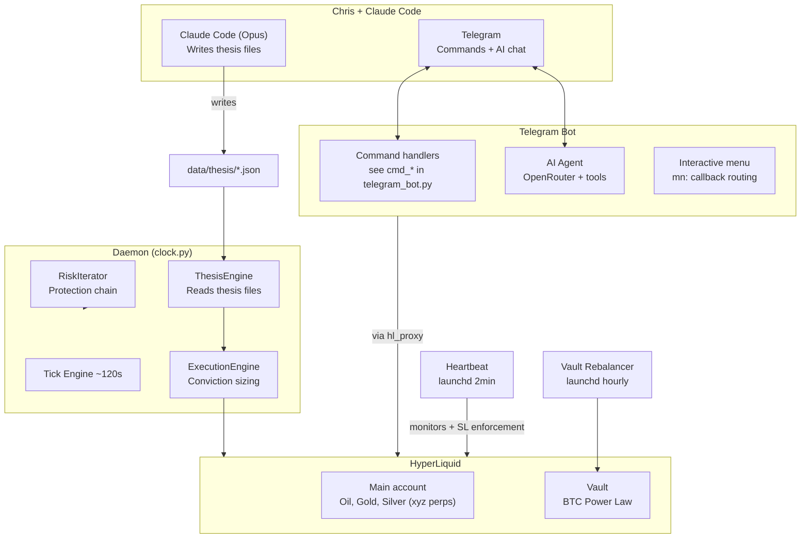

# System Architecture

The HyperLiquid Bot serves three roles: **copilot** (AI chat via Telegram), **research agent** (autonomous market analysis), and **risk manager** (stop enforcement, drawdown protection, position sizing).

## System Diagram

## Data Flow: Thesis to Execution

1. **Chris + Claude Code** analyze markets and write `ThesisState` files to `data/thesis/` with conviction scores (0.0-1.0), direction, TP/SL levels, and evidence.
2. **ThesisEngineIterator** reads thesis files every 60s into the daemon's `TickContext`. Stale theses (>72h) get conviction clamped to 50%.
3. **ExecutionEngine** maps conviction to position size via Druckenmiller bands, respecting authority delegation (agent/manual/off per asset).
4. **RiskManager** enforces hard limits: drawdown gates, circuit breakers, ruin prevention. Worst gate wins.
5. **Telegram Bot** provides a real-time dashboard and AI chat. WRITE actions (trades, SL/TP) require explicit approval via inline keyboard.

## Key Packages

| Package | Purpose |
|---------|---------|
| `common/` | Shared libraries: thesis, market_snapshot, context_harness, authority, watchlist, tools, renderer |
| `cli/` | Telegram bot, AI agent, agent tools, interactive menu, MCP server |
| `cli/daemon/` | Tick engine, iterators (see `iterators/` directory), tiers, state persistence |
| `modules/` | Candle cache, strategy modules |
| `parent/` | Exchange gateway (`hl_proxy.py`), risk manager, position tracker |
| `openclaw/` | Agent personality (AGENT.md, SOUL.md), auth profiles |
| `plugins/` | Power Law bot (vault rebalancer strategy) |
| `scripts/` | Standalone daemons (vault rebalancer) |

## What's Running vs Dormant

**Running in production:**
- Telegram bot (polling, commands, AI agent)
- Daemon in WATCH tier (monitoring, thesis reads, alerts -- not executing trades)
- Heartbeat (2-min launchd, stop enforcement)
- Vault rebalancer (hourly launchd)

**Built but dormant:**
- Daemon REBALANCE/OPPORTUNISTIC tiers (execution_engine, profit_lock, radar, pulse)
- Full autonomous trading loop (requires authority delegation to "agent" per asset)
