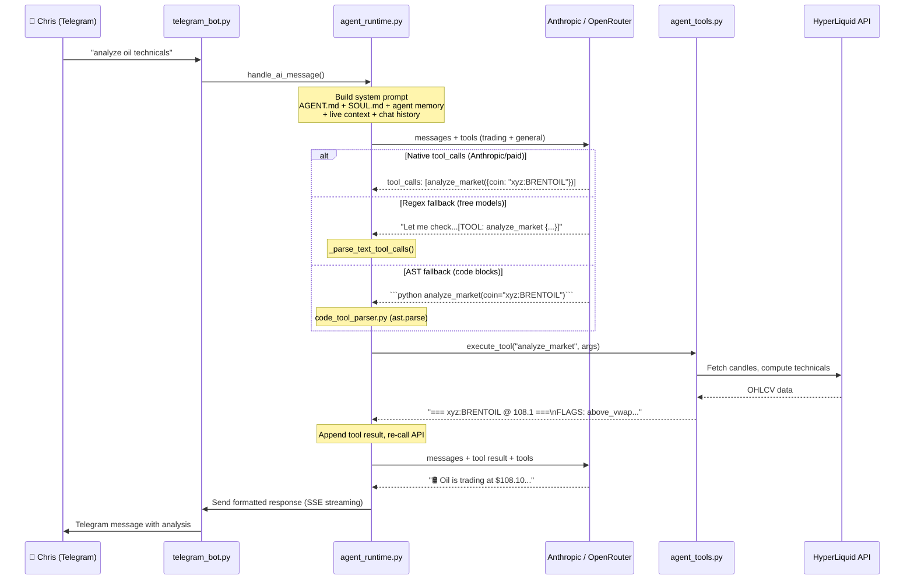
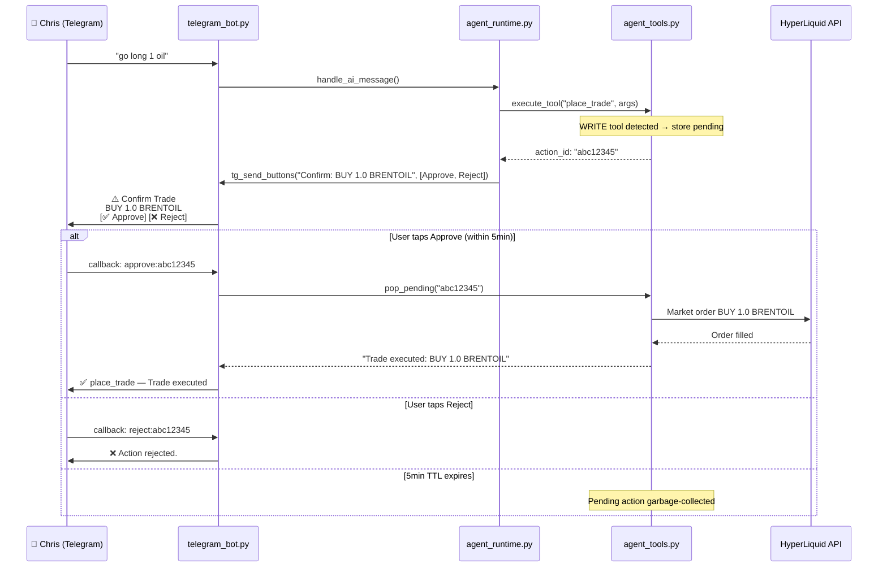
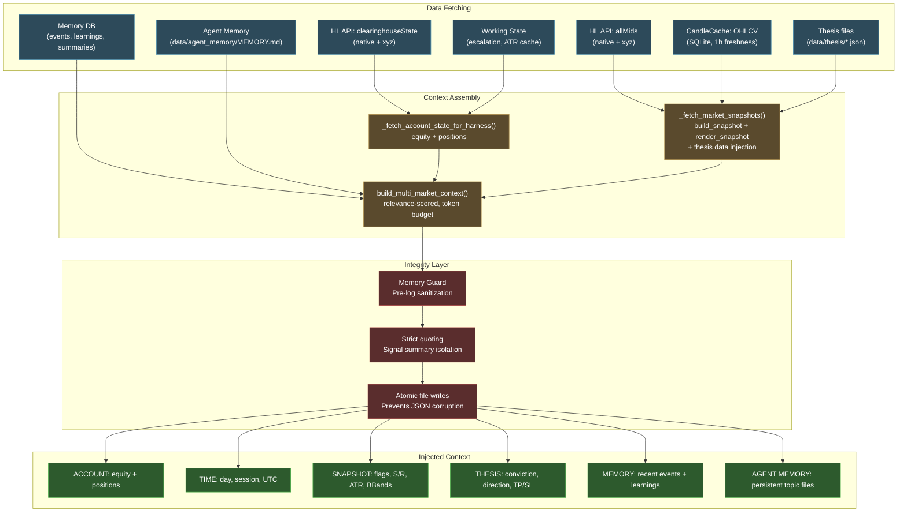
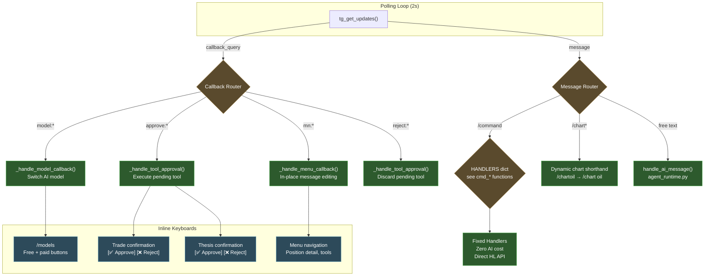
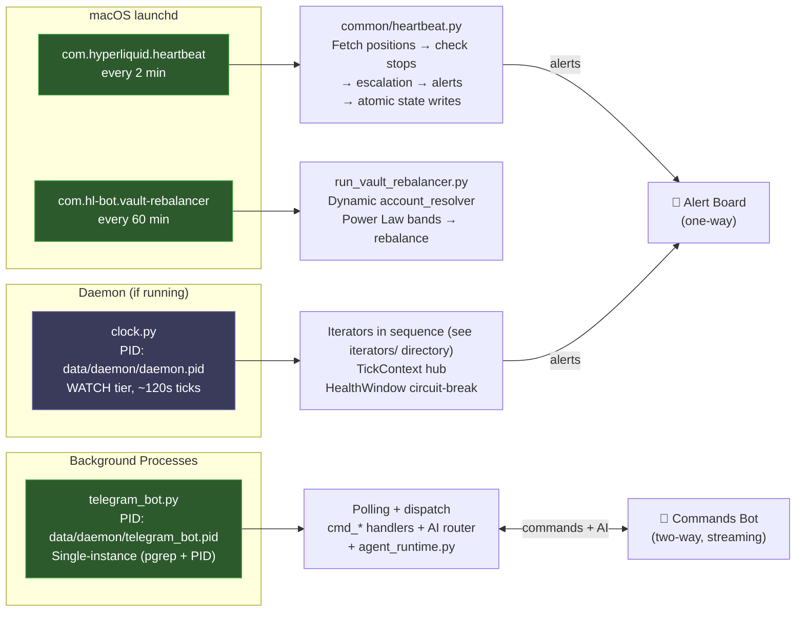
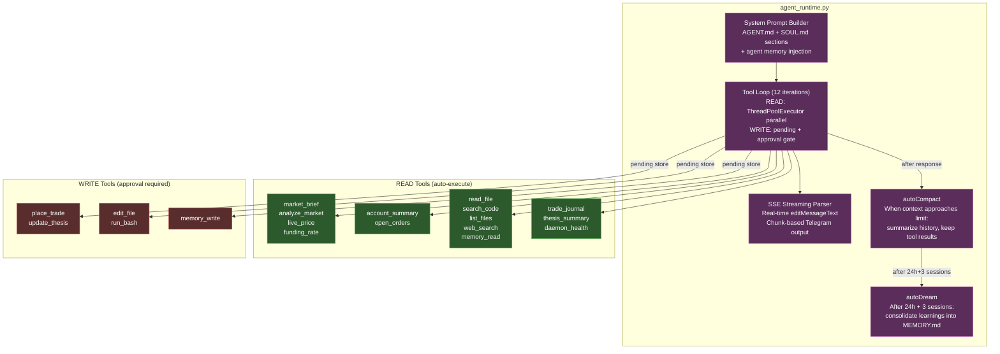

# HyperLiquid Trading System — Complete Architecture

*Updated 2026-04-05 (v4). Supersedes v1-v3 (archived in git). See [build-log.md](build-log.md) for version history.*

The system serves three roles: **copilot** (AI chat via Telegram), **research agent** (autonomous market analysis), and **risk manager** (stop enforcement, drawdown protection, conviction-based sizing). Built on four architecture generations:

| Version | Era | Key Innovation |
|---------|-----|---------------|
| v1 | Daemon-centric | 19 iterators, 4-phase plan, no UI |
| v2 | Interface-first | Telegram bot, OpenRouter bypass, rich AI context |
| v3 | Agentic tool-calling | 9 tools, dual-mode parsing, approval gates |
| v4 | Embedded agent runtime | Claude Code port, parallel tools, streaming, self-modification |

---

## 1. System Overview

```mermaid
graph TB
    subgraph HUMAN["👤 CHRIS (Human-in-the-Loop)"]
        CC["Claude Code (Opus)<br/>Manual sessions<br/>Writes thesis, reviews system"]
        TG_READ["Reads Telegram alerts"]
        TG_CMD["Sends /commands"]
        TG_CHAT["Chats with AI agent"]
    end

    subgraph EXCHANGE["🏦 HyperLiquid Exchange"]
        HL_API["HL REST API<br/>/info endpoint"]
        HL_TRADE["HL Trading API<br/>Orders, leverage, stops"]
        MAIN_ACCT["Main Account<br/>Oil, Gold, Silver<br/>xyz clearinghouse"]
        VAULT_ACCT["Vault<br/>BTC Power Law<br/>default clearinghouse"]
    end

    subgraph RUNTIME["⚙️ Running Processes (macOS)"]
        HB["Heartbeat<br/>launchd, every 2min<br/>common/heartbeat.py"]
        CMD_BOT["Telegram Bot<br/>background process<br/>cli/telegram_bot.py"]
        AI_AGENT["Embedded Agent Runtime<br/>cli/agent_runtime.py<br/>+ cli/telegram_agent.py"]
        VR["Vault Rebalancer<br/>launchd, hourly<br/>scripts/run_vault_rebalancer.py"]
    end

    subgraph AGENT_CORE["🧠 Agent Runtime (v4 — Claude Code Port)"]
        SYSPROMPT["System Prompt Builder<br/>AGENT.md + SOUL.md + Memory"]
        STREAMING["SSE Streaming Parser<br/>Real-time Telegram output"]
        COMPACT["Context Compactor<br/>Auto-summarize at limit"]
        DREAM["autoDream Consolidator<br/>24h + 3 sessions trigger"]
        GUARD["Memory Guard<br/>Pre-log sanitization<br/>Strict quoting"]
    end

    subgraph DATA["📁 Shared State (filesystem)"]
        THESIS["data/thesis/*.json<br/>Conviction, direction, TP<br/>THE shared contract"]
        MEMORY_DB["data/memory/memory.db<br/>SQLite 6-table store"]
        HISTORY_F["data/daemon/chat_history.jsonl"]
        CANDLE_DB["data/candles/candle_cache.db"]
        AGENT_MEM["data/agent_memory/<br/>MEMORY.md + topic files"]
        WORKING["data/memory/working_state.json<br/>ATR, prices, escalation"]
    end

    subgraph DAEMON_CODE["🔧 Daemon Engine (WATCH tier running)"]
        CLOCK["Clock Loop<br/>cli/daemon/clock.py<br/>~120s ticks"]
        CTX["TickContext<br/>cli/daemon/context.py"]
        ITERATORS["Iterators<br/>see iterators/ directory"]
    end

    subgraph LIBS["📚 Shared Libraries"]
        LIB_CTX["common/context_harness"]
        LIB_SNAP["common/market_snapshot"]
        LIB_THESIS["common/thesis"]
        LIB_MEM["common/memory_consolidator"]
        LIB_ACCT["common/account_resolver"]
        LIB_CANDLE["modules/candle_cache"]
        LIB_PROXY["parent/hl_proxy"]
        LIB_TELE["common/telemetry<br/>HealthWindow, atomic writes"]
    end

    %% Human → Bot
    CC -->|atomic writes| THESIS
    TG <--> CMD_BOT
    TG_CHAT --> AI_AGENT

    %% Agent internals
    AI_AGENT --> SYSPROMPT
    AI_AGENT --> STREAMING
    AI_AGENT --> COMPACT
    AI_AGENT --> DREAM
    AI_AGENT --> GUARD

    %% Data flows
    CMD_BOT -->|fetches| HL_API
    AI_AGENT -->|tools| HL_API
    AI_AGENT -->|tools| HL_TRADE
    HB -->|fetches + alerts| HL_API
    HB -->|places stops| HL_TRADE
    HB -->|alerts| TG_READ
    VR -->|trades| HL_TRADE
    CLOCK --> CTX
    CTX --> ITERATORS
    ITERATORS --> HL_API

    %% Libraries
    LIB_PROXY --> HL_API
    LIB_PROXY --> HL_TRADE
    LIB_CANDLE --> CANDLE_DB
    LIB_MEM --> MEMORY_DB
    LIB_THESIS --> THESIS

    %% Styling
    classDef running fill:#2d5a2d,stroke:#4a4,color:#fff
    classDef agent fill:#5a2d5a,stroke:#a4a,color:#fff
    classDef data fill:#5a4a2d,stroke:#a84,color:#fff
    classDef libs fill:#3a3a5a,stroke:#66a,color:#fff

    class CMD_BOT,HB,VR,CLOCK running
    class AI_AGENT,SYSPROMPT,STREAMING,COMPACT,DREAM,GUARD agent
    class THESIS,MEMORY_DB,HISTORY_F,CANDLE_DB,AGENT_MEM,WORKING data
    class LIB_CTX,LIB_SNAP,LIB_THESIS,LIB_MEM,LIB_ACCT,LIB_CANDLE,LIB_PROXY,LIB_TELE libs
```

---

## 2. Tool-Calling Architecture (v3→v4)

### Triple-Mode Tool Execution (ADR-008)

Three parsing modes form a fallback chain to support both paid and free models:

```mermaid
graph LR
    MSG["User Message"] --> OR["API Call<br/>(Anthropic or OpenRouter)<br/>tools param always sent"]

    OR -->|"finish_reason: tool_calls<br/>(Claude, GPT, Gemini)"| NATIVE["Native Function Calling<br/>Structured tool_calls array"]
    OR -->|"finish_reason: stop<br/>(Qwen, Llama, DeepSeek)"| TEXT["Text Response"]

    TEXT --> REGEX["Regex Parser<br/>[TOOL: name {args}]"]
    REGEX -->|"no matches"| AST["AST Code Parser<br/>code_tool_parser.py<br/>Python ast.parse (no eval)"]
    REGEX -->|"matches found"| EXEC
    AST -->|"matches found"| EXEC
    AST -->|"no matches"| DIRECT["Direct text response<br/>(context-only mode)"]

    NATIVE --> EXEC["execute_tool()<br/>agent_tools.py"]

    EXEC -->|"READ tool"| AUTO["Auto-execute<br/>ThreadPoolExecutor parallel"]
    EXEC -->|"WRITE tool"| PENDING["store_pending()<br/>Telegram approval gate"]

    PENDING -->|"[✅ Approve]"| WRITE_EXEC["Execute + respond"]
    PENDING -->|"[❌ Reject]"| DISCARD["Discard + notify"]
    PENDING -->|"5min TTL"| EXPIRE["Auto-expire<br/>Remove stale buttons"]

    RESULT["Tool result"] --> LOOP["Re-call API<br/>(max 12 iterations)"]

    AUTO --> RESULT
    WRITE_EXEC --> RESULT

    classDef native fill:#2d5a2d,stroke:#4a4,color:#fff
    classDef text fill:#2d4a5a,stroke:#48a,color:#fff
    classDef fallback fill:#5a4a2d,stroke:#a84,color:#fff
    classDef write fill:#5a2d2d,stroke:#a44,color:#fff

    class NATIVE native
    class TEXT,REGEX,AST text
    class DIRECT fallback
    class PENDING,WRITE_EXEC,EXPIRE write
```

### READ→WRITE Sequence Diagram

### WRITE Tool Approval Flow

---

## 3. AI Context Pipeline

Every message triggers a fresh context build:

---

## 4. Telegram Command & Callback Architecture

---

## 5. Process Architecture

---

## 6. File Dependency Map

```mermaid
graph TD
    subgraph ENTRY["Entry Layer"]
        TB["cli/telegram_bot.py<br/>Command handlers, polling, callbacks"]
        AR["cli/agent_runtime.py<br/>Claude Code port: streaming,<br/>parallel tools, compaction, dream"]
        TA["cli/telegram_agent.py<br/>OpenRouter/Anthropic, tool loop"]
        AT["cli/agent_tools.py<br/>Tool definitions + dispatch"]
    end

    subgraph INTEGRITY["Integrity Layer"]
        MG["modules/memory_guard.py<br/>Pre-log sanitization"]
        HBS["common/heartbeat_state.py<br/>Atomic JSON writes"]
        TEL["common/telemetry.py<br/>HealthWindow, atomic ops"]
    end

    subgraph COMMON_LAYER["Common Layer"]
        CH["common/context_harness.py<br/>Relevance-scored assembly"]
        MS["common/market_snapshot.py<br/>build_snapshot, render_snapshot"]
        TH["common/thesis.py<br/>ThesisState dataclass"]
        ACR["common/account_resolver.py<br/>Dynamic wallet resolution"]
        MC["common/memory_consolidator.py<br/>Event compression"]
        MM["common/memory.py<br/>SQLite 6-table store"]
        CTP["common/code_tool_parser.py<br/>AST-based tool parsing"]
        HB_C["common/heartbeat.py<br/>2-min monitoring"]
        WL["common/watchlist.py<br/>Dynamic market whitelist"]
    end

    subgraph MODULE_LAYER["Module Layer"]
        CC_M["modules/candle_cache.py<br/>OHLCV SQLite cache"]
        RE["modules/reflect_engine.py<br/>Meta-evaluation"]
        RA["modules/radar_engine.py<br/>Opportunity scanner"]
        PE["modules/pulse_engine.py<br/>Momentum signals"]
        AE["modules/apex_engine.py<br/>Playbook accumulator"]
    end

    subgraph PARENT_LAYER["Parent Layer"]
        HP["parent/hl_proxy.py<br/>Exchange API wrapper"]
        RM["parent/risk_manager.py<br/>ProtectionChain"]
    end

    TB -->|"routes AI"| AR
    TB -->|"routes AI (legacy)"| TA
    TB -->|"approval callbacks"| AT
    AR -->|"tools"| AT
    TA -->|"tool definitions"| AT
    AR -->|"context build"| CH
    TA -->|"context build"| CH
    AR -->|"sanitization"| MG
    AT -->|"market tools"| MS
    AT -->|"market tools"| CC_M
    AT -->|"account tools"| ACR
    AT -->|"thesis tools"| TH
    AT -->|"exchange tools"| HP
    AT -->|"code parsing"| CTP
    CH -->|"memory"| MC
    MC -->|"storage"| MM
    MS -->|"candles"| CC_M
    HB_C -->|"exchange"| HP
    HP -->|"REST"| HL["HL API"]
    HBS -->|"atomic state"| TEL

    classDef entry fill:#5a4a2d,stroke:#a84,color:#fff
    classDef integrity fill:#5a2d2d,stroke:#a44,color:#fff
    classDef common fill:#2d4a5a,stroke:#48a,color:#fff
    classDef module fill:#3a3a5a,stroke:#66a,color:#fff
    classDef parent fill:#2d5a2d,stroke:#4a4,color:#fff

    class TB,AR,TA,AT entry
    class MG,HBS,TEL integrity
    class CH,MS,TH,ACR,MC,MM,CTP,HB_C,WL common
    class CC_M,RE,RA,PE,AE module
    class HP,RM parent
```

---

## 7. Embedded Agent Runtime (v4 — ADR-009)

Ported from Claude Code's TypeScript to Python. Five critical components:

---

## 8. Conviction Engine — Data Flow

```mermaid
graph LR
    subgraph WRITER["Layer 1: Thesis Writer"]
        CHRIS["👤 Chris + Claude Code"]
        AI_TOOL["AI Agent<br/>update_thesis tool"]
    end

    subgraph CONTRACT["Shared Contract"]
        THESIS_F["data/thesis/*.json<br/>ThesisState dataclass<br/>conviction 0.0-1.0<br/>direction, TP/SL, evidence"]
    end

    subgraph READER["Layer 2: Execution Reader"]
        TE["ThesisEngineIterator<br/>Every 60s tick<br/>Staleness: >72h = halved"]
        EE["ExecutionEngine<br/>Druckenmiller bands<br/>conviction → size"]
        AUTH["Authority check<br/>agent / manual / off"]
    end

    subgraph SAFETY["Safety Gates"]
        RISK["ProtectionChain<br/>4 composable protections<br/>Worst gate wins"]
        BANDS["Conviction Bands<br/>0.0-0.2: exit<br/>0.2-0.5: cautious 6%<br/>0.5-0.8: standard 12%<br/>0.8-1.0: full 20%"]
        RUIN["Ruin Prevention<br/>25% DD: halt entries<br/>40% DD: close ALL"]
    end

    CHRIS -->|"writes"| THESIS_F
    AI_TOOL -->|"writes (approved)"| THESIS_F
    THESIS_F --> TE
    TE -->|"ctx.thesis_states"| EE
    EE --> AUTH
    AUTH -->|"agent-delegated"| BANDS
    BANDS --> RISK
    RISK -->|"OPEN gate"| ORDER["OrderIntent → HL API"]
    RISK -->|"COOLDOWN/CLOSED"| BLOCK["Blocked"]
    RUIN -.->|"unconditional"| ORDER

    classDef writer fill:#5a4a2d,stroke:#a84,color:#fff
    classDef contract fill:#2d4a5a,stroke:#48a,color:#fff
    classDef reader fill:#2d5a2d,stroke:#4a4,color:#fff
    classDef safety fill:#5a2d2d,stroke:#a44,color:#fff

    class CHRIS,AI_TOOL writer
    class THESIS_F contract
    class TE,EE,AUTH reader
    class RISK,BANDS,RUIN safety
```

---

## 9. Infrastructure Health Assessment

| Area | Status | Notes |
|------|--------|-------|
| **Import chains** | ✅ CLEAN | Zero circular deps, all lazy imports correct |
| **Orphaned files** | ✅ ZERO | Every .py file has at least one importer |
| **Data flow** | ✅ COMPLETE | User → Bot → Agent → Tools → HL API fully traced |
| **Config files** | ✅ ALL REFERENCED | Configs all loaded by code |
| **Process management** | ✅ ROBUST | PID + pgrep single-instance, SIGTERM/SIGKILL |
| **Error handling** | ✅ GRACEFUL | 429 retry, tool fallback, context-only degradation |
| **Security** | ✅ LAYERED | WRITE tools gated by approval buttons, 5min TTL |
| **File integrity** | ✅ ATOMIC | Atomic JSON writes prevent corruption on crash |
| **Memory integrity** | ✅ SANITIZED | Pre-log sanitization, strict quoting, no instruction poisoning |
| **Chat history** | ✅ SANITIZED | Stale data stripped before LLM injection |
| **Context budget** | ✅ BOUNDED | Relevance-scored tiers, auto-compaction |
| **Streaming** | ✅ SSE | Real-time Telegram output via editMessageText |
| **Self-modification** | ✅ GATED | edit_file + run_bash with approval gates, sandboxed to project root |

---

## 10. Module Inventory

| Area | Key Nodes | Status |
|------|-----------|--------|
| `cli/` (bot+agent+tools+runtime) | telegram_bot.py, agent_runtime.py, agent_tools.py | ✅ Running, agentic (v4) |
| `cli/commands/` | main.py dispatch | ✅ All connected |
| `cli/daemon/` | context.py hub, clock.py | 🟡 WATCH tier running |
| `cli/daemon/iterators/` | see iterators/ directory | ✅ Connected |
| `modules/` | candle_cache, radar, pulse, reflect, apex, memory_guard | ✅ Used by tools + daemon |
| `common/` | context_harness, market_snapshot, thesis, account_resolver, telemetry | ✅ All connected |
| `parent/` | hl_proxy, risk_manager | ✅ All connected |
| `execution/` | order_types | ✅ Connected |
| `strategies/` | via sdk.base | ✅ Connected |
| `agent/` | AGENT.md, SOUL.md — agent system prompt | ✅ Active |
| `skills/` | apex, guard, onboard, pulse, radar, reflect | ✅ Available |

---

## 11. Build Phases

### ✅ Phase 1: Foundation (DONE)
Heartbeat, thesis contract, conviction engine, single-instance processes.

### ✅ Phase 1.5: Agentic Interface (DONE)
Telegram commands, OpenRouter integration, AI context pipeline, tool calling with approval gates.

### ✅ Phase 2: Daemon + UX Hardening (DONE)
Interactive menu system, write commands (/close, /sl, /tp), composable protection chain, HealthWindow, Renderer ABC, signal engine, daemon running in WATCH tier.

### ✅ Phase 2.5: Embedded Agent Runtime (DONE)
Claude Code port to Python (agent_runtime.py). Parallel tool execution, SSE streaming, context compaction, autoDream memory consolidation. Anthropic direct API. 8 general tools including codebase access and self-modification.

### 🔧 Phase 3: REFLECT Loop (IN PROGRESS)
Wire ReflectEngine into daemon. Nightly journal review, weekly report card to Telegram. Convergence tracking.

### 📋 Phase 4: Self-Improving (PLANNED)
Playbook accumulates what works per (instrument, signal). DirectionalHysteresis prevents oscillation. Meta-evaluation suggests parameter adjustments. Weekly REFLECT summary to Chris.
