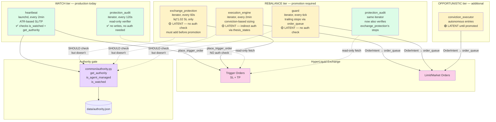
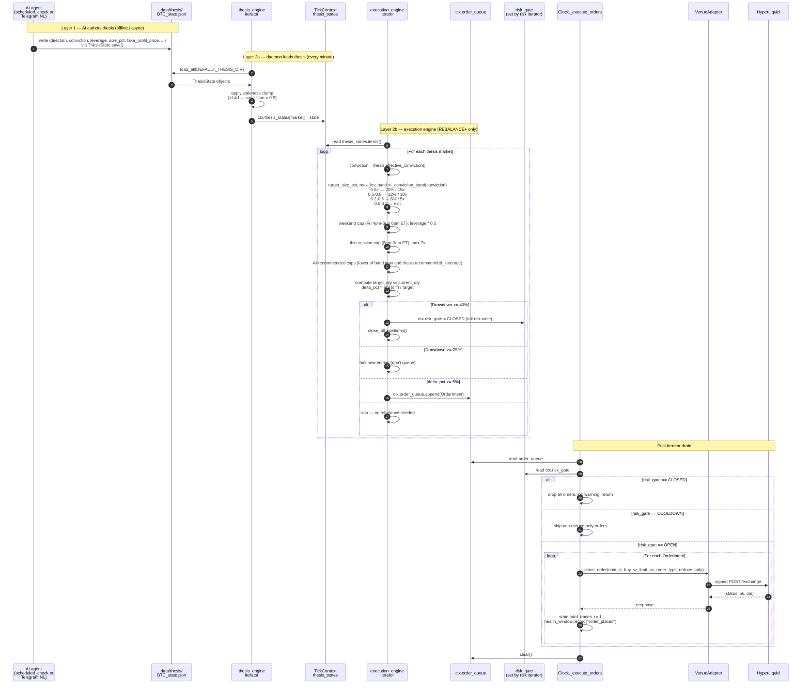
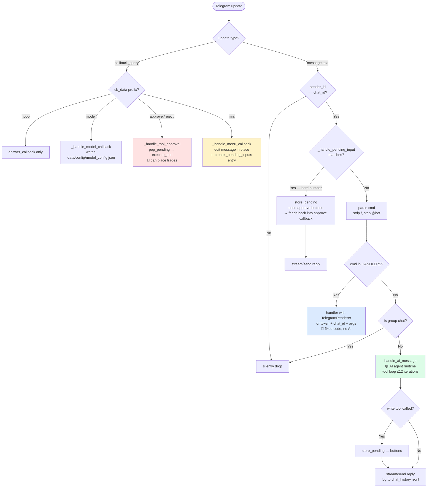

# Master Architecture Diagrams

**Date:** 2026-04-07
**Verification:** Every diagram in this doc was built from code, not from prior wiki
content. Each carries a "Verified against" footer naming the source file(s). See
`verification-ledger.md` for the audit methodology.
**Purpose:** Seven canonical mermaid views of the system. When you need to explain
how the bot works to a new agent session, point at this doc — not at the prose
elsewhere.

> **The seven views:**
> 1. Process topology (3 long-running processes + their I/O)
> 2. Three-writer authority model (refined, with status badges)
> 3. TickContext fan-in / fan-out (per tier)
> 4. Conviction → execution chain (thesis to fill)
> 5. Daemon clock harness (the safety subsystems prior docs missed)
> 6. Data store ownership map (writers, readers, criticality)
> 7. Telegram routing tree (slash / NL / button)
>
> View 7 is also in `workflows/telegram-input-trace.md` in expanded form. It's
> repeated here for self-containedness.

---

## View 1: Process Topology

The bot has **three** long-running OS processes plus optional CLI invocations.
The agent runtime lives **inside** the telegram_bot process — it is not its own
daemon, despite the prior docs sometimes implying otherwise.

```mermaid
graph TB
    subgraph "External — exchange"
        HL[(HyperLiquid API<br/>native + xyz dex)]
    end

    subgraph "External — model providers"
        Anthropic[Anthropic API<br/>Sonnet/Opus via session token<br/>Haiku via streaming]
        OR[OpenRouter API<br/>fallback for free models]
    end

    subgraph "External — Telegram"
        TG[(Telegram Bot API)]
    end

    subgraph "Process A — telegram_bot.py (foreground)"
        Run[run polling loop<br/>2s interval]
        Handlers[HANDLERS dict<br/>fixed slash commands]
        Agent[handle_ai_message<br/>embedded agent runtime]
        Tools[agent_tools<br/>execute_tool + WRITE_TOOLS]
        PendingMem[_pending_actions<br/>in-memory dict, 5 min TTL]
    end

    subgraph "Process B — daemon clock.py (launchd)"
        Tick[Clock._tick<br/>configurable interval]
        Iter[Iterator stack<br/>per cli/daemon/tiers.py]
        Ctx[TickContext<br/>fresh per tick]
        Order[OrderIntent queue<br/>drained via _execute_orders]
        Adapter[VenueAdapter<br/>parent/hl_proxy.py]
        Health[HealthWindow<br/>auto-downgrade]
    end

    subgraph "Process C — heartbeat.py (launchd, every 2 min)"
        HB[heartbeat main loop]
        ATR[ATR-based SL/TP<br/>compute_stop_price]
        AuthCheck[is_watched + get_authority<br/>per-position gate]
    end

    subgraph "Shared state on disk"
        Thesis[(data/thesis/*.json)]
        WS[(data/memory/working_state.json)]
        Mem[(data/memory/memory.db)]
        Snap[(data/snapshots/)]
        Auth[(data/authority.json)]
        Watch[(data/config/watchlist.json)]
        Chat[(data/daemon/chat_history.jsonl)]
        Funding[(state/funding.json)]
    end

    Run --> Handlers
    Run --> Agent
    Agent --> Tools
    Agent --> Anthropic
    Agent --> OR
    Tools --> PendingMem
    Tools --> HL
    Handlers --> HL
    Run --> TG
    TG --> Run
    Run --> Chat
    Agent --> Chat
    Agent --> Mem

    Tick --> Iter
    Iter --> Ctx
    Iter --> Order
    Order --> Adapter
    Adapter --> HL
    Iter --> Mem
    Iter --> Snap
    Iter --> Thesis
    Iter --> Watch
    Iter --> Funding
    Iter --> Health
    Health --> Tick

    HB --> AuthCheck
    HB --> ATR
    ATR --> HL
    HB --> Mem
    HB --> WS
    HB --> Auth

    Run -.read.-> Auth
    Agent -.read.-> Thesis
    Agent -.read.-> WS
    Iter -.read.-> Auth
    Iter -.read.-> Thesis
    Iter -.read.-> Watch

    style Run fill:#dbeafe
    style Agent fill:#dcfce7
    style HB fill:#fee2e2
    style Tick fill:#fef3c7
    style HL fill:#fbcfe8
```



**Verified against:** `cli/telegram_bot.py:run()`, `cli/telegram_agent.py:handle_ai_message`,
`cli/daemon/clock.py:Clock._tick`, `common/heartbeat.py`, `common/authority.py`,
`cli/daemon/tiers.py`, `common/credentials.py`.

**Process management:**
- **Process A** (telegram_bot.py) is started via `hl telegram start` (or directly
  via `python cli/telegram_bot.py`). Single-instance enforced via PID file + pgrep.
- **Process B** (daemon clock.py) is started via `hl daemon start --tier watch
  --mainnet --tick 120` or via launchd plist. Single-instance enforced via
  StateStore PID management. Production runs in WATCH tier.
- **Process C** (heartbeat.py) is a launchd job (`com.hl-bot.heartbeat.plist`)
  that runs every 2 minutes, does its work, and exits. Not a long-running daemon
  in the strict sense — it's a periodic batch.

**Critical coordination rule:** Heartbeat and `exchange_protection` (which lives in
the daemon iterator stack) **must not run simultaneously**. Heartbeat is active in
WATCH tier; on promotion to REBALANCE, the operator must `launchctl unload` the
heartbeat plist. See `tier-state-machine.md` § Transition Checklist.

---

## View 2: Three-Writer Authority Model

This view replaces the diagram in `writers-and-authority.md` with a refined version
that includes status badges (per the verification ledger reconciliation) and
correctly shows that `protection_audit` runs in **all three tiers**, not just WATCH.



**Verified against:** `cli/daemon/tiers.py`, `cli/daemon/iterators/exchange_protection.py`,
`cli/daemon/iterators/execution_engine.py`, `cli/daemon/iterators/protection_audit.py`,
`common/heartbeat.py:650-675`, `common/authority.py`.

**Status badge legend:**
- 🟢 **ACTIVE** — runs in current production tier (WATCH); behavior is what production sees today
- 🟡 **LATENT-REBALANCE** — only fires on tier promotion; gap is dormant in production
- 🟢 **LATENT-OPPORTUNISTIC** — only fires at the highest tier; further away from production

**The four authority gaps to close before WATCH→REBALANCE promotion:**
1. `exchange_protection` — add `is_agent_managed(inst)` check before `_protect_position`
2. `execution_engine` — add explicit `is_agent_managed(market)` check in `_process_market`
3. `guard` — add per-position authority check before queueing OrderIntent
4. `clock._execute_orders` — add per-asset gate as defense-in-depth fallback

---

## View 3: TickContext Fan-In / Fan-Out (per tier)

This is what happens **inside** one tick of `Clock._tick()` in WATCH tier (production).
Read top-to-bottom — each iterator either populates a TickContext field (writer) or
consumes one (reader). The `OrderState` lifecycle on `OrderIntent` means orders
carry persistence across ticks even though the TickContext itself is rebuilt fresh.

```mermaid
graph TB
    subgraph Inputs["External inputs"]
        HL2[(HL API)]
        Disk[(disk: thesis, watchlist,<br/>candles, working_state)]
    end

    subgraph Tick["One tick (WATCH tier)"]
        AC[1. account_collector<br/>writes: snapshot_ref,<br/>account_drawdown_pct,<br/>high_water_mark]
        Conn[2. connector<br/>writes: balances, positions,<br/>prices, candles, all_markets]
        LM[3. liquidation_monitor<br/>reads: positions, prices<br/>writes: alerts]
        FT[4. funding_tracker<br/>reads: positions, prices<br/>writes: alerts]
        PA[5. protection_audit<br/>reads: positions, prices<br/>writes: alerts]
        Brent[6. brent_rollover_monitor<br/>writes: alerts]
        MS[7. market_structure<br/>reads: prices, candles, positions, thesis_states<br/>writes: market_snapshots, prices fallback]
        TE[8. thesis_engine<br/>reads disk: data/thesis/*.json<br/>writes: thesis_states]
        Radar[9. radar<br/>reads: candles, all_markets<br/>writes: radar_opportunities, alerts]
        Pulse[10. pulse<br/>reads: candles, all_markets<br/>writes: pulse_signals, alerts]
        Liq[11. liquidity<br/>writes: alerts]
        Risk[12. risk<br/>reads: HWM, drawdown, positions, prices<br/>writes: risk_gate, alerts<br/>worst-gate-wins merge]
        Apex[13. apex_advisor<br/>reads: pulse_signals, radar_opportunities,<br/>positions, prices<br/>writes: alerts<br/>DRY-RUN only in WATCH]
        AR[14. autoresearch<br/>reads: thesis_states, positions, prices, balances<br/>writes: alerts<br/>memory.db read-only in WATCH]
        MC[15. memory_consolidation<br/>writes: memory.db summaries]
        Journal[16. journal<br/>reads: timestamp, balances, prices, positions,<br/>risk_gate, active_strategies, thesis_states<br/>writes: alerts, ticks.jsonl]
        Telegram[17. telegram<br/>reads: alerts, risk_gate, order_queue,<br/>balances, positions, active_strategies<br/>writes: external Telegram]
    end

    subgraph Drain["Post-iterator drain"]
        Exec[Clock._execute_orders<br/>checks risk_gate<br/>NOT in WATCH<br/>order_queue is always empty]
        TGI[Telegram I/O]
        State[Persist DaemonState]
    end

    HL2 --> Conn
    Disk --> AC
    Disk --> TE
    Disk --> MS

    AC --> Conn
    Conn --> LM
    LM --> FT
    FT --> PA
    PA --> Brent
    Brent --> MS
    MS --> TE
    TE --> Radar
    Radar --> Pulse
    Pulse --> Liq
    Liq --> Risk
    Risk --> Apex
    Apex --> AR
    AR --> MC
    MC --> Journal
    Journal --> Telegram
    Telegram --> Exec
    Exec --> TGI
    TGI --> State

    style AC fill:#dbeafe
    style Conn fill:#dbeafe
    style LM fill:#dcfce7
    style FT fill:#dcfce7
    style PA fill:#dcfce7
    style Brent fill:#dcfce7
    style MS fill:#fef3c7
    style TE fill:#fef3c7
    style Radar fill:#fef3c7
    style Pulse fill:#fef3c7
    style Liq fill:#dcfce7
    style Risk fill:#fee2e2
    style Apex fill:#fef3c7
    style AR fill:#dcfce7
    style MC fill:#e9d5ff
    style Journal fill:#e9d5ff
    style Telegram fill:#e9d5ff
    style Exec fill:#fbcfe8
```



**Verified against:** `cli/daemon/tiers.py['watch']`, `cli/daemon/context.py:TickContext`,
each iterator's `tick()` method, `cli/daemon/clock.py:_tick`.

**Color legend:**
- 🟦 Blue — data inputs (from HL API or disk)
- 🟩 Green — read-only or alert-only iterators
- 🟨 Yellow — iterators that write to TickContext shared state (signal data)
- 🟥 Red — iterators that write to risk_gate (the gate that controls order execution)
- 🟪 Purple — iterators that write to persistent storage (memory.db, journal, Telegram)
- 🟪 Pink — order execution drain (NOT in WATCH; only in REBALANCE+)

**Key observation:** In WATCH tier, the `Clock._execute_orders` step always finds an
empty `order_queue` because no iterator in WATCH writes to it. The drain step is a
no-op. The whole tick is observation + alerting only.

For REBALANCE/OPPORTUNISTIC tiers, additional iterators between steps 7 and 14 write
to `order_queue`:
- `execution_engine` (after `thesis_engine`) — conviction-based sizing
- `exchange_protection` (after `execution_engine`) — ruin SL placement
- `guard` (after `risk`) — trailing stops
- `rebalancer` (after `guard`) — strategy roster
- `profit_lock` (after `rebalancer`) — partial closes
- `catalyst_deleverage` (after `funding_tracker`) — pre-event reduce

Then `Clock._execute_orders` drains the queue, gated by `risk_gate`.

---

## View 4: Conviction → Execution Chain (Thesis to Fill)

This is the **two-layer architecture** that the bot is designed around: AI authors
thesis files, execution engine reads them, conviction band picks size + leverage,
order goes through risk gate + adapter to exchange.



**Verified against:** `common/thesis.py`, `cli/daemon/iterators/thesis_engine.py`,
`cli/daemon/iterators/execution_engine.py:_process_market`,
`cli/daemon/iterators/risk.py`, `cli/daemon/clock.py:_execute_orders + _submit_order`.

**Critical contracts:**
- **Thesis is the AI/execution interface.** AI writes JSON files; daemon reads them
  every minute. There is no IPC, RPC, or shared memory — the disk is the channel.
- **Conviction bands are deterministic** (Druckenmiller pyramid rule). Given the same
  conviction value, the same size and leverage come out every time.
- **Hard constraints baked into execution_engine**: 25% / 40% drawdown gates,
  weekend / thin-session leverage caps, LONG-or-NEUTRAL-only on oil (per
  CLAUDE.md), conviction kill-switch (`conviction_bands.enabled = false`).
- **The risk gate is the final say.** Even if execution_engine queues orders, if
  `risk.py` writes `risk_gate = CLOSED` later in the same tick, all orders get
  dropped at the drain step. See `tickcontext-provenance.md` §"Critical Issues" #1
  for the reconciled write-ordering story.

---

## View 5: Daemon Clock Harness (the safety subsystems prior docs missed)

This view documents the five wrapper subsystems in `Clock._tick` that the prior
architecture docs never mentioned. They're the bot's production-grade safety net.

```mermaid
graph TB
    subgraph Clock["Clock._tick (one tick)"]
        Start([tick begin])
        MakeCtx[_make_context<br/>fresh TickContext + active_strategies]
        Control[_process_control<br/>read control file<br/>shutdown / set_tier / add_strategy]
        Active[_rebuild_active_set<br/>filter iterators by current tier]

        subgraph Wrap["Per-iterator wrapping (run_with_middleware)"]
            MW[run_with_middleware<br/>timeout_s + telemetry]
            Tick[iterator.tick(ctx)]
            MWout{mw.status}
            Fail[_consecutive_failures + 1<br/>health_window.record error]
            CB{failures >= max_consecutive_failures?}
            Trip[Circuit breaker open<br/>alerts.append CRITICAL<br/>_maybe_downgrade_tier]
            Reset[_consecutive_failures = 0]
        end

        Budget[health_window.budget_exhausted?]
        AutoDown[_maybe_downgrade_tier]
        Drain[_execute_orders<br/>drain queue gated by risk_gate]
        Alerts[for each alert in ctx.alerts:<br/>log severity]
        Persist[store.save_state<br/>roster.save]
        Telem[telemetry.set_health_window<br/>telemetry.end_cycle<br/>trajectory.log tick_complete]
        End([tick end])
    end

    Start --> MakeCtx
    MakeCtx --> Control
    Control --> Active
    Active --> MW
    MW --> Tick
    Tick --> MWout
    MWout -->|ok| Reset
    MWout -->|error/timeout| Fail
    Fail --> CB
    CB -->|yes| Trip
    CB -->|no| MW
    Reset --> MW
    Trip --> MW
    MW --> Budget
    Budget -->|yes| AutoDown
    Budget -->|no| Drain
    AutoDown --> Drain
    Drain --> Alerts
    Alerts --> Persist
    Persist --> Telem
    Telem --> End

    style MW fill:#fef3c7
    style Trip fill:#fee2e2
    style AutoDown fill:#fee2e2
    style Drain fill:#fbcfe8
    style Persist fill:#dbeafe
```

**Verified against:** `cli/daemon/clock.py:_tick`, `common/middleware.py:run_with_middleware`,
`common/telemetry.py:HealthWindow + TelemetryRecorder`, `common/trajectory.py:TrajectoryLogger`.

**The five subsystems and what they protect against:**

| Subsystem | Code | Protects against |
|---|---|---|
| **`run_with_middleware`** | `common/middleware.py` | Iterator hang (per-iterator `timeout_s`); silent failures (returns `mw.status`); telemetry capture |
| **`_consecutive_failures` + circuit breaker** | `clock.py:51, 137-160` | A single iterator repeatedly failing while others run normally — auto-downgrades tier after `max_consecutive_failures` consecutive errors |
| **`HealthWindow`** | `common/telemetry.py:HealthWindow(window_s=900, error_budget=10)` | Slow accumulation of errors across many iterators — sliding window with error budget; auto-downgrades when exhausted |
| **`TelemetryRecorder`** | `common/telemetry.py:TelemetryRecorder` | Lack of per-cycle observability — records latency, errors, alerts to `state/telemetry.json` |
| **`TrajectoryLogger`** | `common/trajectory.py` | Lack of historical event trail — append-only event log to `logs/trajectories/` |
| **`_maybe_downgrade_tier`** | `clock.py:264` | Auto-rollback safety: triggered by circuit breaker OR health budget exhaustion. Drops to a safer tier without operator action |

**Why this matters:** The prior architecture docs framed the daemon as "a tick loop
that runs iterators". That's true, but it misses the most important part: there are
**five layers of defense** wrapped around every iterator call. The daemon will
auto-downgrade itself out of REBALANCE/OPPORTUNISTIC if it gets unhealthy. That's
production-grade behavior the docs never mentioned.

---

## View 6: Data Store Ownership Map

Aligned with the verification of `data-stores.md`. Color = criticality, dashed
arrow = read-only access, solid arrow = write.

```mermaid
graph LR
    subgraph Critical["🔴 CRITICAL — losing these breaks the bot"]
        Snap[(data/snapshots/<br/>+ hwm.json<br/>account history + HWM)]
        Mem[(data/memory/memory.db<br/>events, learnings, traces, summaries)]
        Thesis[(data/thesis/*.json<br/>AI conviction state<br/>NO dual-write backup)]
        WS[(data/memory/working_state.json<br/>escalation, ATR cache<br/>NO WAL recovery)]
        Config[(data/config/*.json<br/>watchlist, model_config,<br/>profit_rules, etc.<br/>NO backup)]
    end

    subgraph High["🟡 HIGH — important but recoverable"]
        Chat[(chat_history.jsonl<br/>78K verified 2026-04-07<br/>AI memory across turns)]
        Funding[(state/funding.json<br/>cumulative funding by symbol)]
        Candles[(data/candles/candles.db<br/>800K SQLite WAL<br/>regenerable from HL API)]
        AgentMem[(data/agent_memory/*.md<br/>MEMORY.md, dreams, learnings<br/>25K rolling trim)]
    end

    subgraph Medium["🟢 MEDIUM — operational logs"]
        Ticks[(data/daemon/journal/ticks.jsonl<br/>1.1MB after 1 day<br/>🔴 ACTIVE growth concern)]
        State[(data/daemon/state.json<br/>tier, tick_count, daily_pnl)]
        Diag[(data/diagnostics/*.jsonl<br/>5×500K rotated)]
        Telem[(state/telemetry.json<br/>last 20 cycles)]
    end

    subgraph Low["🟦 LOW — convenience / catalog"]
        Calendar[(data/calendar/*.json<br/>brent rollover, etc.)]
        Roster[(data/daemon/roster.json)]
        TGoff[(telegram_last_update_id.txt)]
        PID[(daemon.pid)]
    end

    AC[account_collector] -->|every 5min| Snap
    AC -.dual-write.-> Mem
    HB[heartbeat] -->|every 2min| Mem
    HB -->|action_log + execution_traces| Mem
    HB -->|escalation + ATR cache| WS
    MC[memory_consolidator] -->|hourly| Mem
    AI[AI agent] -->|via tools| Thesis
    AI -.write via memory_write tool.-> AgentMem
    AI -->|every turn| Chat
    Run[telegram_bot.py] --> Diag
    Run --> Calendar
    Tick[clock] --> State
    Tick --> Telem
    Tick --> PID
    JI[journal iterator] -->|every tick| Ticks
    FI[funding_tracker] --> Funding
    CI[connector] -->|via candle_cache| Candles
    Setup[CLI setup] --> Config
    Daemon[daemon.py] --> Roster

    Run -.read.-> Mem
    Run -.read.-> WS
    Run -.read.-> Snap
    Run -.read.-> Chat
    Run -.read.-> Config
    Tick -.read.-> Config
    Tick -.read.-> Watch[(data/config/watchlist.json)]
    Tick -.read.-> Thesis
    Tick -.read.-> Funding

    style Snap fill:#fee2e2
    style Mem fill:#fee2e2
    style Thesis fill:#fee2e2
    style WS fill:#fee2e2
    style Config fill:#fee2e2
    style Chat fill:#fef3c7
    style Funding fill:#fef3c7
    style Candles fill:#fef3c7
    style AgentMem fill:#fef3c7
    style Ticks fill:#dcfce7
    style State fill:#dcfce7
    style Diag fill:#dcfce7
    style Telem fill:#dcfce7
```



**Verified against:** `data-stores.md` (post-reconciliation), `cli/daemon/iterators/account_collector.py`,
`common/memory.py`, `common/heartbeat_state.py`, `common/thesis.py`,
`cli/daemon/iterators/journal.py`, `common/funding_tracker.py`,
`modules/candle_cache.py`, `common/memory_consolidator.py`.

**Two SPOF (single point of failure) categories that need attention:**

1. **No dual-write backup:** thesis files, working_state.json, funding.json. If any
   of these is lost, the bot loses material state with no recovery path. Compare to
   account snapshots which dual-write to `memory.db.account_snapshots`.
2. **No retention logic:** ticks.jsonl (active concern, ~365MB/year unrotated),
   chat_history.jsonl (mild — slow growth), candles.db (mild — regenerable). The
   diagnostics file is the only one with proper rotation (5×500K).

---

## View 7: Telegram Routing Tree (Compact)

The expanded version of this view is in `workflows/telegram-input-trace.md`. This
compact form is included here so the master diagrams doc is self-contained.



**Verified against:** `cli/telegram_bot.py:run` (lines ~3083-3320), the four callback
handlers (`_handle_model_callback`, `_handle_tool_approval`, `_handle_menu_callback`,
`_handle_pending_input`), and `cli/telegram_agent.py:handle_ai_message`.

**See also:** `workflows/telegram-input-trace.md` for the line-by-line walkthrough,
including the WRITE-tool approval async pattern.

---

## How to update this doc

1. Read the source files listed in the "Verified against" footer of any view you
   want to update.
2. Make the diagram match the code first; update the prose only after.
3. Per `MAINTAINING.md`, do not introduce hardcoded counts ("17 iterators", "3
   processes", etc.) — the only exception is the explicit "three writers" / "three
   tiers" architectural names because those are part of the model itself, not file
   counts.
4. Re-render diagrams in your editor (most markdown viewers render mermaid inline).
5. Add a build-log entry if a major architectural shift (new view, restructured
   topology) lands.

## Related Docs

- `verification-ledger.md` — what every claim above was checked against
- `architecture/current.md` — the canonical "what's running now" doc (the views
  here are detail views; current.md is the headline)
- `architecture/writers-and-authority.md` — narrative for view 2
- `architecture/tickcontext-provenance.md` — R/W matrix for view 3
- `architecture/data-stores.md` — owners table for view 6
- `architecture/tier-state-machine.md` — state machine + transition checklists
- `architecture/system-grouping.md` — research/strategy work cell taxonomy (different
  from the production-cell taxonomy in `work-cells.md`)
- `workflows/telegram-input-trace.md` — expanded view 7
- `workflows/input-routing-detailed.md` — historical detail of view 7
- `MAINTAINING.md` — doc rules
