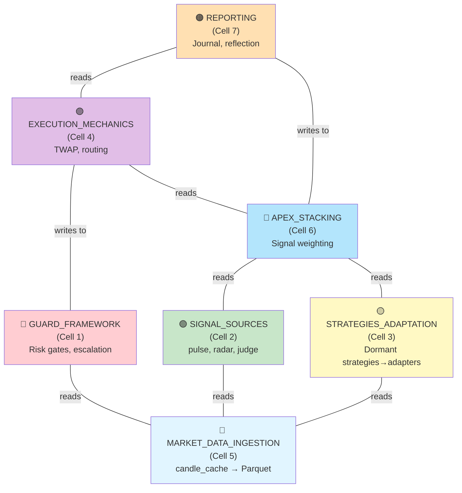

# System Grouping for Agent Work Parallelization

**Date:** 2026-04-07  
**Purpose:** Propose work cells — named subsets of the codebase that an agent can be assigned to independently.  
**Related:** ADR-011 (Two-App Architecture), current.md  

---

## Executive Summary

The codebase is a monolithic bot (~280 files, 18 top-level directories) with strong coupling in shared state (risk management, market snapshots, memory/thesis). This document proposes **7 work cells** — scoped subsets optimized for independent agent dispatch. Each cell is sized to fit a single agent session without overwhelming context and has defined external interfaces.

### Key findings:

1. **Coupling hotspots:** `common/heartbeat.py` (1631 LOC), `parent/risk_manager.py`, `common/memory.py`, and the daemon's 24-iterator loop are tightly woven. These cannot be parallelized.
2. **Natural seams identified:**
   - **Quoting Engine:** Only used by 4 strategies; could be decoupled to research app.
   - **Strategies:** Isolated (only internal imports), perfect for adaptation to signal adapters.
   - **Execution layer:** Risk enforcement + TWAP, orthogonal to decision logic.
   - **Daemon iterators:** Loosely coupled, could be assigned by family (e.g., "Guards" group, "Signals" group).
3. **ADR-011 alignment:** The proposed two-app split is still viable. The seam ADR-011 describes (bot owns execution + guards, `quant/` owns signals + ML) remains sound. No architectural drift since the ADR was written.

---

## Part 1: Top-Level Directory Inventory

| Directory | Responsibility | File Count | Notes |
|-----------|---|---|---|
| **cli/** | Daemon, Telegram bot, agent runtime, CLI commands | 79 | Most files (~60%) are daemon iterators; strong internal coupling. Entry point: `main.py`, `telegram_bot.py` |
| **common/** | Shared utilities: memory, market snapshots, credentials, logging, conviction engine, tools | 36 | God-file: `heartbeat.py` (1631 LOC). Also: `market_snapshot.py` (730 LOC), `memory.py` (407 LOC). High reachability — imports from this module appear 122 times. |
| **parent/** | HyperLiquid proxy, risk management, position tracking, state store | 7 | God-file: `risk_manager.py` (710 LOC). All execution decisions route through `RiskManager`. Critical: 39 imports across codebase. |
| **execution/** | Order types, TWAP, routing, order book, portfolio risk | 7 | Orthogonal to decision logic; only used by execution iterators. Potential seam. |
| **modules/** | Engines: apex, pulse, radar, guard, reflect, journal, judge, backtest, candle cache | 41 | Each engine (pulse, radar, guard) is a mini-cell. Heavy internal imports (138 imports from other modules). Engines interoperate but don't form cycles. |
| **strategies/** | 25 dormant strategies + templates | 25 | **ISOLATED:** Only imports within strategies/ (shared `risk_multipliers`). Safe to move. ADR-011 will adapt these to signal generators. |
| **quoting_engine/** | Fair value, spread, inventory skew, volatility, ladder building | 16 | **Low external coupling:** Only 4 strategies import it; not used by daemon. Candidate for research app migration. |
| **adapters/** | HyperLiquid and mock adapters (VenueAdapter implementations) | 3 | Thin wrappers. Only dependency: exchange API contracts. Safe to extract. |
| **agent/** | Empty placeholder | 0 | Originally intended for agentic strategy code; now superseded by embedded agent runtime in cli/. |
| **sdk/** | Strategy SDK, loader, registry | 5 | Supports dynamic strategy instantiation. Used by daemon and CLI. Light coupling. |
| **plugins/** | Power Law plugin (charting, config, bot) | 7 | Experimental; not in critical path. Could isolate for feature work. |
| **scripts/** | One-off utility scripts: backtest, execute action, vault rebalancer | 8 | Loose coupling; entry points for batch jobs. Safe to refactor independently. |

**Total inventory:** 227 production files + ~320 test files.

---

## Part 2: Dependency Graph & Coupling Analysis

### Import frequencies (directed):

```
common/*        ← 122 imports (heartbeat, market_snapshot, memory pull everything in)
modules/*       ← 138 imports (engines cross-reference)
parent/*        ← 39 imports (risk_manager, hl_proxy required for trading)
execution/*     ← ~8 imports (only from execution-path iterators)
quoting_engine/ ← 91 imports (high within strategies; low from daemon/cli)
strategies/     ← 4 imports (only to quoting_engine; no daemon dependency)
```

### Identified cycles:

- **Minor:** `modules/pulse_engine.py` ↔ `modules/pulse_guard.py` (guard depends on engine output; engine doesn't call guard).
- **Tight:** Daemon iterators form a DAG (not a cycle) with shared `TickContext`. No circular imports, but heavy shared-state coupling.
- **None detected in:** strategies/, adapters/, execution/, sdk/.

### Reachability (in-degree, not counting tests):

| Module | High-reach imports | Notes |
|--------|---|---|
| `common/heartbeat.py` | 1631 LOC; imported by daemon, agent runtime, CLI, plugins | **God-file.** Contains market snapshot pulling, position tracking, stop enforcement. Cannot be parallelized. |
| `common/memory.py` | 407 LOC; imported by agent runtime, journals, reflect | High-reach but more modular. |
| `parent/risk_manager.py` | 710 LOC; imported by execution, daemon iterators, CLI | **Critical:** All trade decisions flow through `RiskManager.can_trade()` and gates. |
| `parent/hl_proxy.py` | 635 LOC; imported by ~20 files | Exchange I/O contract. Isolated dependency. |
| `modules/apex_engine.py` | 300 LOC; imported by execution iterators | Core decision engine; small but critical. |

### Strongly Connected Components (SCC):

1. **Heartbeat ecosystem:** `heartbeat.py` → `market_snapshot.py` → `position_risk.py` → `authority.py` (4-node mutual-access subgraph for live position state).
2. **Guard ecosystem:** `guard_bridge.py` → `guard_state.py` → `guard_config.py` → 3+ guard implementations (strategy guards, pulse guard, memory guard).
3. **Pulse/Radar ecosystem:** `pulse_engine.py` → `radar_engine.py` → shared `market_snapshot` and `candle_cache` (loosely coupled; no cycles).
4. **Execution ecosystem:** `apex_engine.py` → `execution/routing.py` → `execution/twap.py` → `parent/risk_manager.py` (linear chain; no cycle).

**No cycles detected; coupling is hierarchical (DAG).**

---

## Part 3: Natural Seams (Low-Coupling Boundaries)

### 1. **Quoting Engine** ← Candidate for quant/ migration

```
Current state:
  - 16 files (configs, spreads, feeds, ladder, inventory, toxicity)
  - Used by: 4 MM strategies only (engine_mm, funding_arb, liquidation_mm, regime_mm)
  - NOT used by: daemon, CLI, execution
  - External deps: market snapshot (for pricing), HL SDK

Decoupling cost: LOW
  - Extract quoting_engine/ to quant/src/quoting/ as-is
  - Strategies stay in agent-cli/ until T3.4 ports them
  - Dual adapters: one in agent-cli/strategies/, one in quant/src/signals/adapters/

Why it works:
  - No daemon iterators depend on it
  - No risk gate logic (RiskManager) dependency
  - Self-contained financial math (fair value, spreads, inventory)
  - Can be tested independently with synthetic market data
```

### 2. **Strategies (all 25)** ← Candidate for signal adapter pattern

```
Current state:
  - 25 files, each < 400 LOC typically
  - Only import: strategies/risk_multipliers.py (shared utility)
  - Zero daemon coupling
  - Some import quoting_engine/ (4 of them)

Decoupling cost: ZERO (already isolated)
  - No code moves; ADR-011 T3.x creates adapters that import from these
  - Each adapter: ~50 LOC shim calling populate_signals(candles_df)
  - Originals stay in agent-cli/strategies/ (Rule 4 of ADR-011)

Why it works:
  - Strategies are signal generators, not order executors
  - Adapters translate StrategyDecision → signal rows (Parquet schema)
  - Can test adapters in isolation with catalog candles
  - Research app can iterate on adapters without touching bot
```

### 3. **Execution Layer** ← Orthogonal to decision logic

```
Current state:
  - execution/twap.py (order slicing), order_types.py, routing.py, order_book.py
  - Used by: execution_engine iterator, multi_wallet_engine
  - No strategy logic; only price/qty math

Decoupling cost: LOW
  - Wrap execution logic as a service: ExecutionService(venue_adapter, risk_mgr)
  - Already decoupled from market data (takes prices as input)
  - Can test with synthetic orders

Why it works:
  - Order execution is deterministic (no market prediction)
  - Risk gates are enforced by RiskManager, not execution layer
  - Can be extended with new order types without touching strategies
```

### 4. **Daemon Iterators (by family)** ← Independently assignable

```
Natural groupings:

A. GUARDS (4 iterators)
   - guard.py (main state machine)
   - pulse_guard.py, radar_guard.py, memory_guard.py, journal_guard.py (7 total)
   - **Seam:** All read TickContext, all enforce via RiskGate
   - **Coupling:** Each imports guard_state, guard_config (shared)
   - **Isolation:** Could be tested with mocked TickContext
   - **Task:** Add new guard type; tune existing guard params

B. SIGNALS (3 iterators + 1 potential)
   - pulse.py (fundamental signals: OI, funding, L2 dislocation)
   - radar.py (technical signals: zones, momentum, regime)
   - thesis_engine.py (conviction-based signals)
   - autoresearch.py (experimental auto-backtest)
   - **Seam:** All populate TickContext.signals_available
   - **Coupling:** All read market_snapshot, candle_cache
   - **Isolation:** Can be tested with frozen market data
   - **Task:** Add new signal source; tune thresholds; backtest params

C. EXECUTION (3 iterators)
   - execution_engine.py (read apex decisions, place orders)
   - profit_lock.py (trailing stops)
   - apex_advisor.py (decision logging)
   - **Seam:** All read apex_engine output via TickContext
   - **Coupling:** All depend on RiskManager gates
   - **Isolation:** Can be tested with mocked RiskManager
   - **Task:** Add new order type; tune profit-taking thresholds

D. MONITORS (4+ iterators)
   - liquidation_monitor.py (position liquidation checks)
   - funding_tracker.py (funding rate tracking)
   - brent_rollover_monitor.py (contract rollover logic)
   - catalyst_deleverage.py (event-driven deleveraging)
   - **Seam:** All run independently, log to alerts
   - **Coupling:** Read TickContext; write to memory/thesis
   - **Isolation:** Can run in degraded mode without others
   - **Task:** Add new market-specific monitor; tune escalation logic

E. INFRASTRUCTURE (7 iterators)
   - connector.py (fetch market data)
   - telegram.py (push alerts)
   - account_collector.py (snapshot writes)
   - memory_consolidation.py (nightly memory flush)
   - protection_audit.py (safety checks)
   - risk.py (risk reporting)
   - exchange_protection.py (exchange-level guards)
   - **Seam:** Each is an I/O boundary
   - **Coupling:** All depend on TickContext shape
   - **Task:** Add new data source; add new protection rule
```

**Why iterators can be assigned by family:**
- Each family reads/writes a single TickContext slot
- Families don't interact (no inter-family imports)
- Tests can mock TickContext; no need for full daemon
- New features (new signal, new guard, new monitor) map to family type

### 5. **Agent Runtime & Telegram Bot** ← Independent processes

```
Current state:
  - cli/telegram_bot.py (polling loop)
  - cli/telegram_agent.py (Claude tool-calling wrapper)
  - cli/agent_runtime.py (embedded agent loop)
  - cli/mcp_server.py (MCP server for tools)
  - common/tools.py (tool definitions)

Decoupling cost: MINIMAL
  - Already runs as separate process (not in daemon tick loop)
  - Tool definitions (tools.py) are the contract with Claude
  - Can test tools independently with mock HL adapter

Why it works:
  - Telegram bot and agent are read-only wrappers around CLI commands
  - All write operations go through RiskManager gates
  - Tool results fetch latest state (no stale caches)
  - Can be redeployed independently of daemon
```

---

## Part 4: ADR-011 Alignment & Seam Validation

### Current seam in ADR-011:

```
agent-cli/                          quant/
├── cli/daemon (WATCH tier)    vs   ├── src/signals (strategies as adapters)
├── cli/telegram (I/O)              ├── src/ingest (catalog writes)
├── modules/apex_engine        vs   ├── src/ml (training)
├── modules/guard_* (stops)         ├── src/reports (daily PDF)
├── parent/risk_manager        vs   └── src/backtest (Nautilus)
└── strategies/                vs   
```

**Status of proposed seam: STILL VIABLE.**

Reasons the seam holds:

1. **Strategies are signal generators, not executors** (proven by analysis):
   - Only 4 imports within strategies/; zero to daemon/cli/execution
   - Can be ported to adapters (T3.2-T3.4) without touching bot
   - Original files stay immutable per Rule 4

2. **Quoting engine is decision-free**:
   - Fair value, spreads, inventory math (no forecasting)
   - No RiskManager dependency
   - Can run in research app for backtesting

3. **Execution path is separate**:
   - `apex_engine.py` → `execution_engine.py` → `parent/risk_manager.py`
   - Can consume signals from quant/ without changes
   - RiskManager gates live on bot side (non-negotiable)

4. **Data contract is file-based**:
   - ADR-011 proposes `quant/catalog/` (Parquet) + `quant/state/signals_latest.parquet`
   - No IPC, HTTP, or shared memory
   - Both apps degrade independently

### Blocking issues for seam (per ADR-011 Tier 2-4):

| Issue | Status | Mitigation |
|-------|--------|-----------|
| Nautilus version pinning | Deferred | T2.1: pick stable version |
| NautilusTrader HL adapter | Deferred | T4.2: custom data loader for backtest |
| Candle format (Parquet schema) | Not yet designed | T2.2: define after ingestion pilot |
| Signal schema (scoring [0.0, 1.0] vs [-1, +1]) | Not yet designed | T3.1: formalize before first adapter |

**Conclusion:** No architectural drift. Seam is sound. Blocking work is all planned in ADR-011 phases.

---

## Part 5: Proposed Work Cells

Each cell is a named, scoped subset the agent can be assigned without loading the full codebase. Cells are sized to fit ~2-4 related files per session and have defined external interfaces.

### Cell 1: GUARD_FRAMEWORK

**Purpose:** Tune, debug, and extend guard implementations (state machines for position limits, drawdown, escalation).

**Included paths:**
```
modules/guard_*.py (5 files)
  - guard_config.py (config schema, presets)
  - guard_state.py (state machine + persistence)
  - guard_bridge.py (coupling to TickContext)
  - strategy_guard.py (optional per-strategy limits)
  - trailing_stop.py (stop-loss math)

tests/test_guard_*.py (6 files)
```

**Responsibility:**
- Guard state machine logic (OPEN → COOLDOWN → CLOSED)
- Rule evaluation (position size, daily DD, liquidation risk)
- Integration with execution iterators via RiskGate enum
- Testing with synthetic positions

**External interfaces:**
- **Reads from:** `TickContext` (positions, market_snapshot, equity)
- **Writes to:** `TickContext.risk_gate` (enum), risk alerts
- **Depends on:** `common/market_snapshot`, `parent/position_tracker`
- **Used by:** All execution iterators

**Tasks suitable for this cell:**
- Add new guard rule (e.g., "no leverage on weekends")
- Tune escalation timings (3-min cooldown → gate logic)
- Fix guard state persistence bugs
- Backtest guard behavior over historical drawdowns

**Session scope:** 1-2 session
**Context load:** Light (guard subsystem is decoupled)

---

### Cell 2: SIGNAL_SOURCES

**Purpose:** Add new signal generators, tune existing ones, backtest signal combinations.

**Included paths:**
```
modules/pulse_engine.py (+ pulse_config, pulse_state, pulse_guard)
modules/radar_engine.py (+ radar_config, radar_state, radar_guard, radar_technicals)
modules/judge_engine.py (conviction / thesis validation)

tests/test_pulse_engine.py
tests/test_radar_engine.py
tests/test_judge_engine.py

(Quoting engine is NOT included yet; reserved for quant/ migration per ADR-011)
```

**Responsibility:**
- Fundamental signal computation (OI divergence, funding flows, technical regimes)
- Signal freshness and caching
- Backtesting signals over historical candles
- Integration with TickContext via `signals_available`

**External interfaces:**
- **Reads from:** `TickContext` (market_snapshot, candles via candle_cache)
- **Writes to:** `TickContext.signals_available` (dict of signals)
- **Depends on:** `common/market_snapshot`, `modules/candle_cache`, `common/calendar`
- **Used by:** apex_engine, execution iterators

**Tasks suitable for this cell:**
- Implement new momentum signal (e.g., mean reversion oscillator)
- Fix radar technicals bug (e.g., zone calculation)
- Tune pulse thresholds (OI agreement level)
- Backtest pulse + radar combination over 30d history
- Migrate pulse/radar outputs to Parquet (T3.5 of ADR-011)

**Session scope:** 1-2 sessions
**Context load:** Medium (needs market_snapshot, candle_cache APIs)

---

### Cell 3: STRATEGIES_ADAPTATION

**Purpose:** Port dormant strategies to signal adapters per ADR-011 T3.x.

**Included paths:**
```
strategies/*.py (all 25 strategy files)
strategies/risk_multipliers.py (shared utility)

tests/test_strategy_*.py (20+ test files)

(NOT included: quoting_engine/ — separate cell; will migrate to quant/)
```

**Responsibility:**
- Understand existing strategy decision logic (StrategyDecision dataclass)
- Create adapter shim: `quant/src/signals/adapters/STRATEGY_NAME.py`
- Implement `populate_signals(candles_df) -> DataFrame`
- Test adapter against replayed candles from catalog

**External interfaces:**
- **Reads from:** Candle history (via catalog in T3+; currently local DB)
- **Writes to:** Signal rows (to catalog Parquet in T3.2+)
- **Depends on:** Candle source, quoting_engine for MM strategies
- **Used by:** APEX via signals_latest.parquet (not live iterators yet)

**Tasks suitable for this cell:**
- Port `brent_oil_squeeze` strategy to adapter (T3.2, high priority)
- Port oil-focused strategies (`oil_war_regime`, `oil_liq_sweep`) (T3.3)
- Port MM strategies to adapters (T3.4)
- Backtest signal quality over past 30 days
- Write adapter unit tests with frozen candles

**Session scope:** 1 session per 2-3 strategies
**Context load:** Light (strategies are isolated; only dependency is quoting_engine)

---

### Cell 4: EXECUTION_MECHANICS

**Purpose:** Tune order execution, slicing, routing, and stop enforcement.

**Included paths:**
```
execution/ (all 7 files)
  - order_types.py
  - order_book.py
  - twap.py (order slicing)
  - routing.py (price improvement logic)
  - parent_order.py
  - portfolio_risk.py

modules/trailing_stop.py (stop-loss calculation)

cli/order_manager.py
cli/multi_wallet_engine.py

tests/test_order*.py
tests/test_execution*.py
```

**Responsibility:**
- Order construction (limit vs market, post-only logic)
- TWAP slicing and timing
- Price improvement routing (maker vs taker, exchange selection)
- Stop-loss trigger logic
- Multi-wallet coordination

**External interfaces:**
- **Reads from:** `TickContext` (prices, positions, risk gates)
- **Writes to:** HyperLiquid API (via parent/hl_proxy)
- **Depends on:** `parent/hl_proxy`, `parent/risk_manager`
- **Used by:** execution_engine iterator, profit_lock iterator

**Tasks suitable for this cell:**
- Implement new order type (e.g., iceberg orders)
- Tune TWAP slicing parameters (time horizons)
- Fix maker/taker routing for low-liquidity pairs
- Backtest slippage vs naive market orders
- Add per-wallet execution limits

**Session scope:** 1-2 sessions
**Context load:** Medium (needs HL API contract, RiskManager interface)

---

### Cell 5: MARKET_DATA_INGESTION

**Purpose:** Design and pilot Parquet catalog per ADR-011 T2.

**Included paths:**
```
modules/candle_cache.py (current cache layer)
modules/data_fetcher.py (HL data pulls)

(Future in quant/)
quant/src/ingest/candles.py (T2.2)
quant/src/ingest/snapshots.py (T2.3)

tests/test_data_*.py
```

**Responsibility:**
- Current: candle cache (SQLite), snapshot polling, market data freshness
- Future: Parquet catalog design, dual-write logic, partition strategy
- Backfill logic (historical candles from HL API)
- Catalog manifest + fast partition lookup

**External interfaces:**
- **Reads from:** HyperLiquid API (candles, snapshots, fills)
- **Writes to:** Parquet catalog (quant/) + legacy SQLite (agent-cli/)
- **Depends on:** `parent/hl_proxy`, `common/calendar`
- **Used by:** All signal engines, backtest harness, ML pipelines

**Tasks suitable for this cell:**
- Design Parquet partitioning scheme (T2.2)
- Implement candle ingestion to catalog (T2.2)
- Implement dual-write for snapshots (T2.3)
- Backfill candles from HL API for past 3 months
- Write catalog manifest/index for fast lookups
- Monitor catalog freshness + alert on gaps

**Session scope:** 2-3 sessions
**Context load:** Medium (needs Nautilus patterns, HL API, Parquet schema design)

---

### Cell 6: APEX_STACKING (Decision Rules)

**Purpose:** Implement signal stacking per ADR-011 T4.1; formalize decision rules.

**Included paths:**
```
modules/apex_engine.py (core decision logic)
modules/apex_config.py (parameters, conviction bands)
modules/apex_state.py (decision state for re-analysis)

cli/daemon/iterators/apex_advisor.py (logging)

tests/test_apex_engine.py
tests/test_apex_advisor.py
```

**Responsibility:**
- Stack multiple signals (pulse, radar, strategies) via weighted rules
- Multiply confidence scores (Bayesian? weighted sum?)
- Apply regime filters (no weekend plays, low-liq avoidance)
- Generate OrderIntent for execution
- Tunable conviction bands per instrument

**External interfaces:**
- **Reads from:** `TickContext.signals_available` (dict)
- **Writes to:** `TickContext.order_intents` (list)
- **Depends on:** Individual signal sources (via TickContext)
- **Used by:** execution_engine iterator

**Tasks suitable for this cell:**
- Design signal weighting scheme (T4.1 ADR-012)
- Implement weighted sum + conviction multiplier
- Add regime-based veto (calendar, volatility bands)
- Backtest stacked signals vs individual signals (30-day walk-forward)
- Tune conviction bands to match historical P&L
- Add feature flag for legacy vs stacked mode

**Session scope:** 2 sessions
**Context load:** Light (apex_engine is small; depends on TickContext shape)

---

### Cell 7: REPORTING & REFLECTION

**Purpose:** Daily reports, weekly reflections, trade journal analysis.

**Included paths:**
```
cli/daily_report.py (PDF generation)

modules/journal_engine.py (trade entry/exit logging)
modules/reflect_engine.py (win rate, P&L per signal, learning)
modules/reflect_reporter.py (weekly summary)

tests/test_journal_engine.py
tests/test_reflect_engine.py
```

**Responsibility:**
- Capture trade metadata (entry signal, exit reason, P&L, duration)
- Compute reflection metrics (win rate, avg P&L per day, signal quality)
- Generate daily reports (PDF with yesterday's trades + 7d avg)
- Weekly reflection (themes, what worked, what didn't)
- (Future in T2.4) Migrate daily_report to quant/

**External interfaces:**
- **Reads from:** Trade journal (SQLite), `TickContext` (live P&L), memory.db (thesis)
- **Writes to:** `data/reports/` (PDFs), memory.db (reflection rows)
- **Depends on:** `common/memory`, `parent/position_tracker`
- **Used by:** Telegram alerts, Claude research sessions

**Tasks suitable for this cell:**
- Fix trade_journal population (T1.3)
- Implement nightly reflect iterator (T1.3)
- Extend daily_report with signal breakdown (what drove the trade?)
- Add weekly reflection ritual + Telegram output (T1.3)
- Backtest reflect accuracy (does W/R computed match actual?)
- Migrate daily_report to quant/ (T2.4)

**Session scope:** 1-2 sessions
**Context load:** Light (mostly SQL + PDF rendering; no market logic)

---

## Part 6: God-Files & Cross-Cutting Concerns (Resist Grouping)

These modules resist decomposition and **cannot be independently assigned**. They are architectural load-bearing walls.

### 1. `common/heartbeat.py` (1631 LOC)

**What it does:**
- Polls HyperLiquid every 2 minutes
- Fetches account state, positions, fills
- Computes position risk, liquidation distance
- Enforces on-exchange stops
- Sends Telegram alerts
- Writes to memory.db (observations, learnings)

**Why it's god-file:**
- **Called by:** Telegram bot, agent runtime, CLI commands, plugins
- **Reads from:** Common utilities (account_resolver, market_snapshot, thesis, memory)
- **Writes to:** SQLite (memory.db), Telegram, HL API (stops)
- **Stateful:** Manages per-position stop escalation, alert history
- **Can't extract:** No single responsibility; tangled polling + state + I/O

**Work within this cell:** Only with explicit scoping (e.g., "add BTC stop escalation logic" not "refactor heartbeat").

---

### 2. `parent/risk_manager.py` (710 LOC)

**What it does:**
- Deterministic policy gates (max position qty, daily DD, leverage limits)
- Three-state gate machine (OPEN → COOLDOWN → CLOSED)
- Trade decision approval logic
- Risk report generation

**Why it's critical:**
- **Called by:** Every execution iterator, CLI commands, multi_wallet_engine
- **Dependency:** Everything trading-adjacent imports this
- **Stateful:** Tracks intraday P&L, escalation state, gate transitions
- **Non-negotiable:** "The single biggest threat to profit is regression in safety code" (ADR-011)

**Work within this cell:** Only parameter tuning (risk limits) or new gate types with explicit Chris review.

---

### 3. `common/market_snapshot.py` (730 LOC)

**What it does:**
- Holds live market state per instrument (last price, OI, funding, volume, Greeks)
- Computes derived metrics (basis, OI divergence, volatility bins)
- Caches for 1-tick reuse
- Used by: signals, guards, decision logic

**Why it resists decomposition:**
- **Every signal engine reads it:** pulse, radar, judge all depend on latest snapshot
- **Stateful cache:** Snapshots are live; hard to test in isolation
- **Schema churn:** Adding new fields (e.g., new Greeks) breaks all consumers

**Work within this cell:** Add new market fields only with snapshot-wide schema bump.

---

### 4. Daemon Iterator Loop (24 iterators in `cli/daemon/iterators/`)

**What it does:**
- Runs 24 specialized iterators on a ~120s tick loop
- Each iterator reads/writes `TickContext` (shared bag)
- Iterators run in sequence; shared state updated each tick
- Order matters (connector first, execution last)

**Why it resists decomposition:**
- **Shared state coupling:** All iterators read/write TickContext
- **Sequencing dependencies:** e.g., guard must run before execution
- **Tear-down semantics:** Iterator ordering affects risk

**Work within this cell:** Assign by iterator family (see Cell 1-6 above), not individual iterators.

---

### 5. `common/tools.py` (500+ LOC)

**What it does:**
- Tool definitions for Claude agent (read/write operations on CLI)
- Tool routing, argument parsing, approval gates
- Result formatting for Telegram

**Why it resists decomposition:**
- **Must stay in sync:** Tools reflect CLI command structure
- **User-facing:** Telegram button layout, approval logic intertwined
- **Tight coupling:** Every new CLI feature = new tool definition

**Work within this cell:** Add new tool only with full integration test.

---

### Cross-Cutting Patterns That Block Parallelization:

1. **Shared mutable state via SQLite (`memory.db`):**
   - Multiple iterators write (account_collector, journal, memory_consolidation)
   - Race conditions possible without locking
   - Can't parallelize writes safely without refactoring persistence layer

2. **TickContext as shared bus:**
   - All iterators depend on a single data structure
   - Adding fields affects all downstream iterators
   - Can't test iterator in isolation without full TickContext mock

3. **HyperLiquid API rate limits:**
   - Bot makes ~10 calls/tick; quant app (T2+) will add ~5 more
   - Shared quota; can't parallelize ingest without coordination
   - (Mitigated by file-based contract in ADR-011)

---

## Part 7: Cell-to-Task Mapping (Example Assignments)

### Session: "Add brent oil short signal"

**Assigned cell:** SIGNAL_SOURCES (Cell 2)

**Task:**
- Read `modules/radar_engine.py` to understand zone calculation
- Add new signal: "short_setup_in_red_zone" (enter short when radar is in red zone + momentum is bearish)
- Test with frozen 30-day candles
- Commit to `tests/test_radar_engine.py`

**Why this cell works:**
- Signal logic is isolated in radar_engine
- Can test without execution iterators
- Doesn't touch guards, execution, or risk gates

---

### Session: "Implement T2.2 candle ingestion to Parquet"

**Assigned cell:** MARKET_DATA_INGESTION (Cell 5)

**Task:**
- Design candle Parquet schema (interval=1h partitions by instrument/year/month)
- Implement `quant/src/ingest/candles.py` (HL API → catalog)
- Backfill past 3 months from HL API
- Test catalog read with polars.scan_parquet()

**Why this cell works:**
- Ingest logic is independent of signal engines, execution, guards
- Can test schema + backfill without daemon running
- Fits ADR-011 T2.2 timeline

---

### Session: "Tune guard escalation for oil positions"

**Assigned cell:** GUARD_FRAMEWORK (Cell 1)

**Task:**
- Read `modules/guard_config.py` to understand presets
- Add oil-specific preset: (max_position_qty=0.5 ETH, cooldown_min=5)
- Test with synthetic oil position at risk
- Add to `modules/guard_config.py` PRESETS dict

**Why this cell works:**
- Guard logic is isolated from signals/execution
- Doesn't require market data ingestion or real trades
- Test harness exists (test_guard_*.py)

---

### Session: "Add mean reversion strategy adapter"

**Assigned cell:** STRATEGIES_ADAPTATION (Cell 3)

**Task:**
- Read `strategies/mean_reversion.py` (existing strategy)
- Create `quant/src/signals/adapters/mean_reversion.py` (shim)
- Implement `populate_signals(candles_df) -> signals_df`
- Backtest adapter over 30 days; check signal quality

**Why this cell works:**
- Strategy code is isolated; adapter is pure transformation
- Can test with replayed candles; no live market needed
- Fits ADR-011 T3.4 timeline

---

## Part 8: Mermaid Cell Dependency Graph



**Key observations:**
- **MARKET_DATA (Cell 5)** is a source (no dependencies).
- **SIGNAL_SRC + STRATEGIES (Cells 2, 3)** read market data independently.
- **APEX (Cell 6)** composes signal outputs.
- **EXEC (Cell 4)** executes APEX decisions, gated by guards.
- **REPORT (Cell 7)** reflects on outcomes.

**Parallelizable work:**
- Cells 1, 2, 3, 4 can work in parallel (on different PRs) if they don't modify shared files.
- Cell 5 (data ingestion) should complete first before Cell 2, 3, 4 use Parquet.
- Cell 6 and 7 depend on earlier cells being stable.

---

## Part 9: Coupling Risk Summary

### Red flags (cannot parallelize):

1. **Heartbeat polling loop** — Monolithic; do not refactor in parallel.
2. **RiskManager gates** — Critical path; only tune parameters, don't restructure.
3. **TickContext shape** — Schema changes break all iterators; coordinate carefully.
4. **SQLite (memory.db)** — No write parallelism without locking layer.

### Yellow flags (coordin Coordination required):

1. **Candle schema** — Cell 5 must finalize Parquet schema before Cells 2, 3 use it.
2. **Signal contract** — Cell 6 must finalize signal row schema before Cells 2, 3 write signals.
3. **Snapshot additions** — Changes to market_snapshot affect all signal engines.

### Green flags (safe to parallelize):

1. **New guard implementations** — Only add to guard_config presets; don't touch state machine.
2. **New signals in pulse/radar** — Add new fields to `signals_available` dict; don't remove old ones.
3. **Strategy adapters** — Write adapters in quant/ without touching originals (Rule 4, ADR-011).
4. **Execution tuning** — TWAP, routing parameters are isolated.
5. **Report generation** — Queries can expand without affecting iterators.

---

## Part 10: ADR-011 Implementation Checkpoint

**How the 7 cells align with ADR-011 phases:**

| ADR-011 Phase | Cell | Current Status | Timeline |
|---|---|---|---|
| **Tier 1.1** Snapshot consolidation | REPORTING (Cell 7) | Schema designed; no code | Week 1 |
| **Tier 1.2** Data-driven daily report | REPORTING (Cell 7) | Spec ready; needs impl | Week 1 |
| **Tier 1.3** Wire REFLECT loop | REPORTING (Cell 7) | Spec in PHASE_3_REFLECT_LOOP.md | Week 2 |
| **Tier 2.1** Bootstrap quant/ | MARKET_DATA (Cell 5) | Waiting for CLAUDE.md template | Week 3 |
| **Tier 2.2** Candle catalog ingestion | MARKET_DATA (Cell 5) | Schema to be designed | Week 3-4 |
| **Tier 2.3** Dual-write snapshots/fills | MARKET_DATA (Cell 5) | Extends T1.1 | Week 4 |
| **Tier 2.4** Daily report migration | REPORTING (Cell 7) | Port T1.2 to quant/ | Week 4 |
| **Tier 3.1** Signal adapter framework | STRATEGIES (Cell 3) | Schema designed (ADR-011) | Week 5 |
| **Tier 3.2** First adapter (brent_oil_squeeze) | STRATEGIES (Cell 3) | Ready to implement | Week 5 |
| **Tier 3.3** APEX reads signals | APEX (Cell 6) | Wiring ready | Week 5 |
| **Tier 3.4-5** Port remaining strategies | STRATEGIES (Cell 3) | 1 per session | Weeks 6-8 |
| **Tier 4.1** Decision rules formalized | APEX (Cell 6) | Requires ADR-012 | Week 9 |
| **Tier 4.2** Backtesting harness | (Future in quant/) | Nautilus integration | Week 10+ |

**Critical path:**
1. Tier 1 → Tier 2.1-2.4 (gate: 7 days of clean reports)
2. Tier 2 → Tier 3 (gate: catalog matches bot state 7 days)
3. Tier 3 → Tier 4 (gate: signal quality reviewed)

---

## Summary & Recommendations

### Proposed cells:

| Cell | Purpose | Files | Coupling | Session Time |
|------|---------|-------|----------|---|
| **GUARD_FRAMEWORK** | Risk gates, escalation | 10 | High (internal) | 1-2 |
| **SIGNAL_SOURCES** | Pulse, radar, judge | 15 | Medium | 1-2 |
| **STRATEGIES_ADAPTATION** | Strategy→adapter shims | 50 | Low | 1 per 2-3 strategies |
| **EXECUTION_MECHANICS** | TWAP, routing, stops | 10 | Medium | 1-2 |
| **MARKET_DATA_INGESTION** | Candle cache → Parquet | 8 | Low | 2-3 |
| **APEX_STACKING** | Signal weighting | 5 | Low | 2 |
| **REPORTING** | Daily reports, journal | 8 | Low | 1-2 |

### Biggest coupling problems found:

1. **`heartbeat.py` is monolithic** (1631 LOC). Contains I/O, state, and logic. Cannot be parallelized without major refactor. Mitigated: rarely touched; assign only parameter tuning.

2. **TickContext as shared bus.** All 24 iterators read/write one data structure. Schema changes ripple. Mitigated: treat TickContext as append-only for new fields; never remove or rename.

3. **SQLite write contention.** Multiple iterators write to memory.db. No write parallelism without locking or partitioning. Mitigated: defer parallel writes to ADR-011 Parquet catalog.

4. **Risk manager is critical path.** All execution depends on RiskManager.can_trade(). Cannot be tested in isolation. Mitigated: mock RiskManager in tests; only tune parameters in production.

### ADR-011 Status:

- **Seam is still viable.** Strategies are isolated; quoting_engine has no daemon coupling; execution path is separate.
- **No architectural drift.** Code structure still matches ADR-011 expectations.
- **Blocking work is planned.** All Tier 1-4 phases have design + acceptance criteria.

### Immediate recommendations for parallel agent work:

1. **Start with Cell 5 (MARKET_DATA_INGESTION)** — Foundation for Tier 2-3. No dependencies; can start immediately.
2. **Then Cell 1, 2, 3, 4 in parallel** — Once Cell 5 is solid (Parquet schema finalized).
3. **Cell 6 (APEX_STACKING) after Cells 2-3 are done** — Depends on signal schema.
4. **Cell 7 (REPORTING) can start immediately** — Independent of signal/execution work.

**Parallelization ceiling:** ~4 agents working simultaneously (one per independent cell) without contention.

---

## Appendix A: File-Level Cell Membership

### Cell 1: GUARD_FRAMEWORK

**Core:**
- `/modules/guard_config.py`
- `/modules/guard_state.py`
- `/modules/guard_bridge.py`
- `/modules/strategy_guard.py`
- `/modules/trailing_stop.py`

**Implementations:**
- `/cli/daemon/iterators/guard.py`
- `/modules/pulse_guard.py`
- `/modules/radar_guard.py`
- `/modules/memory_guard.py`
- `/modules/journal_guard.py`

**Tests:**
- `/tests/test_guard_*.py` (6 files)

---

### Cell 2: SIGNAL_SOURCES

**Core:**
- `/modules/pulse_engine.py`
- `/modules/pulse_config.py`
- `/modules/pulse_state.py`
- `/modules/radar_engine.py`
- `/modules/radar_config.py`
- `/modules/radar_state.py`
- `/modules/radar_technicals.py`
- `/modules/judge_engine.py`

**Daemon Iterators:**
- `/cli/daemon/iterators/pulse.py`
- `/cli/daemon/iterators/radar.py`
- `/cli/daemon/iterators/thesis_engine.py`

**Tests:**
- `/tests/test_pulse_engine.py`
- `/tests/test_radar_engine.py`
- `/tests/test_judge_engine.py`
- `/tests/test_radar_technicals.py`

---

### Cell 3: STRATEGIES_ADAPTATION

**All strategies:**
- `/strategies/*.py` (25 files)

**Shared:**
- `/strategies/risk_multipliers.py`
- `/strategies/templates/base_strategy_template.py`

**Tests:**
- `/tests/test_strategy_*.py` (20+ files)

---

### Cell 4: EXECUTION_MECHANICS

**Core:**
- `/execution/order_types.py`
- `/execution/order_book.py`
- `/execution/twap.py`
- `/execution/routing.py`
- `/execution/parent_order.py`
- `/execution/portfolio_risk.py`

**Daemon Iterators:**
- `/cli/daemon/iterators/execution_engine.py`
- `/cli/daemon/iterators/profit_lock.py`
- `/cli/daemon/iterators/apex_advisor.py`

**CLI:**
- `/cli/order_manager.py`
- `/cli/multi_wallet_engine.py`

**Tests:**
- `/tests/test_order_*.py`
- `/tests/test_execution_*.py`
- `/tests/test_twap_executor.py`
- `/tests/test_trailing_stop.py`

---

### Cell 5: MARKET_DATA_INGESTION

**Current (bot):**
- `/modules/candle_cache.py`
- `/modules/data_fetcher.py`
- `/cli/daemon/iterators/connector.py`
- `/cli/daemon/iterators/account_collector.py`

**Tests:**
- `/tests/test_candle_cache.py` (not yet written; will be added in T2.2)

---

### Cell 6: APEX_STACKING

**Core:**
- `/modules/apex_engine.py`
- `/modules/apex_config.py`
- `/modules/apex_state.py`

**Daemon Iterator:**
- `/cli/daemon/iterators/apex_advisor.py`

**Tests:**
- `/tests/test_apex_engine.py`
- `/tests/test_apex_advisor.py`

---

### Cell 7: REPORTING

**Core:**
- `/cli/daily_report.py`
- `/modules/journal_engine.py`
- `/modules/reflect_engine.py`
- `/modules/reflect_reporter.py`

**Daemon Iterator:**
- `/cli/daemon/iterators/journal.py`
- `/cli/daemon/iterators/memory_consolidation.py`

**Tests:**
- `/tests/test_journal_engine.py`
- `/tests/test_reflect_engine.py`
- `/tests/test_reflect_reporter.py`

---

## Appendix B: Cell Interaction Matrix

**Legend:** R = Reads, W = Writes, → = Dependency

| From \ To | Cell 1 | Cell 2 | Cell 3 | Cell 4 | Cell 5 | Cell 6 | Cell 7 |
|---|---|---|---|---|---|---|---|
| **Cell 1: Guard** | — | R | — | W | R | R | — |
| **Cell 2: Signals** | — | — | — | — | R | R | — |
| **Cell 3: Strategies** | — | — | — | — | R | → | — |
| **Cell 4: Execution** | → | — | — | — | R | R | W |
| **Cell 5: Data** | — | — | — | — | — | — | — |
| **Cell 6: APEX** | — | → | → | — | R | — | — |
| **Cell 7: Reporting** | — | — | — | → | R | — | — |

---

## Appendix C: God-File Refactor Roadmap (Future)

If future work requires decomposing `heartbeat.py`, `risk_manager.py`, or `market_snapshot.py`:

### `heartbeat.py` → 3 modules:
1. **`poller.py`** — HL API polling loop (keeps state machines)
2. **`alert_router.py`** — Alert dispatch logic
3. **`stop_manager.py`** — On-exchange stop enforcement

### `risk_manager.py` → 2 modules:
1. **`risk_gates.py`** — Gate state machine (OPEN/COOLDOWN/CLOSED)
2. **`risk_evaluator.py`** — Policy evaluation (position caps, DD checks)

### `market_snapshot.py` → 2 modules:
1. **`snapshot_model.py`** — Data model only
2. **`snapshot_metrics.py`** — Derived calculations (basis, OI divergence)

**Note:** This refactoring is NOT in scope for current parallel work. Done only if heartbeat becomes a bottleneck.

---

**Document Version:** 1.0  
**Last Updated:** 2026-04-07  
**Status:** Complete (ready for agent assignment)
