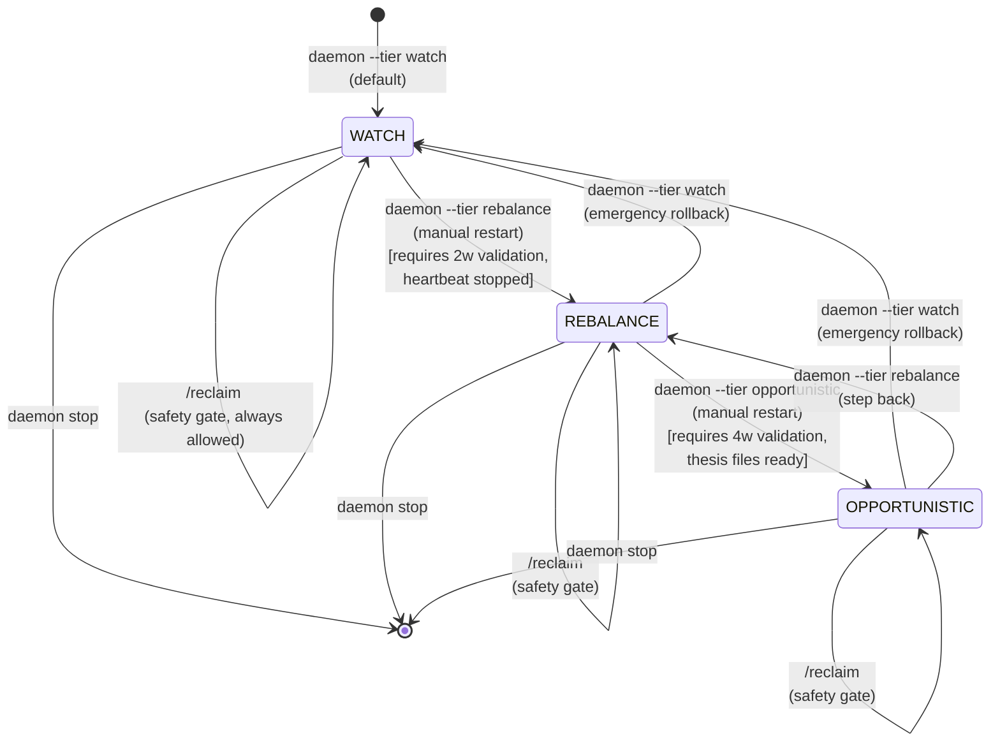

# Tier State Machine — Architecture and Guarantees

> Status: Living spec. Extracted from `docs/wiki/operations/tiers.md` (prose) and
> validated against `cli/daemon/tiers.py` (code of truth) on 2026-04-07.
>
> **Source of truth:** If this document and the code disagree, the code wins.

## Overview

The daemon runs a tick loop with **three operational tiers**, each strictly more
privileged than the last:

| Tier | Authority | Write Capability | Default | Use Case |
|------|-----------|------------------|---------|----------|
| **WATCH** | Read + alert only | **ZERO** exchange writes | ✅ | Observation, validation, before going live |
| **REBALANCE** | WATCH + defensive protection | Exchange SL/TP + vault rebalancing | No | Active SL management + position rebalancing |
| **OPPORTUNISTIC** | REBALANCE + autonomous trading | Conviction-driven entries and exits | No | Full autonomy on delegated assets |

**Key principle:** Tiers are a global capability knob. Per-asset authority
(`common/authority.py`) gates the actual use on each instrument. You can be
in REBALANCE tier but an asset can still be `manual` (daemon ignores it) or
`off` (no alerts, no touches).

---

## State Machine

### States

```
┌─────────────────────────────────────────────────────────────────┐
│                                                                 │
│              WATCH                                              │
│         (read-only, observe)                                    │
│              ↓                                                   │
│       [manual → REBALANCE]                                      │
│              ↓                                                   │
│          REBALANCE                                              │
│    (defensive writes)                                           │
│              ↓                                                   │
│       [manual → OPPORTUNISTIC]                                  │
│              ↓                                                   │
│       OPPORTUNISTIC                                             │
│   (autonomous trading)                                          │
│                                                                 │
└─────────────────────────────────────────────────────────────────┘
```

### Transitions

| From | To | Trigger | Guard | Action | Side Effects |
|------|----|---------|----- -|--------|--------------|
| **WATCH** | **REBALANCE** | Manual: `daemon --tier rebalance` restart | ✅ User must confirm readiness checklist in ops guide | Iterator set changes; `exchange_protection` becomes active | Heartbeat launchd job **must** be stopped to avoid dual-writer bug on SL placement |
| **REBALANCE** | **OPPORTUNISTIC** | Manual: `daemon --tier opportunistic` restart | ✅ User must confirm `apex_advisor` proposals match judgment; conviction config loaded | Iterator set changes; `apex_advisor` replaced by live execution engine | Must have thesis files in `data/thesis/` for each market |
| **WATCH** / **REBALANCE** / **OPPORTUNISTIC** | **WATCH** (demote) | Manual: `daemon --tier watch` restart, or `/reclaim <ASSET>` per-asset | ✅ Always allowed (safety rollback) | Iterator set narrows; write-capable iterators removed on next restart | All open positions remain; SL/TP orders remain on exchange (must be manually cancelled if desired) |
| (any) | (any) | Authority change via `/delegate <ASSET>` or `/reclaim <ASSET>` | ✅ Always allowed | N/A (authority is per-asset, not tier-level) | Asset enforcement happens on next iterator tick |

### Transition Timing

- **Tier changes** require daemon restart. Cannot change mid-session.
- **Authority changes** (`delegate` / `reclaim`) take effect immediately on next tick — no restart needed.
- **Demotion** is always safe: `/reclaim` + restart with `--tier watch` stops all writes in one shot.

---

## Iterator Taxonomy by Tier

### WATCH Tier

> Iterator set is the canonical list in `cli/daemon/tiers.py['watch']`. Don't trust counts in this doc — read the source.

These are **read-only observers**. No exchange writes ever occur.

#### Always-run (even without market data):
| Iterator | Role | Writes? | Notes |
|----------|------|---------|-------|
| `account_collector` | Snapshots account equity, tracks HWM + drawdown | 📄 filesystem only | Injects `ctx.account_drawdown_pct`, `ctx.high_water_mark` into TickContext |
| `connector` | Fetches positions, prices, orders, balances | ❌ none | Populates `ctx.positions`, `ctx.prices`, `ctx.orders`, `ctx.balances` |
| `liquidation_monitor` | Tiered cushion alerts (safe ≥20%, warn 10–20%, critical <10%) | ❌ alerts only | Fires WATCH→REBALANCE checkpoint (F6 early-warning) |
| `funding_tracker` | Tracks cumulative hourly funding cost per position | 📄 `funding_tracker.jsonl` | Alerts when cumulative cost exceeds threshold |
| `protection_audit` | **Verifies** every open position has a sane exchange stop | ❌ read-only | Does NOT place stops (heartbeat does that separately). Alerts: `no_stop` (CRITICAL), `wrong_side` (CRITICAL), `too_close` / `too_far` (WARNING) |
| `brent_rollover_monitor` | Reads `data/calendar/brent_rollover.json`, alerts at T-7/T-3/T-1/T-0 | ❌ none | Calendar-driven alerts only |

#### Market structure + signals:
| Iterator | Role | Writes? | Notes |
|----------|------|---------|-------|
| `market_structure` | Pre-computes technicals (RSI, Bollinger, MACD, etc.) | 📄 ctx snapshot only | Populates `ctx.market_snapshots` for downstream use |
| `thesis_engine` | Reads AI thesis files from `data/thesis/*.json` into TickContext | 📄 ctx snapshot only | Injects `ctx.thesis_states` (conviction, leverage caps, direction) |
| `pulse` | Capital inflow scanner (multi-timeframe momentum) | ❌ read-only | Populates `ctx.pulse_signals` (throttled 2min) |
| `radar` | Conviction engine opportunity scanner | ❌ read-only | Populates `ctx.radar_opportunities` (throttled 5min) |
| `liquidity` | Tracks bid/ask spread depth (not writes) | ❌ read-only | Injects liquidity data into ctx |

#### Risk + logging:
| Iterator | Role | Writes? | Notes |
|----------|------|---------|-------|
| `risk` | Consolidated alert chain (combines all prior alerts, appends calendar tags) | ❌ alerts only | Feeds OpenClaw and Telegram |
| `apex_advisor` | DRY-RUN APEX engine — proposes slots, logs them, emits Telegram, never executes | ❌ dry-run only | Throttle 60s; proposes up to 3 slots per cycle; lets user validate advisor before promotion |
| `autoresearch` | REFLECT loop — records observations to memory.db (read observations only in WATCH) | ❌ read memory.db | Future: upgrades to write mode in OPPORTUNISTIC |
| `memory_consolidation` | Compresses old events hourly | 📄 memory.db | Cleanup iterator |
| `journal` | Records events to persistent journal | 📄 journal file | Audit trail |
| `telegram` | Sends alerts to Telegram | ❌ external I/O | Uses alerts from `ctx.alerts` |

---

### REBALANCE Tier

> Iterator set is the canonical list in `cli/daemon/tiers.py['rebalance']`. Don't trust counts in this doc — read the source.

Inherits all WATCH iterators, plus adds:

#### Write-capable protection + rebalancing:
| Iterator | Role | Writes? | Triggers | Authority Check |
|----------|------|---------|----------|-----------------|
| `exchange_protection` | Places ruin-prevention SL at `liq_px * 1.02` (2% buffer) for every open position | ✅ trigger orders | Every position without an SL; throttle 60s | ❌ **NO authority check** in code (verified 2026-04-07 — see `writers-and-authority.md` §1.2 and the verification-ledger). Must be fixed before WATCH→REBALANCE promotion. |
| `execution_engine` | Conviction-based rebalancing: moves position size to match thesis conviction band | ✅ market orders | Conviction drift >5%; throttle 2min | ✅ Reads `ctx.thesis_states`; skips if conviction is 0 (exit band) |
| `vault_rebalancer` | Maintains target vault allocation per `data/config/rebalancer.yaml` | ✅ market orders | Drift from target; throttle varies | ✅ Only runs if delegated; respects authority |
| `guard` | Trailing stop engine — ratchets SL upward as profit grows, syncs to exchange | ✅ trigger order sync | Every position; per-tick | ⚠️ Runs in REBALANCE; guards ALL positions regardless of authority (but can be gated per-asset) |
| `profit_lock` | Sweeps % of realized profits to safety (future: vault transfer; now: logs intent) | ✅ reduce-only orders | Profit threshold exceeded; throttle 5min | ✅ Respects authority; only closes on delegated assets |
| `catalyst_deleverage` | Pre-event deleverage ahead of known catalysts (FOMC, contract rolls, etc.) | ✅ reduce-only orders | Event date ± pre_event_hours window | ✅ Per-asset gate (in config) |
| `rebalancer` | Runs active roster strategies on their tick intervals | ✅ strategy-generated orders | Strategy tick interval | ✅ Strategies can query authority if they want per-asset checks |

**REBALANCE heartbeat coordination:** The heartbeat (separate launchd process) places ATR-based SL
every 2 minutes in WATCH mode. When promoting to REBALANCE, **stop the heartbeat** and let
`exchange_protection` take over. Dual writers on the same SL slot → thrashing + race conditions.

---

### OPPORTUNISTIC Tier

> Iterator set is the canonical list in `cli/daemon/tiers.py['opportunistic']`. Don't trust counts in this doc — read the source.

Inherits all REBALANCE iterators, adds:

#### Autonomous execution:
| Iterator | Role | Writes? | Triggers | Authority Check |
|----------|------|---------|----------|-----------------|
| (APEX engine upgraded) | `apex_advisor` is **replaced** by live execution engine | ✅ market orders | Whenever APEX recommends a slot move | ✅ Respects `authority.py`; only enters on `agent`-delegated assets |
| `conviction_executor` | Reads thesis conviction bands, executes size → position conversion using Druckenmiller pyramid rules | ✅ market orders | Conviction change; rebalance threshold | ✅ Applies hard constraint: LONG-or-NEUTRAL only on oil, never SHORT |
| `autoresearch` (write mode) | REFLECT loop upgrades from read to write — can update conviction state | ✅ memory.db + thesis state | AI update signals | ✅ Respects conviction kill-switch (`conviction_bands.enabled = false`) |

**Hard constraints (even at OPPORTUNISTIC):**
1. **LONG-or-NEUTRAL only on oil.** Never short Brent, never short commodities. This is enforced in `execution_engine._process_market()`.
2. **Every position must have both SL and TP on exchange before sizing finishes.**
3. **Conviction kill-switch** in config (`conviction_bands.enabled = false`) disables all autonomous entries instantly.
4. **Thesis-driven markets only:** BTC, BRENTOIL, GOLD, SILVER. Other markets can have positions but won't be autonomously promoted to thesis-driven.
5. **Per-asset authority still applies.** `manual` and `off` assets are never touched.

---

## Per-Asset Authority Overlay

Authority is defined in `data/authority.json` and read by `common/authority.py`.

### Authority Levels

```
Default (unset): "manual"

Levels:
  "agent"  → Bot manages entries, exits, sizing, dip-adds, profit-takes
  "manual" → User trades; bot is safety-net only (SL/TP, alerts)
  "off"    → Not watched at all; no alerts, no stops, nothing
```

### Authority × Tier Matrix

| Tier | Asset Authority | What Happens |
|------|-----------------|--------------|
| **WATCH** | `agent` / `manual` / `off` | Same behavior: read-only. `off` assets skip alerts. `manual` and `agent` get full alerts. |
| **REBALANCE** | `agent` | Daemon can place SL/TP, rebalance position, close on thesis invalidation. |
| **REBALANCE** | `manual` | Daemon skips all writes. Only human and heartbeat touch it. Still gets alerts (unless `off`). |
| **REBALANCE** | `off` | No alerts, no stops, no touches — same as WATCH. |
| **OPPORTUNISTIC** | `agent` | Daemon can open/close positions autonomously, scale on dips, execute conviction. |
| **OPPORTUNISTIC** | `manual` | Daemon skips entries/exits. Can still place SL/TP if authority-aware iterators check. |
| **OPPORTUNISTIC** | `off` | No alerts, no touches. |

### Example Scenarios

**Scenario 1: Mixed Portfolio**
```
Tier: REBALANCE
Authority:
  BTC        → agent   (daemon manages)
  BRENTOIL   → manual  (user trades, daemon audits SL)
  GOLD       → off     (not watched)

Outcome:
  BTC:        exchange_protection places SL, execution_engine rebalances
  BRENTOIL:   protection_audit alerts if missing SL, but daemon never writes
  GOLD:       no alerts, no monitoring
```

**Scenario 2: Conviction shift in OPPORTUNISTIC**
```
Tier: OPPORTUNISTIC
Asset: BTC
Current authority: agent
Thesis conviction changes: 0.8 → 0.2

Outcome:
  execution_engine detects conviction drop
  queues CLOSE order (because 0.0-0.2 = "exit" band)
  Order executes via order executor
  conviction_executor respects the conviction drop
```

**Scenario 3: Emergency reclaim**
```
Tier: OPPORTUNISTIC
Asset: GOLD
Current authority: agent
User issues: /reclaim GOLD

Outcome:
  authority.py updates GOLD → manual
  on next tick: execution_engine skips GOLD (not agent)
  guard + profit_lock skip GOLD (check authority before acting)
  SL/TP orders remain on exchange (must cancel manually if desired)
```

---

## Safety Envelope: Capabilities by Tier

### WATCH Tier

**What the system CAN do:**
- ✅ Read all positions, prices, balances, orders
- ✅ Compute technicals, funding costs, liquidation risk
- ✅ Alert on position dangers (cushion <10%, funding >$50, contract rolls)
- ✅ Propose trades via APEX advisor (logged, never executed)
- ✅ Persist account snapshots and research to disk
- ✅ Run strategies in "dry-run" (advisor mode)

**What the system CANNOT do:**
- ❌ Place ANY order on the exchange (not even SL — heartbeat does that)
- ❌ Modify positions (close, reduce, scale)
- ❌ Execute trades autonomously
- ❌ Modify leverage
- ❌ Claim a position as owned by the bot (all `manual` authority by default)

**Safety guarantee:** Zero exchange writes. The daemon can only observe and alert.
The heartbeat (separate process) handles all SL placement in WATCH. If heartbeat
fails, `protection_audit` detects the gap via alert.

---

### REBALANCE Tier

**What the system CAN do:**
- ✅ All WATCH capabilities
- ✅ Place ruin-prevention SL at `liq_px * 1.02` for every `agent`-delegated position
- ✅ Rebalance position size to match conviction band (via `execution_engine`)
- ✅ Close positions when thesis conviction drops to "exit" band
- ✅ Close positions when Guard (trailing stop) signals CLOSE
- ✅ Run vault rebalancer on delegated assets
- ✅ Lock profits (partial closes to protect capital)
- ✅ Deleverage ahead of known catalysts
- ✅ Run active strategies in roster

**What the system CANNOT do:**
- ❌ Open NEW positions autonomously (execution_engine is rebalance-only in this tier)
- ❌ Scale into dips (no pyramid) — can only rebalance to target size
- ❌ Use APEX to hunt opportunities (advisor mode only)
- ❌ Execute on `manual` or `off` authority assets
- ❌ Modify leverage directly (can adjust via position size changes)

**Safety guarantee:** All writes are defensive or thesis-driven. Positions close
only if conviction drops or Guard triggers. SL is always within 2% of liquidation.
Manual authority assets are untouched.

---

### OPPORTUNISTIC Tier

**What the system CAN do:**
- ✅ All REBALANCE capabilities
- ✅ Open NEW positions autonomously via APEX + conviction engine
- ✅ Scale into dips (full pyramid per Druckenmiller bands)
- ✅ Hunt opportunities from pulse + radar signals
- ✅ Update conviction state via autoresearch
- ✅ Exit early based on AI recommendation (conviction killer)
- ✅ Use full leverage per conviction band (15x at 0.8+ conviction)
- ✅ Scale from 0% → 20% of account equity per conviction

**What the system CANNOT do:**
- ❌ Short oil (hard constraint: LONG-or-NEUTRAL only)
- ❌ Open positions without placing both SL and TP on exchange first
- ❌ Open positions if drawdown ≥ 25% (halt new entries) or ≥ 40% (ruin prevention: close all)
- ❌ Execute on `manual` or `off` authority assets
- ❌ Execute if conviction kill-switch is OFF
- ❌ Promote non-thesis markets to autonomous (BTC, BRENTOIL, GOLD, SILVER only)

**Safety guarantee:** Account ruin is prevented by drawdown gates (25% halt, 40% close-all).
Leverage is capped by conviction band and weekend/thin-session rules. Every position has
protective SL before sizing. Hard constraints (no short oil) are baked into the engine.
Per-asset authority gates execution.

---

## Transition Checklist: WATCH → REBALANCE

User must confirm:

1. ✅ Run WATCH for ≥2 weeks with zero `protection_audit` CRITICAL alerts that heartbeat failed to resolve
2. ✅ `protection_audit` matches heartbeat output (no `wrong_side` or `too_close` alerts)
3. ✅ `account_snapshots` table is populating cleanly; no drawdown excursion exceeds comfort level
4. ✅ **STOP the heartbeat launchd job** (`launchctl unload com.hl-bot.heartbeat.plist`)
   - If you don't stop it, `exchange_protection` and heartbeat will fight over SL placement → thrashing
5. ✅ Restart daemon with `--tier rebalance`
6. ✅ Delegate ONE asset first (`/delegate BRENTOIL`)
7. ✅ Watch for one full day with just that asset; confirm SL places cleanly
8. ✅ Only after proving stability, delegate additional assets

---

## Transition Checklist: REBALANCE → OPPORTUNISTIC

User must confirm:

1. ✅ Run REBALANCE for ≥4 weeks with the daemon successfully maintaining SL/TP on ≥1 delegated asset, zero overrides
2. ✅ `apex_advisor`'s historical proposals (logged in WATCH/REBALANCE) match your judgement
   - If advisor's calls don't match your instinct, **do not promote**
3. ✅ `data/thesis/` files exist and are current for every market you intend to delegate (BTC, BRENTOIL, GOLD, SILVER)
4. ✅ Conviction bands kill-switch is wired and tested
5. ✅ Restart daemon with `--tier opportunistic`
6. ✅ Delegate one asset. Watch for one full week.
7. ✅ Only after a clean week, expand delegation

---

## Rollback / Demotion (Any Tier)

Emergency demotion is always safe:

**Step 1: Reclaim the asset**
```bash
/reclaim <ASSET>   # per-asset, takes effect on next tick
```

**Step 2: Drop to WATCH**
```bash
# Stop daemon
daemon --tier watch   # restarts with write-capable iterators removed
```

**Step 3 (if applicable): Restart heartbeat**
If you stopped heartbeat when promoting to REBALANCE, restart it now:
```bash
launchctl load ~/Library/LaunchAgents/com.hl-bot.heartbeat.plist
```

**Result:**
- Authority flips to `manual` for the asset (daemon won't touch it)
- Tier drops to WATCH (no more write-capable iterators)
- All open positions remain on the exchange
- SL/TP orders remain on the exchange (user must cancel manually if desired)
- Heartbeat resumes SL placement (if restarted)

---

## Tier State Machine Diagram (Mermaid)



---

## Iterator Run Order and Cross-Tier Behavior

The tick loop executes iterators in the order defined in `cli/daemon/tiers.py`.

**WATCH order (canonical list — `cli/daemon/tiers.py['watch']`):**
```
1.  account_collector       (snapshots HWM + drawdown)
2.  connector               (fetch positions, prices)
3.  liquidation_monitor     (F6: early-warning cushion alerts)
4.  funding_tracker         (cumulative cost tracking)
5.  protection_audit        (read-only SL audit)
6.  brent_rollover_monitor  (calendar alerts)
7.  market_structure        (technicals: RSI, BB, MACD)
8.  thesis_engine           (load AI thesis into ctx)
9.  radar                   (conviction scanner)
10. pulse                   (capital inflow scanner)
11. liquidity               (spread + depth)
12. risk                    (consolidated alerts + calendar tags)
13. apex_advisor            (dry-run APEX: proposes, never executes)
14. autoresearch            (REFLECT: observe-only in WATCH)
15. memory_consolidation    (cleanup)
16. journal                 (audit trail)
17. telegram                (send alerts)
```

**REBALANCE adds (canonical list — `cli/daemon/tiers.py['rebalance']`):**
- Inserts `execution_engine`, `exchange_protection`, `guard`, `rebalancer`, `profit_lock`, `catalyst_deleverage`
- Order is preserved from the tier definition in `cli/daemon/tiers.py`

**OPPORTUNISTIC adds (canonical list — `cli/daemon/tiers.py['opportunistic']`):**
- Removes `apex_advisor` (dry-run)
- Upgrades `autoresearch` to write mode (conviction state updates)
- Adds `radar` and `pulse` to the REBALANCE base set
- (APEX engine is invoked within `execution_engine` logic, not as separate iterator)

---

## Logging and Provenance

Each iterator logs to `daemon.<iterator_name>` logger. All alerts flow through `ctx.alerts`
and are consumed by:
1. **Telegram** iterator (external notifications)
2. **Risk** iterator (consolidated view with calendar tags)
3. **Journal** (persistent audit trail)

All tier transitions and authority changes are logged to `common.authority` logger with
timestamp and reason.

---

## FAQ

**Q: Can I be in REBALANCE tier but have an asset in `manual` authority?**

A: Yes. Tier is global capability. Authority is per-asset. A `manual` asset in REBALANCE
tier *should* mean:
- `liquidation_monitor` still alerts on it (cushion <10%) ✅
- `protection_audit` still verifies its SL ✅
- `exchange_protection` should skip it, **but currently does NOT** (no authority check
  in code — see `writers-and-authority.md` §1.2). Known gap; must be fixed before
  promoting to REBALANCE in production.
- `execution_engine` skips it implicitly (only acts on markets in `ctx.thesis_states`,
  which is populated only for AI-delegated assets via thesis files).

User and heartbeat manage the SL; daemon watches and alerts only — but the
`exchange_protection` gap means a `manual` asset in REBALANCE will still receive a
ruin-prevention SL until that gap is closed.

---

**Q: What if I promote to REBALANCE but forget to stop the heartbeat?**

A: Both heartbeat and `exchange_protection` will write to the same SL slot every 2 min.
They'll thrash — one cancels, the other replaces. Eventually one wins, but you'll see
constant SL updates and churn in the exchange logs. **Always stop heartbeat before
promoting to REBALANCE.**

---

**Q: Can I promote a single asset to OPPORTUNISTIC while others stay in REBALANCE?**

A: No. Tier is global. All assets in the same daemon instance run the same tier.
Per-asset gating is via authority only. If you want different tiers per asset,
run separate daemon instances (not recommended for simplicity).

---

**Q: What if conviction_bands.enabled = false and I'm in OPPORTUNISTIC?**

A: `execution_engine` and `conviction_executor` check this flag. If false:
- No new autonomous entries will be placed
- Existing positions are not closed (conviction doesn't drop below 0.2 suddenly)
- It's a soft gate: turn it back on and trading resumes on next tick

---

**Q: How does Guard interact with `manual` authority?**

A: Guard runs in REBALANCE and OPPORTUNISTIC tiers. Currently, Guard **does not check
authority** — it runs on every position. This is a known design gap. Typically:
- Guard is enabled for positions you trust the bot with (implicit `agent` assumption)
- If you have a `manual` position you want Guard to track, you can configure it
- If you don't want Guard on a position, set authority to `off`

---

**Q: Can I manually edit `data/authority.json` instead of using `/delegate` and `/reclaim`?**

A: Not recommended. Authority changes via commands are logged with timestamp and reason.
Manual edits to `data/authority.json` skip logging and can cause confusion. Always use
commands, then verify with `/authority status`.

---

## References

| Concern | File |
|---------|------|
| Tier definitions + iterator wiring | `cli/daemon/tiers.py` |
| Iterator base class + TickContext | `cli/daemon/context.py` |
| Per-asset authority delegation | `common/authority.py` |
| WATCH-tier audit (read-only) | `cli/daemon/iterators/protection_audit.py` |
| REBALANCE write-capable protection | `cli/daemon/iterators/exchange_protection.py` |
| Conviction-based execution | `cli/daemon/iterators/execution_engine.py` |
| Guard (trailing stops) | `cli/daemon/iterators/guard.py` |
| Heartbeat (separate SL placer, WATCH only) | `common/heartbeat.py` |
| APEX engine (dry-run in WATCH/REBALANCE, live in OPPORTUNISTIC) | `modules/apex_engine.py`, `cli/apex/` |

