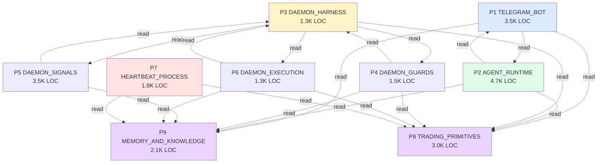

# Work Cells for Parallel Agent Dispatch

**Date:** 2026-04-07
**Verification:** Cell boundaries and LOC budgets verified against current source on
2026-04-07. See `verification-ledger.md` for the audit methodology.
**Purpose:** Define **production-side** work cells — named subsets of the codebase
that an agent can be assigned to without loading the rest of the repo. Each cell has
explicit boundaries, freeze lists, and dispatch checklists.
**Companion to:** `system-grouping.md` (which defines **research/strategy-side** cells
for the future quant/ app per ADR-011). Together these two docs cover the whole repo.

---

## Why work cells matter

The `agent-cli/` codebase is ~21K LOC across the production layer alone. No single
agent session has the context budget to load all of it productively. Without explicit
cell boundaries, two failure modes recur:

1. **Context exhaustion** — agents try to load too much, run out of working memory
   mid-task, and produce shallow or incorrect work.
2. **Drift across the repo** — agents touch files outside the task scope ("while I'm
   here, let me also clean up X"), introducing regressions in code they don't fully
   understand.

A work cell is a **freeze-list-bounded subset** an agent loads at the start of a
session. Within the cell, the agent can move freely. Outside the cell, the agent
**only reads, never writes**. Inter-cell coordination is the human operator's job
(or a coordinator agent's), not any individual cell agent's.

This is the same idea as a microservice contract — except the boundary is informal
(file paths, not deployment) and enforced socially (the freeze list is in the cell
spec, not the file system).

---

## Cell anatomy (template)

Every cell in this doc carries the following fields:

| Field | What it captures | Why it's there |
|---|---|---|
| **Name** | Short, ALL_CAPS identifier | Unambiguous reference |
| **Purpose** | One-paragraph mission | What an agent in this cell is for |
| **Files included** | Path globs | The agent's working set |
| **LOC budget** | Rough total LOC of the cell | Sanity-check context budget (target: ≤6K LOC per cell) |
| **External interfaces (R)** | What the cell reads from outside | The "I depend on this not changing" list |
| **External interfaces (W)** | What the cell writes that's visible outside | The "this affects other cells" list |
| **Freeze list** | Files the agent must NOT modify | Hard boundary; touching these requires escalation |
| **Test surface** | Test files that validate the cell | Where to look for regression coverage |
| **Safe operations** | Edits the agent can make without confirmation | The default action set |
| **Risky operations** | Edits that need user confirmation | Per CLAUDE.md "Confirm before building" |
| **Common tasks** | Typical agent prompts that fit this cell | Disambiguation aid |
| **Dependencies on other cells** | Which other cells this needs context from | For READ-only orientation |

---

## The 9 production cells

### Cell P1: TELEGRAM_BOT

**Purpose:** Slash commands, callback handlers, inline menus, polling loop, message
routing. Everything in `cli/telegram_bot.py` plus the helpers it calls. The
user-facing surface of the bot.

**Files included:**
```
cli/telegram_bot.py           (~3329 LOC — the file)
common/renderer.py            (TelegramRenderer + Renderer ABC)
common/credentials.py         (read-only — for resolving HL keys)
```

**LOC budget:** ~3500 LOC (one big file + small helpers)

**External interfaces (R):**
- HL API direct (via helpers in `cli/telegram_bot.py:_hl_post`, `_get_all_positions`,
  `_get_account_values`, `_get_all_orders`, `_get_current_price`, `_get_market_oi`)
- `data/config/watchlist.json` (read-only)
- `data/authority.json` (read-only via `common/authority.py`)
- `data/memory/working_state.json` (read-only for `/diag`, `/health`)
- `data/agent_memory/MEMORY.md` (read-only for `/memory`)
- `cli/agent_tools.execute_tool` (called by `_handle_tool_approval`)

**External interfaces (W):**
- Telegram Bot API (sendMessage, editMessageReplyMarkup, answerCallbackQuery)
- `data/diagnostics/*.jsonl` (via `_diag.log_chat`, `_diag.log_error`)
- `data/daemon/chat_history.jsonl` (via `_log_chat` for `[command] /xxx` entries)
- `data/daemon/telegram_last_update_id.txt`

**Freeze list (must NOT touch from this cell):**
- `cli/telegram_agent.py` (AGENT_RUNTIME owns it)
- `cli/agent_runtime.py` (AGENT_RUNTIME owns it)
- `cli/agent_tools.py` (AGENT_RUNTIME owns it — but READING is fine)
- `cli/daemon/**` (DAEMON cells own it)
- `common/heartbeat.py` (HEARTBEAT_PROCESS owns it)
- `parent/**`, `adapters/**`, `execution/**` (TRADING_PRIMITIVES owns it)
- `data/thesis/**` (the bot only reads thesis files)

**Test surface:** `tests/test_telegram_*.py` (especially the bot/router tests)

**Safe operations:**
- Add a new fixed slash command (handler + HANDLERS dict + `_set_telegram_commands` list + `cmd_help` + `cmd_guide` per CLAUDE.md checklist)
- Tune existing rendering (compact/expand, formatting, emojis if user asks)
- Add a new menu callback (`mn:` prefix)
- Fix bugs in the polling loop
- Add a new diagnostic field to `/diag` or `/health`

**Risky operations (need confirmation):**
- Removing existing commands or aliases (CLAUDE.md "no destructive overreach")
- Changing the auth model (sender_id == chat_id)
- Reordering callback handler priorities

**Common tasks:**
- "Add a new `/funding` slash command that shows current funding rates"
- "The `/orders` command should also show trigger orders, not just limit orders"
- "Fix the `/chartoil` shorthand — it crashes on missing args"
- "Add a confirmation step before `/restart`"

**Dependencies:** AGENT_RUNTIME (for the `cli.agent_tools` import in
`_handle_tool_approval` — read-only).

---

### Cell P2: AGENT_RUNTIME

**Purpose:** The AI agent runtime. System prompt assembly, tool registry, tool loop,
streaming, model selection, the tool approval store. This is where the bot's "AI
brain" lives.

**Files included:**
```
cli/telegram_agent.py         (~2087 LOC — handle_ai_message + supporting infra)
cli/agent_runtime.py          (~461 LOC — generic runtime: streaming, parallel tools, dream)
cli/agent_tools.py            (~1308 LOC — TOOL_DEFS + execute_tool + WRITE_TOOLS + pending store)
cli/mcp_server.py             (~806 LOC — alternative MCP path, not used in Telegram)
common/code_tool_parser.py    (Python AST parser for free-model tool blocks)
common/tool_renderers.py      (compact AI-facing renderer for tool output)
common/tools.py               (unified tool primitives shared with MCP server)
agent/AGENT.md                (system prompt content)
agent/SOUL.md                 (system prompt content)
agent/reference/*.md          (on-demand reference docs the agent reads via read_reference)
```

**LOC budget:** ~4700 LOC (the largest cell — agent runtime is dense)

**External interfaces (R):**
- Anthropic API (Sonnet/Opus via session token, Haiku via streaming)
- OpenRouter API (free-model fallback)
- HL API (via tool implementations like `_tool_account_summary`, `_tool_live_price`)
- `data/agent_memory/MEMORY.md` and other agent memory files
- `data/thesis/*.json` (via `_tool_update_thesis`, `_tool_market_brief`)
- `data/config/model_config.json` (read by `_get_active_model`)
- `data/daemon/chat_history.jsonl` (read by `_load_chat_history`)
- `~/.openclaw/agents/default/agent/auth-profiles.json` (session token; **never write to
  this file** per CLAUDE.md)

**External interfaces (W):**
- `data/daemon/chat_history.jsonl` (via `_log_chat` for user/assistant turns)
- `data/agent_memory/*.md` (via `_tool_memory_write`)
- `data/thesis/*.json` (via `_tool_update_thesis`, with user approval)
- HL API trade execution (via `_tool_place_trade`, `_tool_close_position`,
  `_tool_set_sl`, `_tool_set_tp` — all WRITE tools, all gated by approval flow)
- `_pending_actions` in-memory store (5 min TTL)

**Freeze list (must NOT touch from this cell):**
- `cli/telegram_bot.py` (TELEGRAM_BOT owns it — but the callback handler in there
  imports from agent_tools, so adding a new WRITE tool requires READ access)
- `cli/daemon/**` (DAEMON cells)
- `common/heartbeat.py` (HEARTBEAT_PROCESS)
- `parent/risk_manager.py`, `parent/hl_proxy.py` (TRADING_PRIMITIVES — but READ for
  understanding HL API patterns is fine)

**Test surface:** `tests/test_telegram_agent_*.py`, `tests/test_agent_runtime_*.py`,
`tests/test_agent_tools_*.py`, `tests/test_code_tool_parser_*.py`

**Safe operations:**
- Add a new READ tool (definition in TOOL_DEFS + implementation function)
- Add a new WRITE tool (definition + implementation + add name to WRITE_TOOLS set)
- Tune the tool loop bounds (`_MAX_TOOL_LOOPS`, `_MAX_HISTORY`, `_MAX_HISTORY_CHARS`)
- Improve the live context builder (`_build_live_context`)
- Update `agent/AGENT.md` or `agent/SOUL.md` (these are the system prompt source)
- Add reference docs under `agent/reference/`

**Risky operations (need confirmation):**
- Changing the model selection logic (`_get_active_model` flow) — affects auth path
- Editing the streaming handler `_tg_stream_response` — Telegram delivery quality
- Removing tools or making READ tools require approval (changes UX)
- Modifying the `agent_runtime.py` loop — load-bearing per AUDIT_FIX_PLAN.md
  ("the embedded agent runtime is load-bearing and must keep working")

**Common tasks:**
- "Add a new `analyze_thesis` READ tool that compares current price to thesis targets"
- "The agent should be able to read the calendar — add a `read_calendar` tool"
- "Fix the live context builder — it's missing the xyz dex positions"
- "Update AGENT.md to reflect that we're now in WATCH tier"
- "Add a new reference doc for the iterator naming conventions"

**Dependencies:** TELEGRAM_BOT (for the callback flow it ultimately depends on),
TRADING_PRIMITIVES (the tool implementations call HL API), MEMORY_AND_KNOWLEDGE
(thesis + memory + context_harness).

---

### Cell P3: DAEMON_HARNESS

**Purpose:** The daemon's tick loop, context structure, tier filter, persistence,
and the five wrapping subsystems (middleware, telemetry, trajectory, health window,
auto-downgrade). The "shell" that all daemon iterators run inside.

**Files included:**
```
cli/daemon/clock.py           (~353 LOC — Clock._tick, _execute_orders, signal handling)
cli/daemon/context.py         (~148 LOC — TickContext, OrderState FSM, OrderIntent, Iterator Protocol)
cli/daemon/tiers.py           (~79 LOC — TIER_ITERATORS dict, iterators_for_tier())
cli/daemon/state.py           (~104 LOC — DaemonState, StateStore, PID management)
cli/daemon/config.py          (~25 LOC — DaemonConfig)
cli/daemon/roster.py          (~126 LOC — Roster, StrategySlot management)
common/middleware.py          (~113 LOC — run_with_middleware wrapper)
common/telemetry.py           (~266 LOC — TelemetryRecorder + HealthWindow)
common/trajectory.py          (~100 LOC — TrajectoryLogger)
```

**LOC budget:** ~1300 LOC

**External interfaces (R):**
- `cli/daemon/iterators/*.py` (the tick loop calls each iterator's `tick()` method)
- `data/daemon/control/*.json` (control commands via `StateStore.read_control`)
- `data/daemon/state.json` (DaemonState persistence)
- `data/daemon/roster.json` (active strategies)

**External interfaces (W):**
- `data/daemon/state.json` (via `store.save_state`)
- `data/daemon/roster.json` (via `roster.save`)
- `data/daemon/daemon.pid` (via `store.write_pid`)
- `state/telemetry.json` (via `telemetry.end_cycle`)
- `logs/trajectories/*.jsonl` (via `trajectory.log`)
- `ctx.alerts` indirectly via auto-downgrade triggers

**Freeze list:**
- All `cli/daemon/iterators/*.py` (DAEMON_ITERATORS_* own them)
- `parent/risk_manager.py` (TRADING_PRIMITIVES owns it; the harness imports `RiskGate`
  but doesn't define it)
- `cli/telegram_bot.py`, `cli/telegram_agent.py` (interface cells)

**Test surface:** `tests/test_clock_*.py`, `tests/test_state_*.py`,
`tests/test_telemetry_*.py`, `tests/test_middleware_*.py`, `tests/test_roster_*.py`

**Safe operations:**
- Add a new field to `TickContext` (and document its writers/readers in
  `tickcontext-provenance.md`)
- Tune `HealthWindow` parameters (window_s, error_budget)
- Add a new `_consecutive_failures` policy
- Improve the auto-downgrade triggers
- Add a new `OrderState` enum value
- Add a new control command (`set_tier`, `add_strategy`, etc.)
- Improve telemetry granularity (per-iterator latency, per-field touch counts)

**Risky operations (need confirmation):**
- Changing the iterator protocol (would require updating every iterator)
- Changing tier definitions in `tiers.py` (would change production behavior)
- Modifying the order execution gating logic in `_execute_orders` (changes safety
  envelope)
- Removing a `OrderState` value (downstream may rely on it)

**Common tasks:**
- "Add per-iterator latency tracking to telemetry"
- "Improve the circuit breaker — it should differentiate flaky from broken iterators"
- "Add a `pause_iterator` control command for runtime debugging"
- "The TickContext should carry an `tick_started_at` timestamp for downstream measurement"

**Dependencies:** TRADING_PRIMITIVES (`RiskGate` enum from `parent/risk_manager.py`).

---

### Cell P4: DAEMON_ITERATORS_GUARDS

**Purpose:** Defensive iterators — protection (SL placement / verification), risk
gates, trailing stops, profit locks, catalyst deleveraging. Anything whose job is
to prevent loss or enforce safety. These run in WATCH (verify-only) and write
defensively in REBALANCE+.

**Files included:**
```
cli/daemon/iterators/exchange_protection.py    (200 LOC — liq SL placer, REBALANCE+)
cli/daemon/iterators/protection_audit.py       (342 LOC — read-only stop verifier, all tiers)
cli/daemon/iterators/risk.py                   (95 LOC — risk_gate writer, ProtectionChain merge)
cli/daemon/iterators/guard.py                  (179 LOC — trailing stops, REBALANCE+)
cli/daemon/iterators/profit_lock.py            (157 LOC — partial profit takes, REBALANCE+)
cli/daemon/iterators/catalyst_deleverage.py    (350 LOC — pre-event reduce, REBALANCE+)
cli/daemon/iterators/liquidation_monitor.py    (172 LOC — cushion alerts, all tiers)
parent/risk_manager.py                         (710 LOC — RiskManager, RiskLimits, ProtectionChain)
                                               (READ-ONLY in this cell — actually owned by TRADING_PRIMITIVES)
```

**LOC budget:** ~1500 LOC writable (+ ~700 LOC read-only context from risk_manager)

**External interfaces (R):**
- `TickContext` (positions, prices, balances, account_drawdown_pct, high_water_mark, alerts)
- HL API (via adapter for trigger order placement)
- `common/authority.py` (the `is_agent_managed` / `is_watched` calls these iterators
  SHOULD make but currently don't — see verification ledger)
- `data/calendar/*.json` (catalyst dates, brent rollover schedule)
- `parent/risk_manager.py` (`RiskManager`, `RiskLimits`, `ProtectionChain` definitions)

**External interfaces (W):**
- `ctx.risk_gate` (via `risk.py` — primary writer; `execution_engine.py:114` is the
  tail-risk co-writer)
- `ctx.order_queue` (via `guard.py`, `profit_lock.py`, `catalyst_deleverage.py`)
- `ctx.alerts` (all of them)
- HL exchange (trigger orders via `exchange_protection.py:_protect_position`)

**Freeze list:**
- `cli/daemon/clock.py` (DAEMON_HARNESS)
- `cli/daemon/context.py` (DAEMON_HARNESS)
- `cli/daemon/iterators/connector.py`, `account_collector.py` (DAEMON_ITERATORS_EXECUTION)
- All signal iterators (DAEMON_ITERATORS_SIGNALS)
- `parent/risk_manager.py` is read-only here — changes go through TRADING_PRIMITIVES
- `common/heartbeat.py` (HEARTBEAT_PROCESS — separate process)

**Test surface:** `tests/test_exchange_protection_*.py`, `tests/test_protection_audit_*.py`,
`tests/test_risk_*.py`, `tests/test_guard_*.py`, `tests/test_profit_lock_*.py`,
`tests/test_catalyst_deleverage_*.py`, `tests/test_liquidation_monitor_*.py`

**Safe operations:**
- Add a new alert tier to `liquidation_monitor`
- Add a new `ProtectionChain` rule (in TRADING_PRIMITIVES, then wire here)
- Tune `protection_audit` thresholds (`MIN_STOP_DISTANCE_PCT`, `MAX_STOP_DISTANCE_PCT`)
- Add the missing `is_agent_managed()` check to `exchange_protection._protect_position`
  (closing the LATENT-REBALANCE gap from the verification ledger)
- Add the missing `is_agent_managed()` check to `guard.tick`
- Tune the `gate_severity` merge logic in `risk.py`

**Risky operations (need confirmation):**
- Changing `exchange_protection`'s SL formula (currently `liq * 1.02`)
- Changing `guard`'s trailing stop ladder
- Adding new write-capable iterators in this cell (must coordinate with DAEMON_HARNESS
  to ensure tier wiring is correct)
- Removing `protection_audit` checks (verification gap)

**Common tasks:**
- "Close the exchange_protection authority gap from the verification ledger"
- "Add a `time_since_entry` column to liquidation_monitor alerts"
- "The trailing stop ladder in guard.py should support a 4th tier"
- "protection_audit should also check for orphaned trigger orders (SL on closed positions)"

**Dependencies:** DAEMON_HARNESS (Iterator protocol), TRADING_PRIMITIVES (RiskManager,
adapters), MEMORY_AND_KNOWLEDGE (authority.py).

---

### Cell P5: DAEMON_ITERATORS_SIGNALS

**Purpose:** Read-only / observational iterators — pulse, radar, market structure,
thesis loading, APEX advisor, autoresearch, brent rollover, funding tracker,
liquidity. Anything whose job is to populate `TickContext` with derived data, not
write to the exchange.

**Files included:**
```
cli/daemon/iterators/pulse.py                  (112 LOC — capital inflow signals)
cli/daemon/iterators/radar.py                  (123 LOC — opportunity scanner)
cli/daemon/iterators/market_structure_iter.py  (190 LOC — RSI, BB, MACD)
cli/daemon/iterators/thesis_engine.py          (123 LOC — load thesis files)
cli/daemon/iterators/apex_advisor.py           (245 LOC — dry-run APEX proposals)
cli/daemon/iterators/autoresearch.py           (596 LOC — REFLECT loop)
cli/daemon/iterators/brent_rollover_monitor.py (268 LOC — calendar alerts)
cli/daemon/iterators/funding_tracker.py        (245 LOC — cumulative funding cost)
cli/daemon/iterators/liquidity.py              (133 LOC — spread/depth tracker)
modules/pulse_engine.py                        (the underlying signal engine)
modules/radar_engine.py                        (the underlying scanner)
modules/apex_engine.py                         (300 LOC — APEX decision logic, READ-ONLY here)
modules/judge_engine.py                        (conviction validation)
modules/reflect_engine.py                      (REFLECT loop logic)
```

**LOC budget:** ~3500 LOC (largest iterator cell — autoresearch is the biggest)

**External interfaces (R):**
- `TickContext` (all_markets, candles, prices, positions, thesis_states, balances)
- `data/thesis/*.json` (via `thesis_engine`)
- `data/calendar/brent_rollover.json` (via `brent_rollover_monitor`)
- `data/research/*` (via `autoresearch`)
- `modules/candle_cache.py` (most signal iterators read candles via this)
- `common/market_snapshot.py` (technicals computation)

**External interfaces (W):**
- `ctx.pulse_signals`, `ctx.radar_opportunities`, `ctx.market_snapshots`,
  `ctx.thesis_states` (the signal/data fields they own)
- `ctx.alerts` (all of them)
- `data/research/learnings.md`, `data/research/journal.jsonl` (autoresearch)
- `state/funding.json` (funding_tracker)

**Freeze list:**
- `cli/daemon/clock.py` (DAEMON_HARNESS)
- `cli/daemon/context.py` (DAEMON_HARNESS)
- All guard iterators (DAEMON_ITERATORS_GUARDS)
- All execution iterators (DAEMON_ITERATORS_EXECUTION)
- `modules/apex_engine.py` is READ-ONLY here — owned by SIGNAL_SOURCES research
  cell + cross-referenced from EXECUTION cells
- `parent/**` (TRADING_PRIMITIVES)

**Test surface:** `tests/test_pulse_*.py`, `tests/test_radar_*.py`,
`tests/test_market_structure_*.py`, `tests/test_thesis_engine_*.py`,
`tests/test_autoresearch_*.py`, `tests/test_funding_tracker_*.py`

**Safe operations:**
- Add a new signal type to pulse or radar
- Tune signal thresholds
- Add a new technical indicator to market_structure (RSI/BB/MACD-style)
- Add a new thesis loading rule (e.g. age-based clamp, currency conversion)
- Add a new alert from autoresearch (e.g. backtest convergence)
- Add a new calendar source (FOMC, OPEC, etc.)

**Risky operations (need confirmation):**
- Removing existing signals (downstream consumers may depend on them)
- Changing the thesis staleness clamp (production-tunable behavior)
- Switching `autoresearch` from read-only to write-mode (would touch
  data/research/ heavily)

**Common tasks:**
- "Add an OPEC announcement calendar to brent_rollover_monitor"
- "Tune the radar opportunity scanner's volatility filter"
- "thesis_engine should warn when conviction dropped >50% in a single load"
- "Add a 'dollar volume' column to the pulse signal output"

**Dependencies:** DAEMON_HARNESS (Iterator protocol), MEMORY_AND_KNOWLEDGE
(thesis.py, candle_cache from modules), TRADING_PRIMITIVES (apex_engine read-only).

---

### Cell P6: DAEMON_ITERATORS_EXECUTION

**Purpose:** Iterators that drive the execution path — connector (data ingest),
account_collector (snapshots), execution_engine (conviction-based sizing), rebalancer
(strategy roster), journal (audit trail), telegram (output), memory_consolidation
(cleanup).

**Files included:**
```
cli/daemon/iterators/connector.py          (135 LOC — fetches positions, prices, candles, all_markets)
cli/daemon/iterators/account_collector.py  (288 LOC — snapshots equity + HWM, dual-write to memory.db)
cli/daemon/iterators/execution_engine.py   (292 LOC — conviction → size + leverage → OrderIntent)
cli/daemon/iterators/rebalancer.py         (100 LOC — runs roster strategies)
cli/daemon/iterators/journal.py            (233 LOC — append-only tick log)
cli/daemon/iterators/telegram.py           (197 LOC — alerts → Telegram)
cli/daemon/iterators/memory_consolidation.py (58 LOC — periodic memory.db cleanup)
```

**LOC budget:** ~1300 LOC

**External interfaces (R):**
- HL API (connector is the primary fetcher; account_collector also calls it)
- `TickContext` (every field — these iterators consume + produce most of it)
- `data/thesis/*.json` (execution_engine indirectly via thesis_states)
- `data/config/risk_caps.json` (execution_engine for per-market hard caps)
- `data/agent_memory/*` (memory_consolidation reads + writes)

**External interfaces (W):**
- `ctx.balances`, `ctx.positions`, `ctx.prices`, `ctx.candles`, `ctx.all_markets`
  (via connector)
- `ctx.snapshot_ref`, `ctx.account_drawdown_pct`, `ctx.high_water_mark` (via
  account_collector)
- `ctx.order_queue` (via execution_engine, rebalancer)
- `ctx.alerts` (via all of them)
- `data/snapshots/*.json` (account_collector)
- `data/memory/memory.db` (account_collector dual-write, memory_consolidation cleanup)
- `data/daemon/journal/ticks.jsonl` (journal — 🔴 active growth concern, no rotation)
- Telegram external (telegram iterator)

**Freeze list:**
- `cli/daemon/clock.py` (DAEMON_HARNESS)
- All guard iterators (DAEMON_ITERATORS_GUARDS)
- All signal iterators (DAEMON_ITERATORS_SIGNALS)
- `parent/risk_manager.py` (TRADING_PRIMITIVES — but READ for understanding gates)
- `parent/hl_proxy.py` (TRADING_PRIMITIVES — READ for HL API patterns)

**Test surface:** `tests/test_connector_*.py`, `tests/test_account_collector_*.py`,
`tests/test_execution_engine_*.py`, `tests/test_rebalancer_*.py`,
`tests/test_journal_*.py`, `tests/test_telegram_iter_*.py`

**Safe operations:**
- Add the missing `is_agent_managed()` check to `execution_engine._process_market`
  (closing the LATENT-REBALANCE gap from the verification ledger)
- Tune `REBALANCE_THRESHOLD` (currently 5%) or `REBALANCE_INTERVAL_S` (120s)
- Add a new conviction band tier
- Add a new entry in `_conviction_band` mapping
- Improve `account_collector`'s expiry logic (currently 7d full, 30d sampled)
- Add a new field to `journal` ticks entries
- Add a journal rotation policy (the active growth concern)

**Risky operations (need confirmation):**
- Changing the conviction bands (Druckenmiller pyramid rule — production-tunable)
- Changing the drawdown gates (HALT_DRAWDOWN_PCT=25, RUIN_DRAWDOWN_PCT=40)
- Changing the weekend / thin-session leverage caps
- Removing the LONG-or-NEUTRAL-only-on-oil hard constraint (CLAUDE.md rule)
- Switching `account_collector` to single-write only (loses memory.db redundancy)

**Common tasks:**
- "Close the execution_engine authority gap from the verification ledger"
- "Add a 'rebalance reason' field to the OrderIntent meta dict"
- "The journal iterator should rotate ticks.jsonl daily"
- "execution_engine should respect a per-market conviction floor"

**Dependencies:** DAEMON_HARNESS, TRADING_PRIMITIVES (HL API patterns,
RiskGate), MEMORY_AND_KNOWLEDGE (thesis_states origin).

---

### Cell P7: HEARTBEAT_PROCESS

**Purpose:** The launchd-managed heartbeat process. Runs every 2 minutes outside
the daemon, places ATR-based stops on every watched position, escalates risk
levels, dip-adds and profit-takes when authority is `agent`. WATCH-tier production
relies entirely on heartbeat for stop placement.

**Files included:**
```
common/heartbeat.py           (1631 LOC — the god-file)
common/heartbeat_state.py     (101 LOC — escalation state, ATR cache, working state I/O)
common/atr.py (or wherever compute_atr lives)
common/account_resolver.py    (resolve_main_wallet helper used by heartbeat)
```

**LOC budget:** ~1800 LOC (concentrated in one file — read it carefully)

**External interfaces (R):**
- HL API (`clearinghouseState`, `candleSnapshot`, `openOrders`)
- `data/authority.json` (via `is_watched` and `get_authority` — the only iterator
  outside the daemon that gates per-asset)
- `data/config/escalation_config.json`, `data/config/profit_rules.json`
- `data/thesis/*.json` (TP placement looks up the thesis target)
- `data/memory/working_state.json` (per-position state across runs)
- `data/memory/memory.db` (writes action_log + execution_traces)

**External interfaces (W):**
- HL exchange (places/cancels SL and TP trigger orders)
- `data/memory/working_state.json` (saves escalation state, ATR cache, last_prices,
  last_add_ms after every run)
- `data/memory/memory.db` (action_log, execution_traces inserts)
- Telegram (alerts on escalation or critical events)

**Freeze list:**
- All `cli/daemon/**` (different process — heartbeat is launchd, daemon is `hl
  daemon start`)
- `cli/telegram_bot.py`, `cli/telegram_agent.py` (interface cells)
- `parent/risk_manager.py` (TRADING_PRIMITIVES)
- READING `parent/hl_proxy.py` is fine; do not modify

**Test surface:** `tests/test_heartbeat_*.py`

**Safe operations:**
- Add a new escalation tier to escalation_config.json schema + heartbeat handler
- Tune the ATR cache TTL (currently 1h)
- Add a new working_state field for cross-run continuity
- Add a new check to the per-position loop (e.g. funding rate threshold)
- Improve the SL placement formula (e.g. tighter for high-volatility regimes)

**Risky operations (need confirmation):**
- Changing the SL formula from `entry ± 3*ATR` (production-tunable behavior)
- Removing the `is_watched()` skip (would attempt to manage `off` assets)
- Changing the heartbeat run cadence (launchd plist + internal timing assumptions)
- Adding new exchange writes outside the existing SL/TP slot model
- Splitting `heartbeat.py` into multiple files (touches every import in the repo)

**Common tasks:**
- "Heartbeat should also place a TP at the thesis target if the thesis exists and
  the current price is past the entry"
- "The escalation level should reset to 0 after 24h of clean state"
- "Add a 'paused' flag to working_state that heartbeat respects"
- "Heartbeat's profit-taking should respect the conviction kill-switch"

**Dependencies:** TRADING_PRIMITIVES (HL API), MEMORY_AND_KNOWLEDGE (thesis,
memory.db schema, authority).

---

### Cell P8: TRADING_PRIMITIVES

**Purpose:** The trading primitives layer — risk manager, HL proxy, position
tracker, adapters, order types, TWAP, routing. Anything that knows about HL API
contracts or order construction. The substrate everything else trades through.

**Files included:**
```
parent/risk_manager.py       (710 LOC — RiskManager, RiskLimits, ProtectionChain, gates)
parent/hl_proxy.py           (489 LOC — DirectHLProxy, signed exchange calls)
parent/position_tracker.py   (226 LOC — Position dataclass, PositionTracker)
parent/store.py              (107 LOC — state store)
parent/house_risk.py         (104 LOC)
parent/sdk_patches.py        (72 LOC)
adapters/hl_adapter.py       (101 LOC — VenueAdapter for HL)
adapters/mock_adapter.py     (98 LOC — VenueAdapter for testing)
execution/order_types.py     (146 LOC — limit, market, trigger order constructors)
execution/order_book.py      (58 LOC)
execution/parent_order.py    (49 LOC)
execution/portfolio_risk.py  (167 LOC)
execution/routing.py         (103 LOC — maker/taker routing)
execution/twap.py            (105 LOC — TWAP slicing)
modules/apex_engine.py       (300 LOC — APEX decision engine)
modules/candle_cache.py      (214 LOC — SQLite candle cache)
```

**LOC budget:** ~3050 LOC

**External interfaces (R):**
- HL API (the entire surface — auth, info, exchange endpoints)
- `data/cli/state.db` (state store for CLI runner)
- `data/candles/candles.db` (candle cache)
- Credentials (via `common/credentials.py` — keystore access)

**External interfaces (W):**
- HL exchange (the only place that signs and sends trades — `hl_proxy.place_order`,
  `hl_proxy.cancel_order`, etc.)
- `data/cli/state.db`
- `data/candles/candles.db` (via `candle_cache.store_candles`)
- `data/cli/trades.jsonl`

**Freeze list:**
- `cli/**` (interface cells, daemon cells, agent runtime — all consume primitives but
  don't define them)
- `common/heartbeat.py` (HEARTBEAT_PROCESS — though it imports from this cell heavily)
- `data/thesis/**` (MEMORY_AND_KNOWLEDGE)
- `data/authority.json` (MEMORY_AND_KNOWLEDGE)

**Test surface:** `tests/test_risk_manager_*.py`, `tests/test_hl_proxy_*.py`,
`tests/test_position_tracker_*.py`, `tests/test_adapters_*.py`,
`tests/test_execution_*.py`, `tests/test_apex_engine_*.py`,
`tests/test_candle_cache_*.py`

**Safe operations:**
- Add a new `RiskLimits` field
- Add a new `ProtectionChain` rule class
- Add a new order type wrapper in `order_types.py`
- Improve TWAP slicing logic
- Add a new `routing.py` decision rule
- Add a new HL API method wrapper in `hl_proxy.py`
- Tune `candle_cache` retention (currently indefinite)

**Risky operations (need confirmation):**
- Changing the `RiskGate` enum values (downstream depends on the names)
- Modifying `place_order` signing logic (auth-critical)
- Changing the `Position` dataclass field names (every consumer breaks)
- Adding new write paths to HL API outside the existing `hl_proxy` surface
- Removing fields from `RiskLimits.mainnet_defaults()` (production tunables)

**Common tasks:**
- "Add a new ProtectionChain rule for consecutive losing trades"
- "hl_proxy should have a `cancel_all_for_market` helper"
- "Add an iceberg order wrapper to order_types.py"
- "candle_cache should support a 'max age' query parameter"

**Dependencies:** Credentials layer (read-only), HL API knowledge.

---

### Cell P9: MEMORY_AND_KNOWLEDGE

**Purpose:** The persistence and knowledge substrate — memory.db, agent memory
files, thesis state, conviction engine, watchlist, authority. Cross-cutting state
that lives outside the daemon tick.

**Files included:**
```
common/memory.py              (407 LOC — memory.db schema + queries)
common/memory_consolidator.py (457 LOC — summary writer, dream consolidation)
common/context_harness.py     (528 LOC — relevance-scored context assembly)
common/thesis.py              (208 LOC — ThesisState dataclass + load/save)
common/conviction_engine.py   (167 LOC — conviction band → size mapping)
common/authority.py           (149 LOC — agent/manual/off levels)
common/watchlist.py           (145 LOC — single source of tracked markets)
common/models.py              (data classes used across the bot)
common/calendar.py (or similar — event calendar logic)
```

**LOC budget:** ~2100 LOC

**External interfaces (R):**
- `data/memory/memory.db` (read by every consumer)
- `data/agent_memory/*.md`
- `data/thesis/*.json`
- `data/authority.json`
- `data/config/watchlist.json`
- `data/calendar/*.json`

**External interfaces (W):**
- `data/memory/memory.db` (events, learnings, observations, action_log,
  execution_traces, account_snapshots, summaries tables)
- `data/agent_memory/*.md` (via memory_consolidator)
- `data/thesis/*.json` (via `ThesisState.save`)
- `data/authority.json` (via `set_authority`, `delegate`, `reclaim`)
- `data/config/watchlist.json` (via `write_watchlist`)

**Freeze list:**
- All `cli/**` (consumers)
- All `parent/**` and `adapters/**` and `execution/**` (TRADING_PRIMITIVES)
- `common/heartbeat.py` (HEARTBEAT_PROCESS — but reads from this cell heavily)

**Test surface:** `tests/test_memory_*.py`, `tests/test_thesis_*.py`,
`tests/test_authority_*.py`, `tests/test_watchlist_*.py`,
`tests/test_conviction_*.py`, `tests/test_context_harness_*.py`,
`tests/test_memory_consolidator_*.py`

**Safe operations:**
- Add a new column to a memory.db table (with migration)
- Add a new conviction band rule
- Add a new authority level
- Tune the staleness clamp in `thesis.py`
- Improve `context_harness.py` relevance scoring
- Add a new memory file under `data/agent_memory/`
- Add a dual-write backup for thesis state files (closing the SPOF gap from
  data-stores.md)
- Add a dual-write backup for working_state.json
- Add rotation logic for `chat_history.jsonl` (the LATENT growth concern)

**Risky operations (need confirmation):**
- Removing a memory.db table or column (downstream depends)
- Changing the `ThesisState` dataclass field names (shared contract with AI)
- Changing the authority levels (changes per-asset behavior)
- Changing the watchlist file format
- Removing the `format_authority_status` Telegram helper (used by `/authority`)

**Common tasks:**
- "Add a 'last_consolidated_at' field to memory.db summaries table"
- "thesis.py should support a 'paused' state where conviction is read but ignored"
- "Add a backup writer for data/thesis/*.json that mirrors to data/thesis_backup/"
- "context_harness should down-rank stale memory entries"

**Dependencies:** None — this is the substrate everything else depends on.

---

## Cell relationships



**Read direction (dotted arrows):** "this cell reads context from that cell to do
its work, but does not modify it."

**Substrate cells (purple, no inbound):** TRADING_PRIMITIVES (P8) and
MEMORY_AND_KNOWLEDGE (P9). These have no dependencies on other cells and are read
by almost everyone. Changes here have the largest blast radius — be cautious.

**Hub cell (yellow):** DAEMON_HARNESS (P3). All daemon iterator cells (P4/P5/P6)
read it. It's the contract that defines the iterator protocol. Changes here ripple
to every iterator cell.

**Process-bound cells:** HEARTBEAT_PROCESS (P7, red) is its own OS process; cell
boundaries are doubly-enforced because cross-process state has to flow through
files, not memory. TELEGRAM_BOT (P1, blue) and AGENT_RUNTIME (P2, green) live in
the same process but are sized as separate cells because together they exceed
context budget.

---

## Cross-cell coordination patterns

When a task spans cells, these patterns work:

### Pattern 1: One coordinator + multiple cell agents (parallel)

For independent sub-tasks:
- Coordinator agent reads the task, identifies which cells are affected
- Dispatches one Explore or Plan agent per cell with cell-scoped instructions
- Each cell agent works in isolation (only writes within its cell)
- Coordinator merges or sequences the results

**Example:** "Add an iceberg order type and expose it as a new `place_iceberg` write
tool the AI agent can call."
- Cell P8 (TRADING_PRIMITIVES) agent: implement `IcebergOrder` in `execution/order_types.py`
- Cell P2 (AGENT_RUNTIME) agent: add `_tool_place_iceberg` definition + implementation
  to `agent_tools.py`, register in WRITE_TOOLS
- Cell P1 (TELEGRAM_BOT) agent: no work needed (the approval flow is already generic)
- Coordinator: sequence P8 → P2, run integration test

### Pattern 2: One agent loads multiple cells (sequential, small task)

For tasks where cells are tightly coupled and the total context fits in one session:
- Explicitly load both cells' file lists into the working set
- Be transparent about which cell each edit goes into
- Commit per-cell

**Example:** "Add the missing authority check to exchange_protection."
- This is mostly within Cell P4 (DAEMON_GUARDS) but reads `common/authority.py` from
  Cell P9 (MEMORY_AND_KNOWLEDGE)
- One agent can do it: read `authority.py`, add the import + check in
  `exchange_protection.py`

### Pattern 3: Spec-then-implement across cells

For larger architectural changes:
- Phase 1: write a spec/plan in `docs/wiki/` (no cell loaded)
- Phase 2: dispatch per-cell agents with the spec as the contract
- Phase 3: integration test against the spec

**Example:** Closing all four authority gaps from the verification ledger
- Phase 1: write a "production safety patches" spec covering all 4 fixes
- Phase 2: dispatch P4 (exchange_protection, guard), P6 (execution_engine), P3
  (clock._execute_orders) agents in parallel with the spec
- Phase 3: run `pytest tests/ -x -q`, smoke-test on testnet

---

## Dispatch checklist

Before dispatching an agent into a cell, confirm:

- [ ] Cell is named and the task fits inside its purpose
- [ ] Agent prompt explicitly lists the freeze list (or links to this doc)
- [ ] Agent prompt explicitly lists the test surface
- [ ] Task does NOT span multiple cells (or you've decided how to coordinate)
- [ ] Risky operations (per the cell spec) have user confirmation queued up
- [ ] LOC budget for the cell + the task fits in the agent's context window
- [ ] You know which CLAUDE.md file the cell agent should read (per package)
- [ ] You've decided whether the cell agent should commit or just propose changes
- [ ] If the cell touches `data/` files, you've decided what's safe to write to

After the cell agent finishes:

- [ ] Run the cell's test surface (`pytest tests/test_<cell>_*.py -x -q`)
- [ ] Smoke-test in mock/testnet if the cell touches trading primitives
- [ ] Update the relevant wiki page if architecture changed (per MAINTAINING.md)
- [ ] Add a build-log entry if a major change shipped

---

## Reference: research/strategy cells

The 7 cells in `system-grouping.md` cover the **research/strategy/ML** side of the
repo (the future `quant/` app per ADR-011):

| Cell | Purpose | Files |
|---|---|---|
| GUARD_FRAMEWORK | Tune guards (state machines, escalation) | `modules/guard_*.py`, `modules/trailing_stop.py` |
| SIGNAL_SOURCES | New signal generators, backtest combinations | `modules/pulse_engine.py`, `radar_engine.py`, `judge_engine.py` |
| STRATEGIES_ADAPTATION | Port dormant strategies to signal adapters | `strategies/*.py` (25 files) |
| EXECUTION_MECHANICS | Order types, TWAP, routing, multi-wallet | `execution/`, `cli/order_manager.py`, `cli/multi_wallet_engine.py` |
| MARKET_DATA_INGESTION | Catalog design, candle cache, dual-write | `modules/candle_cache.py`, `modules/data_fetcher.py` |
| APEX_STACKING | Signal stacking, decision rules | `modules/apex_engine.py`, `apex_config.py`, `apex_state.py` |
| REPORTING_REFLECTION | Daily reports, weekly reflections | `cli/daily_report.py`, `modules/reflect_engine.py`, `journal_engine.py` |

These cells are **complementary** to the production cells in this doc — they share
some files (e.g. `apex_engine.py` is in both APEX_STACKING and DAEMON_SIGNALS) but
the perspective is different. Production cells care about runtime safety; research
cells care about backtest accuracy and adapter portability.

**Choose the cell type that matches the task:**
- "Fix a bug in the running daemon" → production cell (P1-P9)
- "Backtest a new signal combination" → research cell (system-grouping.md)
- "Add a new signal that's also wired into the daemon" → research cell (build) +
  production DAEMON_SIGNALS cell (wire it up)

---

## How to keep this doc honest

1. **No hardcoded counts.** This doc carries LOC budgets but they're approximations
   (per `wc -l`). When iterators get added/removed, do NOT update this doc — let the
   periodic alignment skill catch the drift.
2. **Cell boundaries should rarely change.** If a new cell needs to exist, add a
   new section. If an old cell needs to go, mark it deprecated rather than deleting.
3. **The freeze list is a social contract.** It only works if cell agents respect
   it. Use `pre-commit` hooks or PR review to enforce.
4. **Tests are the safety net.** Every cell carries a test surface. If a cell
   doesn't have tests, that's the first thing to add before dispatching agents.

---

## Related Docs

- `verification-ledger.md` — what's actually true in the codebase right now
- `master-diagrams.md` — the 7 architectural views (cells correspond loosely to
  views 1, 2, 3, 5)
- `tier-state-machine.md` — tiers + authority overlay (orthogonal to cells)
- `system-grouping.md` — the 7 research/strategy cells (complement to this doc)
- `tickcontext-provenance.md` — what TickContext fields each iterator touches
- `MAINTAINING.md` — the doc rules
- ADR-011 — research-app split (the long-term decomposition this doc serves)
- ADR-012 (Phase 5) — formal architectural composition decision
