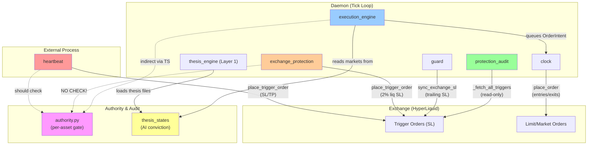

# Three-Writer Story: Stop-Loss & Exchange State Authority Model

**Status**: Architecture document
**Last Updated**: 2026-04-08 (post H1-H4 hardening, §§1.2, 1.3, 5.1, 6 reconciled with post-fix code)
**Context**: C1 dual-writer bug post-mortem, C1' through C7 hardening, and H1-H4 authority gates
**Owner**: Trading bot team

> **Verification status:** Every claim in this doc has been spot-checked against
> source code. The H1-H4 production hardening (four authority gates) landed
> 2026-04-07 and the affected sections (§§1.2, 1.3, 5.1, 6) have been updated in
> place. The historical §5 "Race Conditions & Authority Bypasses" text is
> preserved as audit trail, with ✅ RESOLVED markers at the top of each issue.
> See `verification-ledger.md` for the full audit trail.
> Production still runs in **WATCH tier**; H1-H4 becomes active on tier promotion.

## Executive Summary

The HyperLiquid Bot has three entities that write stop-loss and protection orders to the exchange:

1. **heartbeat** (production, WATCH tier) — standalone launchd process, places ATR-based SL/TP every 2 minutes
2. **exchange_protection** (REBALANCE/OPPORTUNISTIC) — daemon iterator, places ruin-prevention SL only (2% above liq)
3. **execution_engine** (REBALANCE/OPPORTUNISTIC) — daemon iterator, queues sizing orders from thesis conviction

The **C1 bug** happened because both heartbeat and exchange_protection tried to manage the same stop-loss slot concurrently, causing thrashing. This doc explains:
- How the three-writer story now works safely
- The per-asset authority gate and who respects it
- The read-only audit verifier (protection_audit) that prevents silent failures
- The stop-slot ownership matrix showing who owns what in each tier
- Where authority bypasses exist (and whether they're intentional)

## Architecture Overview

### The Three Writers

```
┌─────────────────────────────────────────────────────────────────┐
│                    EXCHANGE (HyperLiquid API)                   │
│  ┌──────────────────────────────────────────────────────────┐   │
│  │  Trigger Orders (Stop-Loss + Take-Profit)               │   │
│  │  Limit Orders (Entries / Exits)                         │   │
│  └──────────────────────────────────────────────────────────┘   │
└─────────────────────────────────────────────────────────────────┘
         ↑                    ↑                    ↑
         │ SL (2%)            │ Orders             │ SL (ATR)
    exchange_           execution_            heartbeat
    protection          engine              (external)
    (daemon iter)       (daemon iter)        (launchd)
         │                    │                    │
         └────────┬───────────┴────────┬──────────┘
                  │                    │
              ╔═══════════════════╗  ╔═══════════════════╗
              │ AUTHORITY GATE    │  │ AUDIT VERIFIER    │
              │ (per-asset)       │  │ (read-only)       │
              │ • agent           │  │ • protection_     │
              │ • manual          │  │   audit           │
              │ • off             │  │ • liquidation_    │
              ╚═══════════════════╝  │   monitor         │
                                     ╚═══════════════════╝
```

### Tier Activation

| Writer | WATCH | REBALANCE | OPPORTUNISTIC |
|--------|-------|-----------|---------------|
| **heartbeat** | ✅ enabled | ⚠️ MUST disable | ⚠️ MUST disable |
| **exchange_protection** | ❌ NOT in tier | ✅ active | ✅ active |
| **execution_engine** | ❌ NOT in tier | ✅ active | ✅ active |
| **protection_audit** | ✅ reads only | ✅ reads only | ✅ reads only |

**Critical rule**: heartbeat and exchange_protection cannot run simultaneously. They will race on the same SL slot and thrash orders. When promoting WATCH → REBALANCE, always disable heartbeat launchd job first.

---

## 1. Per-Writer Responsibilities

### 1.1 heartbeat (Separate Process)

**File**: `common/heartbeat.py`  
**Activation**: Runs every 2 minutes via launchd (not a daemon iterator)  
**Tier**: WATCH only (when running at all)  
**Authority checks**: ✅ YES

#### What it writes:
- **Stop-loss (SL)**: ATR-based, `entry ± (3 × ATR)`, respects min-distance and liq buffer
- **Take-profit (TP)**: Thesis-driven or mechanical 5x ATR from entry
- **Order type**: Trigger orders (conditional exchange orders)
- **Instruments**: Any position with `is_watched(coin) = true`

#### Authority checks:
```python
# heartbeat.py:667-671
if not is_watched(coin):
    log.debug("Skipping %s — authority: off", coin)
    continue

asset_authority = get_authority(coin)  # Returns: "agent", "manual", or "off"
```

#### When it places stops:
- Every tick (2 min), for every open position that lacks a stop
- Only if `atr_val > 0` and `not has_stop`
- Skips positions where `authority = "off"`
- Places on both `authority = "agent"` and `authority = "manual"` (safety net)

#### When it exits positions:
- Spike/dip profit-taking: **only if** `authority = "agent"` (lines 866, 917)
- Dip-add scaling: **only if** `authority = "agent"` (lines 994, 1007)
- Stop-loss trigger execution: handled by exchange

#### Risk: Authority gate on entries/exits is asymmetric
- **Stop placement**: respects `is_watched()`, acts on all non-`off`
- **Profit-taking**: requires `authority = "agent"`
- **Result**: A `manual` position can have a stop placed but cannot be auto-exited for profit — asymmetric but safe

---

### 1.2 exchange_protection (REBALANCE/OPPORTUNISTIC Daemon Iterator)

**File**: `cli/daemon/iterators/exchange_protection.py`
**Activation**: REBALANCE tier and above
**Authority checks**: ✅ **Per-asset `is_agent_managed()` gate** (H1 hardening, commit `37be8c7`)

#### What it writes:
- **Stop-loss only**: Ruin prevention, `liq_price × 1.02` (2% buffer above liq)
- **NO take-profit orders**: Exits are conviction-driven via execution_engine
- **Order type**: Trigger orders (conditional exchange orders)
- **Instruments**: **Agent-delegated positions only** (H1 gate skips `manual` / `off`)

#### How it works:
1. Every 60 seconds, iterates `ctx.positions`
2. For each position with `net_qty ≠ 0`:
   - **H1 gate**: `is_agent_managed(pos.instrument)` — skip if not agent
   - Calculates target SL = `liq_px × 1.02` (long) or `liq_px × 0.98` (short)
   - Checks if existing SL drifted >0.5% from target
   - Cancels old SL, places new one
3. When position closes (or authority is reclaimed mid-flight), the cleanup loop
   cancels the SL — the alert message reads "position closed or authority reclaimed".

#### Authority gate (post-H1):
```python
# exchange_protection.py — H1 hardening
for pos in ctx.positions:
    if pos.net_qty == ZERO:
        continue
    if not is_agent_managed(pos.instrument):
        log.debug("H1: skipping non-agent position %s", pos.instrument)
        continue
    active[pos.instrument] = pos

# ... then for each position:
for inst, pos in active.items():
    self._protect_position(inst, pos, ctx)
```

Tested in `tests/test_exchange_protection_authority.py` (7 tests covering agent,
manual, off, mixed, reclaim, zero-qty, and close paths).

#### Comparison to heartbeat:
- **heartbeat**: SL is ATR-based (market-informed), acts as safety net on all positions
  regardless of authority — it's the user's safety floor in WATCH tier
- **exchange_protection**: SL is liq-only (ruin prevention), gated per-asset so it only
  manages assets the user has explicitly delegated

---

### 1.3 execution_engine (REBALANCE/OPPORTUNISTIC Daemon Iterator)

**File**: `cli/daemon/iterators/execution_engine.py`
**Activation**: REBALANCE tier and above
**Authority checks**: ✅ **Per-asset `is_agent_managed()` gate at top of `_process_market()`** (H2 hardening, commit `45df230`)

#### What it writes:
- **Entries**: Buy/sell orders when conviction band > 0
- **Exits**: Close orders when conviction band = 0 or ruin threshold hit
- **Leverage & sizing**: Per Druckenmiller conviction bands
- **Order type**: Limit or market (via OrderIntent)

#### How it works:
1. Every 2 minutes, iterates `ctx.thesis_states.items()`
2. For each `(market, ThesisState)` in the dict:
   - **H2 gate**: `is_agent_managed(market)` — short-circuit before any conviction or sizing math
   - Calculates conviction → target size & leverage
   - Compares to current position
   - If delta > 5% threshold, queues OrderIntent
3. The **global drawdown-ruin gate** (≥40%) at the `tick()` scope is intentionally
   NOT gated on authority — it fires globally and closes everything on account ruin.

#### Authority gate (post-H2):
```python
# execution_engine.py — H2 hardening
def _process_market(self, market, thesis, ctx):
    if not is_agent_managed(market):
        log.warning("H2: skipping non-agent market %s", market)
        return
    # ... conviction band math, sizing, OrderIntent enqueue ...
```

The previous implicit defense — "thesis files only get written for delegated assets,
so `ctx.thesis_states` is already filtered" — was brittle. A manually-created thesis
file or a delegation change between thesis_engine load and execution_engine tick could
produce a thesis for a non-delegated asset and trigger an autonomous trade. H2 closes
that window with an explicit check.

Tested in `tests/test_execution_engine_authority.py` (6 tests covering agent, manual,
off, mixed, gate-order vs conviction, and the global drawdown-ruin carve-out).

---

## 2. Authority Gate Implementation

### 2.1 The Authority File

**Location**: `data/authority.json`

```json
{
  "default": "manual",
  "assets": {
    "BTC": {"authority": "agent", "changed_at": "2026-04-07T...", "note": "..."},
    "GOLD": {"authority": "manual", "changed_at": "2026-04-06T...", "note": "User holds"},
    "BRENTOIL": {"authority": "off", "changed_at": "...", "note": "Inactive"}
  }
}
```

### 2.2 Authority Levels

| Level | Meaning | Bot behavior |
|-------|---------|--------------|
| **agent** | Bot owns this asset | Bot can open, close, scale, set SL/TP |
| **manual** | User owns, bot is safety net | Bot can set SL/TP only; cannot enter or exit for profit |
| **off** | Not watched at all | Bot ignores completely; no alerts, no stops |

### 2.3 API Surface

**File**: `common/authority.py`

```python
get_authority(asset: str) -> str          # Returns "agent", "manual", or "off"
is_agent_managed(asset: str) -> bool      # Returns True iff authority == "agent"
is_watched(asset: str) -> bool            # Returns True iff authority != "off"
delegate(asset: str, note: str) -> str    # Set to "agent"
reclaim(asset: str, note: str) -> str     # Set to "manual"
set_authority(asset: str, level: str)     # Direct set
```

### 2.4 Who Actually Calls the Authority Gate

#### ✅ heartbeat (respects it)
- Checks `is_watched()` before any action
- Checks `get_authority()` before profit-taking or dip-adding
- Places SL/TP on all non-`off` assets (both `agent` and `manual`)

#### ❌ exchange_protection (ignores it)
- **No authority check at all**
- Places SL on every position regardless of delegation
- **BUG**: Should check `is_agent_managed()` before placing

#### ⚠️ execution_engine (trusts thesis_states)
- No explicit check
- Implicitly filtered via thesis_states contents
- **GAP**: Should have explicit `is_agent_managed(market)` check before queuing OrderIntent

#### ✅ protection_audit (respects it by design)
- Read-only verifier, no writes
- Audits all positions (reads from exchange, not authority)
- But doesn't alert about authority mismatches

#### ✅ Telegram bot (respects it)
- Displays authority status via `/authority`
- Prevents manual delegation when daemon has authority

---

## 3. Protection Audit (Read-Only Verifier)

### 3.1 Purpose

**File**: `cli/daemon/iterators/protection_audit.py`

The **C1' solution**: Instead of adding a second writer (exchange_protection to WATCH), we added a second reader. Protection_audit verifies heartbeat's work without writing to the exchange.

### 3.2 What it reads
- Fetches all open trigger orders from exchange for main wallet (native + xyz dex)
- Filters to stop-loss orders only (ignores TP orders)
- Matches them to positions in `ctx.positions`

### 3.3 What it verifies (every 120 seconds)

For each open position:

| Check | Alert | Severity |
|-------|-------|----------|
| Position has NO matching stop on exchange | `no_stop` | CRITICAL |
| Stop exists but on wrong side of entry | `wrong_side` | CRITICAL |
| Stop is <0.5% from mark (hunted price) | `too_close` | WARNING |
| Stop is >50% from mark (ineffective) | `too_far` | WARNING |
| Stop now within valid range (was previously flagged) | `ok` | INFO |

### 3.4 What it logs

- All alerts are tagged `severity: critical|warning|info`
- Logs to `ctx.alerts` (picked up by telegram)
- Keeps per-coin state to avoid alert spam
- Only re-alerts if state changes

### 3.5 What it does NOT do

- Never calls `place_trigger_order()`
- Never cancels or modifies stops
- Never executes trades
- Purely observational

### 3.6 Race protection

Protection_audit runs every 120 seconds (heartbeat's cadence). If heartbeat fails or is delayed, protection_audit will surface it as `no_stop` CRITICAL within 2 minutes.

**Tier coverage:** `protection_audit` is active in **all three tiers** (WATCH,
REBALANCE, OPPORTUNISTIC) per `cli/daemon/tiers.py`. In WATCH it verifies heartbeat.
In REBALANCE/OPPORTUNISTIC it verifies `exchange_protection`. The same verifier
catches gaps regardless of which writer is supposed to be active.

---

## 4. Stop-Slot Ownership Matrix

This is the diagram that would have prevented the C1 bug. It answers: **For each tier, who owns the right to place/manage the stop-loss slot?**

### WATCH Tier

```
Position: [LONG BTC @ $40k]

┌─────────────────────────────────────────────────┐
│ Stop-Loss Slot (1 per position)                 │
│                                                 │
│  Owner: heartbeat (external process)            │
│  Updater: heartbeat every 2 minutes             │
│  Verifier: protection_audit every 2 minutes     │
│  Formula: ATR-based                             │
│                                                 │
│  ╔════════════════════════════════════════╗     │
│  ║ Real Order: TRIGGER SELL @ $38,500     ║     │
│  ║ (3x ATR below entry, with constraints) ║     │
│  ╚════════════════════════════════════════╝     │
└─────────────────────────────────────────────────┘

exchange_protection: NOT IN THIS TIER
execution_engine: NOT IN THIS TIER
```

**Rules**:
- Heartbeat places/updates SL every 2 min
- Protection_audit reads every 2 min, alerts if missing or wrong
- Neither exchange_protection nor execution_engine run
- No coordination needed (only one writer)

---

### REBALANCE Tier

```
Position: [LONG BTC @ $40k]

┌─────────────────────────────────────────────────┐
│ Stop-Loss Slot (1 per position)                 │
│                                                 │
│  Owner: exchange_protection (daemon)            │
│  Updater: exchange_protection every 60 sec      │
│  Verifier: protection_audit every 120 sec       │
│  Formula: Liq-based (2% above liq)              │
│                                                 │
│  ╔════════════════════════════════════════╗     │
│  ║ Real Order: TRIGGER SELL @ $35,000     ║     │
│  ║ (2% above liquidation price)           ║     │
│  ╚════════════════════════════════════════╝     │
└─────────────────────────────────────────────────┘

heartbeat: DISABLED (launchd job must be stopped)
protection_audit: reads, alerts if stops missing/wrong
execution_engine: can close position on conviction exit (via order queue)
```

**Rules**:
- Exchange_protection owns the SL slot
- Heartbeat **must be disabled** (would fight exchange_protection)
- Protection_audit monitors that SLs are in place
- If exchange_protection fails, protection_audit will alert within 2 min
- Execution_engine can trigger a position close (conviction exit), which also cancels the SL

**Potential race**: execution_engine closes position → SL auto-cancels, then exchange_protection tries to update SL for closed position. Handled by exchange_protection's cleanup logic (`closed = [inst for inst in self._tracked if inst not in active]`).

---

### OPPORTUNISTIC Tier

```
Position: [LONG BTC @ $40k]

┌─────────────────────────────────────────────────┐
│ Stop-Loss Slot (1 per position)                 │
│                                                 │
│  Owner: exchange_protection + guard             │
│  Updater: exchange_protection (60s), guard (10s)│
│  Verifier: protection_audit (120s)              │
│  Formula: Liq-based + trailing stops (guard)    │
│                                                 │
│  ╔════════════════════════════════════════╗     │
│  ║ Real Order: TRIGGER SELL @ $36,000     ║     │
│  ║ (exchange_protection base + guard tier)║     │
│  ╚════════════════════════════════════════╝     │
└─────────────────────────────────────────────────┘

heartbeat: DISABLED
protection_audit: reads, alerts
execution_engine: can entry/exit on conviction
guard: ratchets stop upward as ROE grows (trailing stop)
```

**Rules**:
- exchange_protection sets base SL (ruin prevention)
- guard module wraps and ratchets it (trailing stops at tiers)
- Protection_audit monitors overall stop validity
- Execution_engine entries/exits via thesis conviction
- All three (exchange_protection, guard, execution_engine) can trigger position closure

---

## 5. Race Conditions & Authority Bypasses

### 5.1 Identified Issues

#### ✅ Issue #1 (RESOLVED): exchange_protection lacks authority gate

**Status:** ✅ **RESOLVED** by H1 hardening (commit `37be8c7`, 2026-04-07). Per-asset
`is_agent_managed()` gate now lives at the top of `exchange_protection.tick()`.
Tested in `tests/test_exchange_protection_authority.py` (7 tests). The text below
is preserved as historical context — see §1.2 above for current behavior.

**Original status (pre-fix):** 🟡 **LATENT-REBALANCE** — `exchange_protection` is not in
`tiers.py['watch']`, so this gap was dormant in production WATCH. It would have activated
the moment the daemon was promoted to REBALANCE or OPPORTUNISTIC.

**File**: `cli/daemon/iterators/exchange_protection.py:96-114`

```python
# NO AUTHORITY CHECK
for pos in ctx.positions:
    if pos.net_qty != ZERO:
        active[pos.instrument] = pos

for inst, pos in active.items():
    self._protect_position(inst, pos, ctx)  # Will place SL on ANY asset
```

**Impact**: 
- In REBALANCE tier, exchange_protection will place SLs on `manual` and `off` assets
- This is against the tier model (REBALANCE should only act on delegated assets)
- **Severity**: Medium (SL is protective, not harmful, but violates permission model)

**Fix**: Add before `self._protect_position()`:
```python
from common.authority import is_agent_managed
if not is_agent_managed(inst):
    continue  # Skip non-delegated assets
```

---

#### ✅ Issue #2 (RESOLVED): execution_engine lacks explicit authority check

**Status:** ✅ **RESOLVED** by H2 hardening (commit `45df230`, 2026-04-07). Explicit
`is_agent_managed()` check now sits at the top of `_process_market()`, before any
conviction or sizing math. Tested in `tests/test_execution_engine_authority.py`
(6 tests). See §1.3 above for current behavior.

**Original status (pre-fix):** 🟡 **LATENT-REBALANCE** — `execution_engine` only runs
in REBALANCE+ tiers and only acted on markets present in `ctx.thesis_states`. Thesis
files are AI-written under delegation, so this was theoretical unless someone manually
created a thesis file for a non-delegated asset. Still worth a defensive check.

**File**: `cli/daemon/iterators/execution_engine.py:130-131`

```python
# Trusts that thesis_states is pre-filtered
for market, thesis in ctx.thesis_states.items():
    self._process_market(market, thesis, ctx)
```

**Implicit gate**: Only works on markets in `ctx.thesis_states`, which is populated by thesis_engine (which loads AI-created files).

**Risk**: 
- If a thesis file is manually created for a `manual` asset, execution_engine will trade it
- No explicit `is_agent_managed(market)` call before queueing OrderIntent
- **Severity**: Low (would require manual file creation and delegation config to both be wrong)

**Defense**: 
- Thesis files should only be in `data/thesis/` for AI-delegated markets
- But no explicit code enforcement

**Fix**: Add explicit check in `_process_market()`:
```python
from common.authority import is_agent_managed
if not is_agent_managed(market):
    log.warning("ExecutionEngine skipping %s — not delegated", market)
    return
```

---

#### ✅ Issue #3 (RESOLVED): Clock._execute_orders() has no per-asset authority check

**Status:** ✅ **RESOLVED** by H3 defense-in-depth (commit `5c20ada`, 2026-04-07). A
per-asset authority check now sits between the risk_gate check and adapter submission.
Non-agent intents are dropped and surfaced as CRITICAL alerts (with iterator origin in
`alert.data["strategy"]`) so the operator can identify the upstream iterator that queued
without checking. Tested in `tests/test_clock_authority_gate.py` (7 tests).

**Original status (pre-fix):** 🟡 **LATENT-REBALANCE** — `_execute_orders` only drains
the order queue when other iterators have queued OrderIntents. In WATCH no iterator
queued orders (none are write-capable), so this defense-in-depth gap was dormant. It
would have mattered in REBALANCE+ only if Issues #1/#2 leaked through.

**File**: `cli/daemon/clock.py:215-273`

```python
def _execute_orders(self, ctx: TickContext) -> None:
    """Drain order queue and submit to exchange."""
    # ... risk gate checks ...
    for intent in ctx.order_queue:
        # NO authority check on intent.instrument
        self._submit_order(intent)
```

**Risk**: If an OrderIntent somehow makes it to the queue for a non-delegated asset, nothing stops it.

**Severity**: Low (execution_engine is the main enqueuer, so issue #2 would catch it first)

**Defense-in-depth**: 
- execution_engine should pre-filter (per issue #2)
- But OrderIntent could come from other iterators (guard, rebalancer) that also lack checks

---

#### ✅ heartbeat + exchange_protection coordination (solved)

**Issue**: Both writers managing the same SL slot (the C1 bug)

**Solution**: 
- heartbeat runs only in WATCH tier
- exchange_protection runs only in REBALANCE+ tier
- They never run simultaneously
- The docs explicitly say "disable heartbeat launchd when promoting to REBALANCE"

**Safeguard**: Protection_audit detects if heartbeat goes silent (no stop placed) and alerts CRITICAL.

---

### 5.2 Authority Bypass Routes

#### Route 1: Thesis file + REBALANCE tier

```
Create: data/thesis/manual_asset.json with conviction=0.8
Result: execution_engine will trade the asset
Detection: Only if protection_audit or human notices
```

**Likelihood**: Low (requires intentional file creation)  
**Prevention**: Enforce thesis_engine to check `is_agent_managed()` before loading

#### Route 2: Direct OrderIntent queue

```
Iterator X calls: ctx.order_queue.append(OrderIntent(instrument="GOLD"))
If GOLD is manual: still executes
Detection: Logs + Telegram alert (journal iterator), but too late
```

**Likelihood**: Low (no iterator currently does this)  
**Prevention**: Guard iterator could check authority before queueing

---

## 6. Summary of Authority Checks

### Checklist: Per-Writer Authority Enforcement

| Component | Check | Where? | Status |
|-----------|-------|--------|--------|
| **heartbeat** | `is_watched()` + `get_authority()` | Lines 667-671 | ✅ Complete (pre-existing) |
| **exchange_protection** | `is_agent_managed()` at top of `tick()` | H1 commit `37be8c7` | ✅ Complete (H1 hardening) |
| **execution_engine** | `is_agent_managed()` at top of `_process_market()` | H2 commit `45df230` | ✅ Complete (H2 hardening) |
| **guard** | `is_agent_managed()` at top of per-position loop; reclaim teardown | H4 commit `0193191` | ✅ Complete (H4 hardening) |
| **rebalancer** | Per-strategy — strategies can query authority | N/A (social contract) | ⚠️ Strategy-dependent |
| **clock** | `is_agent_managed()` between risk_gate and adapter submit | H3 commit `5c20ada` | ✅ Complete (H3 defense-in-depth) |
| **protection_audit** | N/A (read-only) | N/A | ✅ No writes — verifier only |

### Recommendations

1. ✅ **DONE** — `exchange_protection` authority gate (H1 commit `37be8c7`)
2. ✅ **DONE** — `execution_engine._process_market` authority gate (H2 commit `45df230`)
3. ✅ **DONE** — `clock._execute_orders` per-asset defense-in-depth (H3 commit `5c20ada`)
4. ✅ **DONE** — `guard.tick` per-position authority gate with reclaim teardown (H4 commit `0193191`)
5. **ONGOING** — Document that thesis files should only exist for delegated assets (social contract; the H2 gate no longer depends on this invariant)
6. **ONGOING** — Rebalancer strategies should query authority themselves before queueing OrderIntents; the H3 gate at `clock._execute_orders` is the backstop for anything that doesn't

---

## 7. Appendix: Code References

| Concept | File | Lines |
|---------|------|-------|
| Tier definitions | `cli/daemon/tiers.py` | 1–80 |
| Heartbeat main | `common/heartbeat.py` | 1–50, 650–850 |
| Exchange protection | `cli/daemon/iterators/exchange_protection.py` | 54–180 |
| Execution engine | `cli/daemon/iterators/execution_engine.py` | 84–293 |
| Protection audit | `cli/daemon/iterators/protection_audit.py` | 66–343 |
| Authority gate | `common/authority.py` | 47–101 |
| Clock/order execution | `cli/daemon/clock.py` | 215–273 |
| Thesis engine | `cli/daemon/iterators/thesis_engine.py` | 32–120 |

---

## 8. Mermaid: Three-Writer Flow Diagram



---

## 9. Related Documents

- `docs/wiki/operations/tiers.md` — Tier promotion checklist and WATCH/REBALANCE/OPPORTUNISTIC details
- `docs/wiki/components/daemon.md` — Daemon architecture and tick loop
- `cli/daemon/context.py` — TickContext definition and order queue
- `common/thesis.py` — ThesisState model

---

**Last reviewed**: 2026-04-07  
**Next review**: Post authority-gate fixes (gap #1 and #2)
