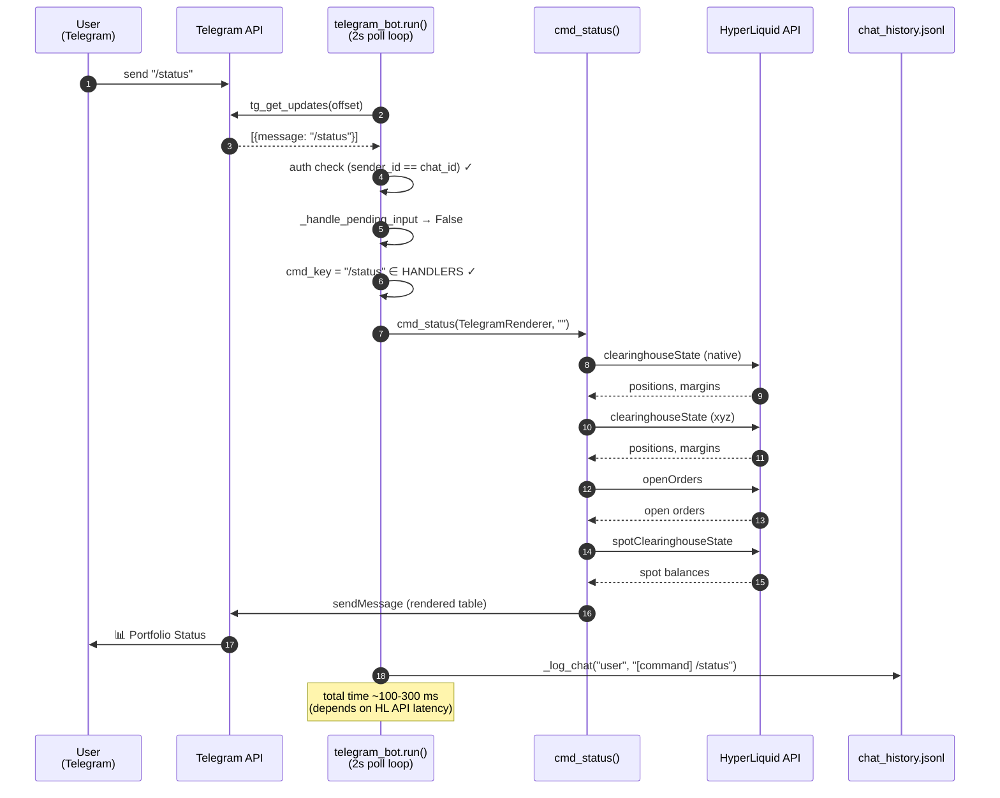
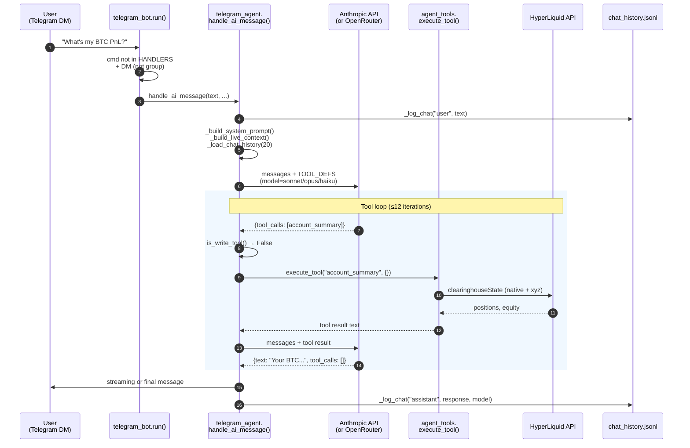
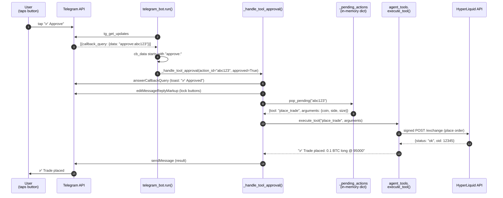
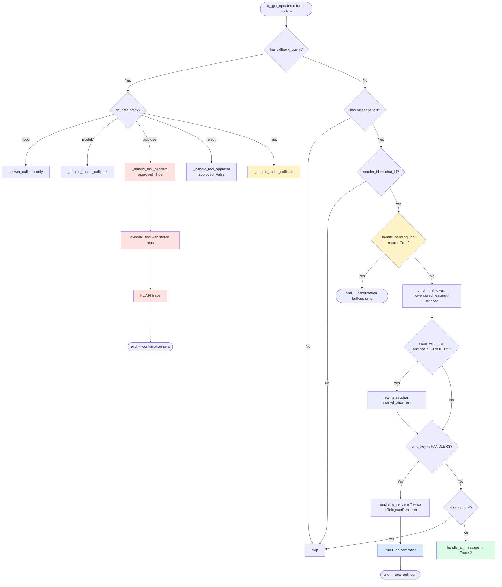

# Telegram Input Trace — End-to-End

**Date:** 2026-04-07
**Verification:** Every step in this doc was traced against current source on
2026-04-07. See `verification-ledger.md` for the audit methodology.
**Purpose:** Show line-by-line what happens when you (a) type a slash command,
(b) type natural language, or (c) tap an inline button. Anchor everything to
function names and explain why each step exists.

---

## Why three traces?

Telegram input enters the bot through exactly **one** path — the polling loop in
`cli/telegram_bot.py:run()` — but that loop branches into three mutually-exclusive
handler families based on the shape of the incoming update:

| Input shape | Handler family | What it touches | AI? | Approval? |
|---|---|---|---|---|
| `message.text` starting with `/cmd` and `cmd in HANDLERS` | Fixed slash command | HL API directly, render to Telegram | ❌ | ❌ |
| `message.text` (DM only) not in HANDLERS | Natural language → AI agent | LLM, tool loop, optional approval | ✅ | ✅ if WRITE tool |
| `callback_query.data` from inline keyboard | Callback handler family | Menu state, pending action store, tool execution | ❌ | ✅ for `approve:`/`reject:` |

The three traces below are the canonical reference for each family. Pick the one
that matches what just landed in the chat.

---

## The Polling Loop (shared by all three traces)

**Function:** `cli/telegram_bot.py:run()`
**Cadence:** every `POLL_INTERVAL = 2.0` seconds
**Auth model:** `sender_id == chat_id` (matches in DMs and groups). Group messages
that aren't slash commands are silently ignored.

Every iteration of the loop fetches a batch of `updates` from
`tg_get_updates(token, offset)`. For each update, it:

1. Bumps the offset (so we don't re-fetch this update next time)
2. Branches on update type:
   - **`callback_query` present** → callback handler family (Trace 3)
   - **`message.text` present** → message handler family (Traces 1 + 2)
3. Auth-checks: `sender_id != chat_id` → drop silently
4. **Pending input check** (`_handle_pending_input`): if there's a pending SL/TP/trade
   price prompt and the user just sent a number, intercept here. Return True →
   skip the rest of the routing. Return False → fall through to normal routing.
5. Parse the first whitespace-delimited token as `cmd`, strip leading `/`, strip
   any `@bot_username` suffix
6. **Dynamic chart shorthand**: if cmd not in HANDLERS but starts with `chart`
   (e.g. `/chartoil`, `/chartbtc`), rewrite to `/chart <market_alias> <rest>`
7. Look up `cmd_key` in `HANDLERS` dict
8. **Hit** → dispatch to fixed slash command (Trace 1)
9. **Miss + group chat** → ignore
10. **Miss + DM** → AI agent path (Trace 2)
11. Every 30 poll cycles (~60 s), call `cleanup_expired_pending()` to drop stale
    write-tool approval requests

---

## Trace 1: Slash Command (`/status`)

**User action:** types `/status` (or `status`, or `/status@MyBot_bot`) in the
Telegram chat with the bot.
**Classification:** 🔧 FIXED — pure code, no AI, no tool approval, no disk writes
beyond logs.

### Step-by-step

| # | Code | What happens | Why |
|---|---|---|---|
| 1 | `tg_get_updates` returns `{"message": {"text": "/status", "from": {...}, "chat": {...}}}` | Polling loop sees a new message | The bot polls every 2s |
| 2 | `cli/telegram_bot.py:run()` enters the message branch | Skips callback handling | No `callback_query` field |
| 3 | `if sender_id != chat_id: continue` | Sender is the configured operator → pass | Auth gate |
| 4 | `_handle_pending_input(token, reply_chat_id, text)` returns `False` | No pending SL/TP price prompt for this chat | Catches bare numeric replies, not slash commands |
| 5 | `cmd = "status"` after strip and lowercase | Parse first token | `text.split()[0].lower().lstrip("/")` |
| 6 | `cmd_key = "/status"` | Lookup in `HANDLERS` (it's keyed both with and without leading `/`) | Hit |
| 7 | `if _diag: _diag.log_chat("user", text, channel="telegram", metadata={"cmd": cmd_key})` | Diagnostic log entry | Audit trail |
| 8 | `handler = HANDLERS["/status"]` → `cmd_status` | Resolve handler | |
| 9 | `cmd_status in RENDERER_COMMANDS` → `True` | New-style handler accepts a Renderer | The dispatch shim wraps it |
| 10 | `cmd_status(TelegramRenderer(token, reply_chat_id), args="")` is called | Enter handler | |
| 11 | `cli/telegram_bot.py:cmd_status` builds the portfolio header | Start composing the response | |
| 12 | `_get_all_positions(MAIN_ADDR)` → HL API `clearinghouseState` (native + xyz) | Fetch positions | Direct API call, no cache |
| 13 | For each position: `_get_current_price(coin)` → HL API mid | Add live mark price to each row | |
| 14 | `_get_market_oi(coin, dex)` → HL API `metaAndAssetCtxs` | Add OI / volume to each row | |
| 15 | `_get_account_values(MAIN_ADDR)` → HL API perps + spot | Compute equity (perps native + xyz + spot) | |
| 16 | `_get_all_orders(MAIN_ADDR)` → HL API `openOrders` | List up to 5 open orders | |
| 17 | If `VAULT_ADDR`: `_hl_post({"type": "clearinghouseState", "user": VAULT_ADDR})` | Vault block | Skipped if no vault |
| 18 | Compose `lines` list, join with `\n` | Build the rendered text | |
| 19 | `renderer.print("\n".join(lines))` → `TelegramRenderer.print()` → `tg_send` | Push to Telegram | |
| 20 | Back in `run()`: `_log_chat("user", "[command] /status")` is called for AI continuity | The AI's chat history sees that the user used `/status` | So if you switch to NL next, the agent knows what you just looked at |

### Mermaid sequence



### Side effects

| Effect | Where | Persistence |
|---|---|---|
| Telegram message sent | Telegram API | Visible in chat |
| Diagnostic chat log entry | `_diag.log_chat` (in-memory + diagnostics file) | Rotated 5×500K |
| Chat history append for AI context | `data/daemon/chat_history.jsonl` | No rotation |
| HL API calls | Network | Logged in HL access logs (not ours) |

**No** disk writes to thesis, memory.db, working_state, or any trading state.
**No** order placement. **No** AI invocation.

### Variations

- **Other read-only fixed commands** (`/price`, `/orders`, `/pnl`, `/market`, `/health`,
  `/diag`, `/watchlist`, `/signals`, `/thesis`, `/authority`, `/memory`, `/help`,
  `/guide`, `/commands`, `/models`, `/powerlaw`, `/chart`, `/brief`) follow the
  same pattern: HL API or local state read → render → send. None invoke AI.
- **Hybrid commands** like `/briefai`: same dispatch path, but the rendered PDF
  contains AI-influenced content (thesis line + catalysts) generated by a separate
  background process that wrote to `data/thesis/`. The slash command itself is still
  pure code at request time.
- **Write-action menu commands** (`/close`, `/sl`, `/tp`): the slash command opens an
  interactive menu (or directly enters a pending-input state). The actual write goes
  through Trace 3 (button approval flow).
- **System commands** (`/restart`, `/rebalancer`, `/rebalance`): same dispatch
  pattern; touches local processes/files but no AI.

---

## Trace 2: Natural Language ("What's my BTC PnL?")

**User action:** types `What's my BTC PnL?` in the chat. No leading slash, not in HANDLERS.
**Classification:** 🤖 AI — full agent loop with tool calls. WRITE tools require user
approval mid-loop.

### Step-by-step

| # | Code | What happens | Why |
|---|---|---|---|
| 1-5 | (same as Trace 1 steps 1-5) | Polling, auth, pending check, parse cmd | |
| 6 | `cmd_key = "/what's"` not in HANDLERS | Cmd lookup misses | Free text starts with "what's" |
| 7 | `is_group = msg.chat.type in ("group", "supergroup")` → `False` (DM) | Not a group | |
| 8 | `cli/telegram_bot.py` calls `from cli.telegram_agent import handle_ai_message` | Lazy import | |
| 9 | `handle_ai_message(token, reply_chat_id, text="What's my BTC PnL?", user_name=...)` | Enter the AI agent | |
| 10 | `cli/telegram_agent.py:handle_ai_message` enters | | |
| 11 | `_log_chat("user", text, user_name=...)` → append to `data/daemon/chat_history.jsonl` | Log incoming user msg | Persistence for next session |
| 12 | `_tg_typing(token, chat_id)` → Telegram `sendChatAction` | Show "typing…" | UX |
| 13 | `system_prompt = _build_system_prompt()` | Reads `agent/AGENT.md` + `agent/SOUL.md`, composes static system prompt | This is cached on the LLM side because it doesn't change between turns |
| 14 | `live_context = _build_live_context()` | Pulls latest equity, positions, prices, thesis from disk + HL API | Built fresh every turn |
| 15 | `history = _load_chat_history(_MAX_HISTORY=20)` | Read last 20 entries from `chat_history.jsonl`, capped at `_MAX_HISTORY_CHARS=12000` total | Conversation memory |
| 16 | Compose `messages = [system, live_context as first user msg, assistant ack, ...history, current user msg]` | Build the LLM prompt | Live context goes as a user message so the system prompt stays cacheable |
| 17 | `from cli.agent_tools import TOOL_DEFS, execute_tool, is_write_tool, store_pending, format_confirmation` | Import the tool registry | Tools are: market_brief, account_summary, live_price, analyze_market, get_orders, trade_journal, get_signals, check_funding, place_trade*, update_thesis*, close_position*, set_sl*, set_tp*, read_file, search_code, list_files, web_search, memory_read, memory_write*, edit_file*, run_bash*, get_errors, get_feedback, introspect_self, read_reference. (* = WRITE) |
| 18 | `active_model = _get_active_model()` → reads `data/config/model_config.json`, falls back to Haiku | Pick model | Per-user model selection |
| 19 | `use_cli = _is_anthropic_model(active_model) and "haiku" not in active_model` | Sonnet/Opus → CLI path; Haiku → streaming | Sonnet/Opus over session-token auth must go through Agent SDK CLI binary |
| 20 | If `use_cli`: `response = _call_openrouter(messages, tools=TOOL_DEFS)` (synchronous, no streaming) | First model call | |
| 20' | Else: `response = _tg_stream_response(token, chat_id, messages, tools=TOOL_DEFS)` (streaming, updates Telegram message every ~1.5s) | First model call with live updates | Faster perceived response on Haiku |
| 21 | **Tool loop begins** — `for _loop in range(_MAX_TOOL_LOOPS=12)` | Up to 12 turns of model→tools→model | Safety cap |
| 22 | Try in order: native `tool_calls`, text-based `[TOOL: name {...}]` regex, Python code-block AST parsing | Triple mode tool extraction | Different LLM providers emit calls differently |
| 23 | If no tool calls in any of the three modes → `break` (model finished) | Done | |
| 24 | For BTC PnL question: model returns `tool_calls=[{"name": "account_summary", "arguments": {}}]` | Model wants the account state | |
| 25 | `is_write_tool("account_summary") = False` | READ tool, no approval needed | |
| 26 | `execute_tool("account_summary", {})` → `_tool_account_summary()` (cli/agent_tools.py) | Run the tool | |
| 27 | Tool function calls HL API `clearinghouseState` (native + xyz), formats positions and equity, returns text | Same data path as `/status` underneath | Tools wrap the same primitives |
| 28 | Tool result is appended to `messages` as `{"role": "tool", "tool_call_id": ..., "content": ...}` | Feed result back to model | |
| 29 | Model is called again with the augmented messages | Loop iteration 2 | |
| 30 | Model returns text answer ("Your BTC position is 0.5 @ $95k, uPnL +$2,500…") with empty `tool_calls` | Model decided it has enough info | |
| 31 | `break` out of tool loop | Done | |
| 32 | If streaming: response was already delivered to Telegram during step 20' / each loop iteration | | |
| 33 | If non-streaming: `tg_send(token, chat_id, response_text)` (split into 4096-char chunks if needed) | Final delivery | |
| 34 | `_log_chat("assistant", response_text, model=active_model)` | Persist for next turn | |

### Mermaid sequence



### Variation 2a: Tool loop with a WRITE tool (e.g. "Place a 0.1 BTC long")

When the model emits a write tool call, the loop diverges:

```
Anthropic returns: {tool_calls: [{"name": "place_trade", "arguments": {"coin": "BTC", "side": "buy", "size": 0.1}}]}
                   ↓
Agent: is_write_tool("place_trade") → True
                   ↓
Agent: store_pending("place_trade", {...args}, chat_id) → returns action_id (5-min TTL)
                   ↓
Agent: format_confirmation("place_trade", args, action_id) → builds:
  - text: "🟢 Confirm Trade — BUY 0.1 BTC at market…"
  - buttons: [{text: "✅ Approve", callback_data: f"approve:{action_id}"},
              {text: "❌ Reject",  callback_data: f"reject:{action_id}"}]
                   ↓
Agent: tg_send_buttons(token, chat_id, text, buttons)
                   ↓
Agent: returns from handle_ai_message — DOES NOT BLOCK on approval
                   ↓
[user taps Approve later] → Trace 3 takes over via callback_query path
```

The agent's tool loop exits without waiting. The action sits in
`_pending_actions[action_id]` until either the user taps a button (Trace 3
handles it) or `cleanup_expired_pending()` drops it after 5 minutes.

### Variation 2b: Multi-tool turn (parallel READ tools)

The model can emit multiple tool calls in a single turn. For READ tools they
execute sequentially within the loop iteration (the trace shows them as separate
appendings to `messages`). The loop only goes back to the model after ALL tool
calls in the current batch are processed.

### Variation 2c: Free-model fallback (text-based or code-block tool calls)

Some free models on OpenRouter don't support native function calling. The agent
handles three formats in priority order:

1. **Native** `tool_calls` field on the response — used by all paid models
2. **Text-based** regex `[TOOL: name {"arg": "val"}]` — extracted via
   `_parse_text_tool_calls()`, content cleaned with `_strip_tool_calls()`
3. **Python code blocks** — parsed via `common.code_tool_parser.parse_tool_calls()`,
   AST-walked, executed via `execute_parsed_calls()`

If any mode produces tool calls, the loop processes them as if they came from
native function calling.

### Side effects

| Effect | Where | Persistence | Conditional |
|---|---|---|---|
| User message logged | `chat_history.jsonl` | No rotation | Always |
| Assistant response logged | `chat_history.jsonl` | No rotation | Always |
| HL API calls (1+ per READ tool) | Network | — | Per tool |
| Pending action stored | `_pending_actions` (in-memory) | 5 min TTL | Only if WRITE tool fired |
| Telegram messages (streaming updates) | Telegram | Visible in chat | Only on Haiku/streaming path |
| Final response message | Telegram | Visible in chat | Always |
| Approval buttons | Telegram | Visible in chat | Only if WRITE tool fired |
| Tool call counts | `_diag.tool_calls` (in-memory) | Lost on bot restart | Per tool |
| Trade execution | HL API | On exchange | Only on Trace 3 approval |

---

## Trace 3: Inline Button (Approve a write tool)

**User action:** taps the "✅ Approve" button on a confirmation message that the
agent (or a `/sl`/`/tp`/`/close` flow) sent earlier.
**Classification:** 🟡 Callback handler — runs deterministic code, but the action
itself can be a trade write.

### Step-by-step

| # | Code | What happens | Why |
|---|---|---|---|
| 1 | `tg_get_updates` returns `{"callback_query": {"id": ..., "data": "approve:abc123", "from": {...}, "message": {...}}}` | Polling loop sees a callback | User tapped a button |
| 2 | `cli/telegram_bot.py:run()` enters the callback branch | `cb = update.get("callback_query")` is truthy | |
| 3 | Auth check: `cb_sender = cb.from.id`, `cb_chat = cb.message.chat.id` | Read sender/chat IDs | |
| 4 | Branch on `cb_data` prefix: | | |
| 4a | `noop` → `tg_answer_callback(token, cb_id, "")` | No-op buttons (e.g. spacers) | |
| 4b | `model:` → `_handle_model_callback(token, cb_chat, cb_id, model_id)` | Model picker callbacks | |
| 4c | `approve:` → `_handle_tool_approval(token, cb_chat, cb_id, action_id, approved=True, message_id=...)` | **This branch fires** | |
| 4d | `reject:` → `_handle_tool_approval(..., approved=False, ...)` | Reject branch | |
| 4e | `mn:` → `_handle_menu_callback(token, cb_chat, cb_id, cb_data, message_id)` | Inline menu navigation | |
| 5 | `cli/telegram_bot.py:_handle_tool_approval` enters | | |
| 6 | `tg_answer_callback(token, callback_id, "✅ Approved")` | Dismisses the spinner immediately, shows toast | Telegram requires acks within ~10s |
| 7 | `_lock_approval_message(token, chat_id, message_id, approved=True)` | Edits the buttons to a locked "Approved" state | Visual feedback so user can't double-tap |
| 8 | `from cli.agent_tools import pop_pending, execute_tool` | | |
| 9 | `action = pop_pending(action_id)` → returns `{"tool": "place_trade", "arguments": {...}}` or `None` | Retrieve queued action | Removes from `_pending_actions` |
| 10 | If `action is None` → `tg_send("Action expired or already handled.")`, return | TTL expired or double-tap | |
| 11 | If `not approved` → `tg_send("❌ Action rejected.")`, return | Reject path | |
| 12 | `result = execute_tool(action["tool"], action["arguments"])` | **THIS IS WHERE THE TRADE FIRES** | Same `execute_tool` used for READ tools, but with the WRITE tool name |
| 13 | For `place_trade`: `_tool_place_trade()` → constructs HL API order (sz, is_buy, limit_px=0 for market, order_type, reduce_only=False) | Build the order | |
| 14 | HL API `POST /exchange` with signed payload | Submit to exchange | Authenticated via key store (OWS + Keychain dual-write per CLAUDE.md) |
| 15 | HL returns order response | | |
| 16 | Tool function returns formatted text result | | |
| 17 | `tg_send(token, chat_id, f"✅ *place_trade*\n\n{result}")` | Confirmation to user | |
| 18 | If exception during execution: `tg_send(... "❌ *place_trade failed*")` | Error path | |

### Mermaid sequence



### Side effects

| Effect | Where | Persistence | Conditional |
|---|---|---|---|
| Callback acknowledged | Telegram | Toast | Always |
| Approval message buttons locked | Telegram | Edited in chat | Always |
| Pending action removed | `_pending_actions` | In-memory | Always |
| **Trade placed on exchange** | HL API | **REAL MONEY** | Only on `approve:` for `place_trade`/etc. |
| Result confirmation message | Telegram | Visible in chat | Always |

### Variation 3a: Reject button

Same path through `_handle_tool_approval`, but with `approved=False`:
- Step 6 toast becomes "❌ Rejected"
- Step 9 still pops the pending action (so it can't be re-tapped)
- Step 11 sends "❌ Action rejected." and returns
- No tool execution, no exchange call

### Variation 3b: Menu callback (`mn:p:xyz:BRENTOIL`)

When the user navigates the inline menu, callbacks have `mn:` prefix and route to
`_handle_menu_callback`. This function does NOT touch the exchange — it edits the
message in place to show a different menu pane. The action codes after `mn:` are:

| Action | Meaning | Handler |
|---|---|---|
| `main` | Main menu | `_build_main_menu()` |
| `p:<coin>` | Position detail | `_build_position_detail(coin)` |
| `cl:<coin>` | Close position prompt | `_handle_close_position()` (creates pending input) |
| `sl:<coin>` | Stop-loss prompt | `_handle_sl_prompt()` (creates pending input) |
| `tp:<coin>` | Take-profit prompt | `_handle_tp_prompt()` (creates pending input) |
| `ch:<coin>:<hours>` | Chart | dispatches `cmd_chart` |
| `mk:<coin>` | Market info | dispatches `cmd_market` |
| `watch`, `tools`, `trade`, `acct`, `ord`, `pnl` | Submenus / commands | various |
| `run:<cmd>` | Run a fixed command (status/health/diag/models/authority/memory) | dispatches via `_menu_dispatch` |
| `buy:<coin>`, `side:<coin>:<side>` | Trade flow | builds trade menu / size prompt |

**Critical pattern:** menu callbacks for write actions (close/sl/tp/buy) do NOT
write directly. They set up a `_pending_inputs[chat_id]` entry that expects the
user to type a number (price or size). The next text message gets intercepted by
`_handle_pending_input` (Trace 3 variation 3c).

### Variation 3c: Pending input fall-through (number reply)

This is a hybrid of Trace 1 and Trace 3. The user is in a state where:

1. They tapped a menu button like "🛡 Set SL" earlier
2. `_handle_sl_prompt` set `_pending_inputs[chat_id] = {"type": "sl", "coin": "BTC", "side": "sell", "size": 0.5, "ts": time.time()}`
3. They sent a message that's a bare number, e.g. `90000`

The polling loop catches it:

| # | Code | What happens |
|---|---|---|
| 1-3 | (auth, callback check, message extract) | |
| 4 | `_handle_pending_input(token, reply_chat_id, "90000")` is called | |
| 5 | `pending = _pending_inputs.get(chat_id)` → matches | |
| 6 | TTL check: `time.time() - pending["ts"] > 60` → False | Within 60s |
| 7 | `value = float("90000")` → succeeds | Parse as price |
| 8 | `del _pending_inputs[chat_id]` | Clear pending |
| 9 | `tool_name = "set_sl"` (since `pending["type"] == "sl"`) | |
| 10 | `args = {"coin": "BTC", "trigger_price": 90000.0, "side": "sell", "size": 0.5, "dex": ""}` | |
| 11 | `action_id = store_pending("set_sl", args, chat_id)` | Queue action with 5-min TTL |
| 12 | Build confirmation text + Approve/Reject buttons | |
| 13 | `tg_send_buttons(token, chat_id, text_msg, buttons)` | |
| 14 | Return `True` from `_handle_pending_input` → polling loop skips normal command parsing | |

The user now sees the same Approve/Reject UI as the AI agent would have produced.
Tapping Approve runs Trace 3 again.

### Variation 3d: Model selection callback (`model:claude-sonnet-4`)

`_handle_model_callback` updates `data/config/model_config.json` so that
`_get_active_model()` returns the new model on next AI turn. No exchange touch,
no Telegram beyond the toast.

---

## Routing Decision Tree



---

## Common Patterns & Gotchas

### Auth is sender-id, not chat-id
The bot can be in a group, but only the configured operator's messages are
processed. This is `sender_id == chat_id` (where `chat_id` here is the *operator's*
DM chat id used as the auth token), not "the chat the message came from".

### Pending input is the only way to type a price
Slash commands like `/sl` don't take inline arguments — they open a menu, the menu
sets a pending state, and the user types a number. This is intentional UX: the
operator confirms the asset / direction / size in the menu before being asked for
the price.

### WRITE tool approval is async
The agent's tool loop does NOT block on approval. It enqueues the action, sends
buttons, and returns. The approval callback runs in a fresh polling iteration.
This means the AI agent does not see the result of the trade in the same turn —
it sees it on the next user turn (which may not happen for a while).

### Triple-mode tool calling exists for free-model support
Most paid models emit native `tool_calls`. Free OpenRouter models often emit
text-based `[TOOL: name {...}]` or Python code blocks instead. The agent's
parsing tries all three modes per loop iteration.

### Chat history is the AI's only memory across turns
There is no separate "conversation state" — each turn rebuilds the message list
from `chat_history.jsonl` (last 20 entries, capped at 12000 chars). When you use
a slash command, an entry like `[command] /status` gets logged so the AI knows
what you just looked at if you switch to NL.

### Live context vs system prompt
The system prompt is built from static files (`agent/AGENT.md` + `agent/SOUL.md`)
and is identical between turns — so it's cacheable on the LLM provider side. The
"live context" (positions, prices, thesis) changes every turn and goes as the
**first user message** rather than appended to the system prompt. This keeps the
expensive prompt cache warm.

### Sonnet/Opus go through the Agent SDK CLI binary
Per the auth model in MASTER_PLAN.md and the no-API-key memory rule
(`feedback_session_token_only.md`), Sonnet and Opus must use session tokens, which
is implemented via the Agent SDK CLI binary path. Haiku can stream over OpenRouter.
The branch is in `handle_ai_message` line ~494 (`use_cli` flag).

---

## Anchor Points

| Concept | File | Function or Anchor |
|---|---|---|
| Polling loop | `cli/telegram_bot.py` | `run()` |
| Command registry | `cli/telegram_bot.py` | `HANDLERS = {`, `RENDERER_COMMANDS = {` |
| `/status` handler | `cli/telegram_bot.py` | `cmd_status(renderer, args)` |
| Pending input intercept | `cli/telegram_bot.py` | `_handle_pending_input` |
| Tool approval callback | `cli/telegram_bot.py` | `_handle_tool_approval` |
| Menu callback | `cli/telegram_bot.py` | `_handle_menu_callback` |
| Model callback | `cli/telegram_bot.py` | `_handle_model_callback` |
| AI agent entry | `cli/telegram_agent.py` | `handle_ai_message(token, chat_id, text, user_name)` |
| System prompt builder | `cli/telegram_agent.py` | `_build_system_prompt` |
| Live context builder | `cli/telegram_agent.py` | `_build_live_context` |
| Chat history loader | `cli/telegram_agent.py` | `_load_chat_history(_MAX_HISTORY)` |
| Active model resolver | `cli/telegram_agent.py` | `_get_active_model` |
| Streaming response | `cli/telegram_agent.py` | `_tg_stream_response` |
| Anthropic call | `cli/telegram_agent.py` | `_call_anthropic` |
| OpenRouter call | `cli/telegram_agent.py` | `_call_openrouter` |
| Tool registry | `cli/agent_tools.py` | `TOOL_DEFS`, `WRITE_TOOLS` |
| Tool executor | `cli/agent_tools.py` | `execute_tool`, `is_write_tool` |
| Pending action store | `cli/agent_tools.py` | `store_pending`, `pop_pending`, `_pending_actions` |
| Tool loop bound | `cli/telegram_agent.py` | `_MAX_TOOL_LOOPS = 12` |
| History bounds | `cli/telegram_agent.py` | `_MAX_HISTORY = 20`, `_MAX_HISTORY_CHARS = 12000` |
| Pending input TTL | `cli/telegram_bot.py` | `_handle_pending_input` 60s timeout |
| Pending action TTL | `cli/agent_tools.py` | `cleanup_expired_pending` (5 min) |

---

## Related Docs

- `verification-ledger.md` — verification of every claim above
- `architecture/master-diagrams.md` — process topology and the routing tree as one of six master views (Phase 3)
- `architecture/writers-and-authority.md` — what happens after a trade is approved (the daemon-side write story)
- `architecture/tickcontext-provenance.md` — what TickContext lives between iterators (orthogonal to Telegram input but relevant when AI agent triggers daemon work)
- `MAINTAINING.md` — the no-counts-in-docs rule that this doc obeys
