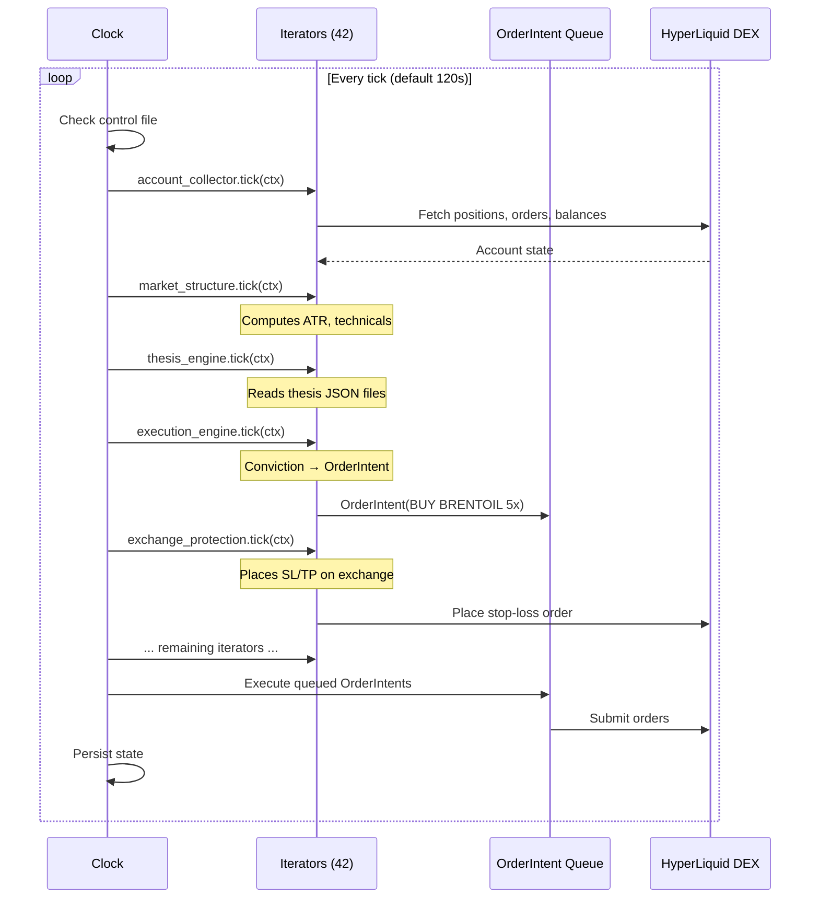
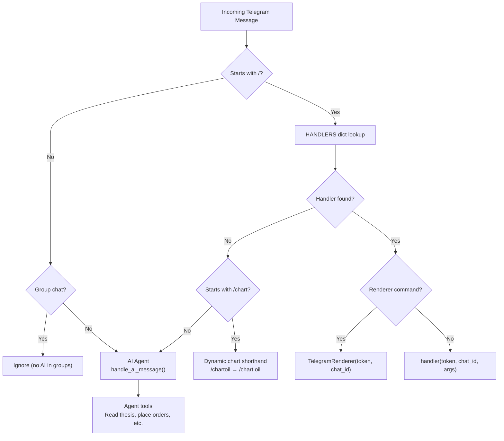
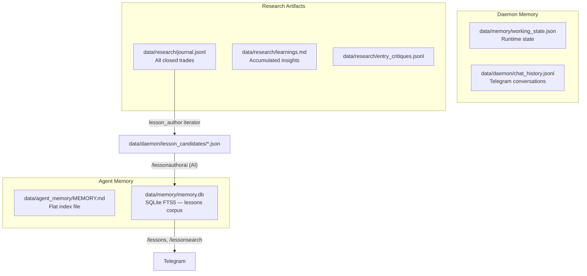

import { Aside } from '@astrojs/starlight/components';

## Data Stores

All state lives on the local filesystem. No external databases, no cloud storage.

### Core State

| Store | Path | Format | Purpose |
|-------|------|--------|---------|
| Thesis files | `data/thesis/*.json` | JSON | Per-market conviction, direction, SL/TP, invalidation conditions |
| Markets config | `data/config/markets.yaml` | YAML | Market registry — instruments, rules, clearinghouse mapping |
| Risk caps | `data/config/risk_caps.json` | JSON | Position size limits, max leverage, drawdown thresholds |
| Oil bot-pattern config | `data/config/oil_botpattern.json` | JSON | Pattern-based entry signal configuration + kill switch |
| Working state | `data/memory/working_state.json` | JSON | ATR values, current prices, escalation counters |

### Databases

| Store | Path | Format | Purpose |
|-------|------|--------|---------|
| Memory DB | `data/memory/memory.db` | SQLite (FTS5) | Lesson corpus, events, learnings, observations, action log |
| Candle cache | `data/candles/candles.db` | SQLite | OHLCV data for technical calculations |

### Append-Only Logs

| Store | Path | Format | Purpose |
|-------|------|--------|---------|
| Chat history | `data/daemon/chat_history.jsonl` | JSONL | Full Telegram message history |
| Research journal | `data/research/journal.jsonl` | JSONL | Trade journal entries |
| Entry critiques | `data/research/entry_critiques.jsonl` | JSONL | Grading of position entries |
| Bot patterns | `data/research/bot_patterns.jsonl` | JSONL | Detected bot/algo patterns |
| News headlines | `data/news/headlines.jsonl` | JSONL | Ingested news headlines |
| Catalyst events | `data/news/catalysts.jsonl` | JSONL | Structured catalyst events |
| Heatmap zones | `data/heatmap/zones.jsonl` | JSONL | Liquidity heatmap zones |
| Heatmap cascades | `data/heatmap/cascades.jsonl` | JSONL | Cascade event log |
| Strategy journal | `data/strategy/oil_botpattern_journal.jsonl` | JSONL | Oil bot-pattern trade log |

### Other State

| Store | Path | Format | Purpose |
|-------|------|--------|---------|
| Agent memory | `data/agent_memory/MEMORY.md` | Markdown | Agent's persistent memory index |
| Supply state | `data/supply/state.json` | JSON | Supply disruption tracker state |
| Strategy state | `data/strategy/oil_botpattern_state.json` | JSON | Oil bot-pattern runtime state |
| Daemon runtime | `data/daemon/` | Mixed | PID files, tick state, catalyst deleverage events |
| Review reports | `data/reviews/` | Mixed | Brutal review output |
| Research learnings | `data/research/learnings.md` | Markdown | Accumulated trading lessons |
| Config directory | `data/config/` | Mixed | 26 config files (YAML + JSON) |

---

## Write Authority

Every file has a canonical writer. Other processes read only.

| State | Primary Writer | Secondary Writer | Everyone Else |
|-------|---------------|-----------------|---------------|
| `data/thesis/*.json` | Human (Claude Code sessions) | AI agent (with delegation) | Read-only |
| `data/config/markets.yaml` | Human (Claude Code) | Web dashboard (control panel) | Read-only |
| `data/config/*.json` | Human (Claude Code) | Web dashboard | Read-only |
| `data/memory/memory.db` | Daemon iterators (journal, lesson_author, memory_consolidation) | AI agent (via tools) | Read via context harness |
| `data/memory/working_state.json` | Daemon (account_collector iterator) | — | Read-only |
| `data/candles/candles.db` | Daemon (connector iterator) | — | Read-only |
| `data/daemon/chat_history.jsonl` | AI agent | Telegram bot (logging) | Read-only |
| `data/research/*.jsonl` | Daemon iterators (journal, entry_critic, bot_classifier) | — | Read-only |
| `data/news/*.jsonl` | Daemon (news_ingest iterator) | — | Read-only |
| `data/heatmap/*.jsonl` | Daemon (heatmap iterator) | — | Read-only |
| `data/supply/state.json` | Daemon (supply_ledger iterator) | — | Read-only |
| `data/strategy/*` | Daemon (oil_botpattern iterators) | — | Read-only |
| `data/agent_memory/MEMORY.md` | AI agent | — | Read-only |

<Aside type="note">
The daemon is the dominant writer. The AI agent writes to thesis files (when delegated), chat history, agent memory, and memory.db. Humans write config and thesis files via Claude Code. The web dashboard can modify config files through the control panel.
</Aside>

---

## Tick Flow

The daemon runs a Hummingbot-style TimeIterator loop from `cli/daemon/clock.py`. Each tick follows this sequence:

```
1. Clock fires                          cli/daemon/clock.py
       │
2. TickContext built                    cli/daemon/context.py
       │  Fetches: account state, positions, prices,
       │  thesis files, config, calendar, working state
       │
3. Iterator runner invokes each         cli/daemon/iterators/
   iterator with the shared TickContext
       │
       ├── Monitoring iterators:        account_collector, liquidation_monitor,
       │                                funding_tracker, market_structure, etc.
       │
       ├── Analysis iterators:          thesis_engine, radar, pulse, heatmap,
       │                                bot_classifier, risk, etc.
       │
       ├── Research iterators:          journal, entry_critic, lesson_author,
       │                                autoresearch, memory_consolidation
       │
       ├── Signal iterators:            oil_botpattern, catalyst_deleverage,
       │                                apex_advisor
       │
       └── Execution iterators:         execution_engine, exchange_protection,
           (REBALANCE+ only)            guard, rebalancer, profit_lock
       │
4. Iterators produce OrderIntents       common/models.py
       │
5. OrderIntent lifecycle:
       PENDING_APPROVAL
         → SUBMITTED (sent to exchange)
           → ACCEPTED (exchange confirms)
             → FILLED | REJECTED | CANCELLED | EXPIRED
       │
6. working_state.json updated           data/memory/working_state.json
       │
7. Telegram alerts sent                 For liquidation warnings, SL/TP triggers,
       │                                thesis staleness, health issues
       │
8. Sleep until next tick (~120s)
```



<Aside type="caution">
In WATCH tier, step 5 only happens for defensive orders (read-only verification by protection_audit). The execution_engine, exchange_protection, and other execution iterators only run at REBALANCE tier and above. See [Tier State Machine](/architecture/tiers/) for the full breakdown.
</Aside>

---

## Telegram Message Routing

The Telegram bot (`cli/telegram_bot.py`) uses long-polling. Every incoming message is routed through the HANDLERS dict:

```
User sends message to Telegram bot
       │
       ├── Starts with "/" ──────────────── Slash command path
       │       │
       │       │  HANDLERS dict lookup
       │       │  e.g. "/pos" → cmd_pos()
       │       │       "/brief" → cmd_brief()
       │       │       "/sl" → cmd_sl()
       │       │
       │       │  Properties:
       │       │  • Pure Python code, deterministic
       │       │  • Direct HyperLiquid API calls
       │       │  • Zero AI credits consumed
       │       │  • Commands ending in "ai" (e.g. /briefai)
       │       │    DO use AI — that's the naming convention
       │       │
       │       └── Response sent back to Telegram chat
       │
       └── Free text ───────────────────── AI agent path
               │
               │  1. Build system prompt
               │     AGENT.md + SOUL.md + memory
               │
               │  2. Inject context snapshot
               │     Thesis files, positions, calendar,
               │     recent alerts, working state
               │
               │  3. Claude processes via session token
               │     (NEVER API keys — cost would bankrupt)
               │
               │  4. Tool calls executed in parallel
               │     agent_tools.py defines available tools
               │
               │  5. Response streamed via SSE to Telegram
               │
               └── 6. Conversation appended to
                      data/daemon/chat_history.jsonl
```



### Command Registration Checklist

When adding a new Telegram command, all of these surfaces must be updated:

1. `cli/telegram_bot.py` — add `def cmd_<name>(token, chat_id, args)` handler
2. `HANDLERS` dict — register both `/cmd` and bare `cmd` forms (plus aliases)
3. `_set_telegram_commands()` — add entry so it appears in the Telegram menu UI
4. `cmd_help()` — add one-line entry under the correct section
5. `cmd_guide()` — add to relevant section if user-facing
6. If AI-dependent, command name MUST end in `ai`
7. Tests in `tests/test_telegram_bot.py` if behaviour is non-trivial

---

## Memory Architecture

The system has three distinct memory layers:

### 1. Memory DB (`data/memory/memory.db`)

SQLite database with FTS5 full-text search. Contains:
- **Trade lessons** — structured learnings from closed positions
- **Events** — market events, alerts, observations
- **Action log** — what the daemon did and why

Written by daemon iterators: `memory_consolidation`, `lesson_author`, `journal`. Also writable by the AI agent via tools.

Backed up by the `memory_backup` iterator. Backups stored in `data/memory/backups/`.

### 2. Agent Memory (`data/agent_memory/MEMORY.md`)

Markdown file maintained by the AI agent. Contains the agent's own persistent context — what it has learned across conversations, user preferences it has observed, and references it wants to keep. This is separate from the daemon's memory.db.

### 3. Working State (`data/memory/working_state.json`)

Ephemeral runtime state updated every tick by the daemon. Contains current ATR values, latest prices, escalation counters, and health status. Read by all components but written only by the daemon's account_collector iterator.



<Aside type="tip">
The three memory layers serve different purposes: memory.db is the long-term trade lesson corpus (queryable via FTS5), agent memory is the AI's own context, and working state is the tick-to-tick runtime snapshot. They never conflict because each has a single canonical writer.
</Aside>
