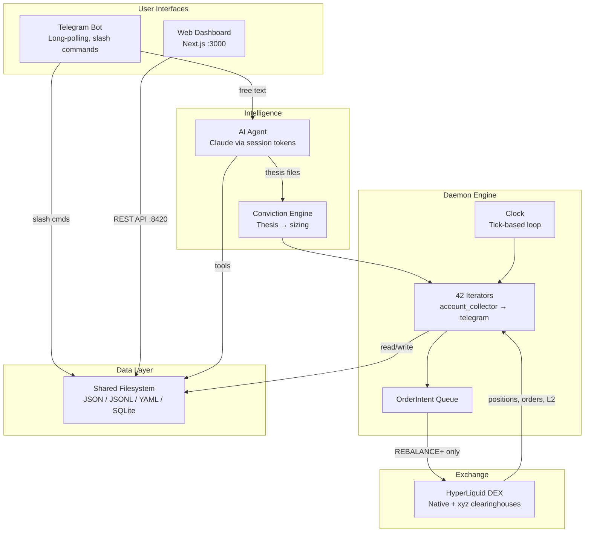
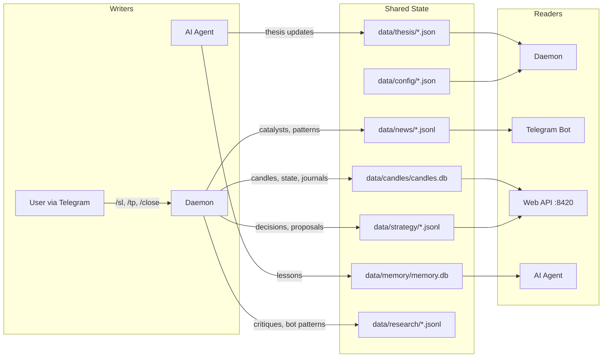

import { Aside } from '@astrojs/starlight/components';

## Four Layers

The system is built from four independent processes that share state through the filesystem:

| Layer | Process | Entry point | Purpose |
|-------|---------|-------------|---------|
| **Daemon** | Tick engine | `cli/daemon/clock.py` | Hummingbot-style TimeIterator loop. Runs 42 iterators every ~120s. Monitors positions, enforces risk, generates signals. |
| **Telegram** | Long-polling bot | `cli/telegram_bot.py` | Slash commands (deterministic code, zero AI) and free-text chat (routed to AI agent). The primary user interface. |
| **AI Agent** | Claude runtime | `cli/agent_runtime.py` | Claude via session tokens (never API keys). System prompt from `agent/AGENT.md` + `agent/SOUL.md`. Tools defined in `agent_tools.py`. Triggered by Telegram free-text or Claude Code sessions. |
| **Web Dashboard** | FastAPI + Next.js | `web/api/app.py` + `web/dashboard/` | Local-only control plane. FastAPI backend on port 8420, Next.js frontend on port 3000, Astro docs on port 4321. Bearer token auth. |

---

## Architecture at a Glance



---

## How They Connect

All four layers communicate through **shared files on disk**. There is no message bus, no external database, no RPC between processes.

```
┌──────────────────────────────────────────────────────────┐
│  Daemon (cli/daemon/clock.py)                            │
│  Tick every ~120s → 42 iterators via TickContext          │
│  WRITES: data/memory/, data/daemon/, data/research/,     │
│          data/news/, data/heatmap/, data/strategy/,      │
│          data/candles/candles.db                          │
│  READS:  data/thesis/, data/config/                      │
└──────────────┬───────────────────────────────────────────┘
               │ shared filesystem
┌──────────────▼───────────────────────────────────────────┐
│  Shared State (all file-based)                           │
│  data/thesis/*.json       — conviction, direction, SL/TP │
│  data/config/*.yaml|json  — 26 config files              │
│  data/memory/memory.db    — lesson corpus (FTS5 SQLite)  │
│  data/candles/candles.db  — OHLCV candle cache           │
│  data/daemon/             — runtime state, chat history  │
│  data/research/           — journal, learnings, critiques│
└──────────────▲───────────────────────────────────────────┘
               │ shared filesystem
┌──────────────┴──────┐  ┌────────────────────────────────┐
│  Telegram Bot       │  │  AI Agent                      │
│  /commands → code   │  │  Claude + session tokens       │
│  free text → agent  │  │  Parallel tool execution       │
│  READS: all data/   │  │  READS+WRITES: data/thesis/,   │
│  WRITES: nothing    │  │   data/daemon/chat_history.jsonl│
│  (slash cmds call   │  │  READS: everything else        │
│   exchange API      │  └────────────────────────────────┘
│   directly)         │
└─────────────────────┘
         ┌─────────────────────────────────────────────────┐
         │  Web Dashboard (local-only, 127.0.0.1)          │
         │  FastAPI reads same files the daemon writes      │
         │  Next.js polls API (3-60s) + SSE for logs       │
         │  READS: all data/    WRITES: config changes only │
         └─────────────────────────────────────────────────┘
```

<Aside type="tip">
Every component reads from the same `data/` tree. The daemon is the primary writer. This means you can stop any non-daemon process without losing monitoring or risk enforcement.
</Aside>

---

## Running Processes

All processes run on macOS. Single-instance is enforced via PID file — starting a second copy kills the first.

```bash
# Daemon — tick engine (always running)
cd agent-cli && .venv/bin/python -m cli.daemon.clock

# Telegram bot — user interface (always running)
cd agent-cli && .venv/bin/python -m cli.telegram_bot

# Web backend (on demand)
cd agent-cli && .venv/bin/uvicorn web.api.app:create_app --factory --host 127.0.0.1 --port 8420

# Web frontend (on demand)
cd agent-cli/web/dashboard && bun run dev    # port 3000

# Docs site (on demand)
cd agent-cli/web/docs && bun run dev         # port 4321
```

The AI agent is not a standalone process. It is launched on demand by the Telegram bot when free-text messages arrive, or invoked directly from Claude Code sessions.

---

## Shared State Model

All persistent state lives in `data/` as flat files. No external databases, no cloud services.

### Data Flow — Who Writes What



| Format | Examples | Why |
|--------|----------|-----|
| JSON | Thesis files, config, working state | Human-readable, easy to edit manually |
| JSONL | Chat history, journal, catalysts, headlines | Append-only logs, no corruption on crash |
| YAML | `markets.yaml` | Complex nested config with comments |
| SQLite | `candles.db`, `memory.db` | Structured queries, FTS5 full-text search |
| Markdown | `MEMORY.md`, learnings | Agent-readable context |

This means:
- **Backups** are just file copies
- **Debugging** is `cat` and `jq`
- **No migration scripts** — schema lives in the code that reads the files
- **No network dependency** — everything works offline after initial exchange data fetch

---

## Authority Model

Per-asset authority controls whether the AI agent can act autonomously on a given market. Authority is managed through the `/delegate` and `/reclaim` Telegram commands.

| State | Meaning |
|-------|---------|
| **Manual** (default) | AI can analyze and suggest, but cannot place orders |
| **Delegated** | AI can execute trades — requires the daemon to be in REBALANCE tier or above |

Key rules:
- All assets start as manual. Delegation is opt-in, per-asset.
- `/delegate BRENTOIL` grants the agent execution authority on BRENTOIL.
- `/reclaim BRENTOIL` revokes it immediately.
- Delegation without REBALANCE tier is harmless — the execution iterators simply are not running.
- Authority state persists across daemon restarts.

---

## Two Clearinghouses

HyperLiquid runs two separate clearinghouses. Every API call must target the correct one.

| Clearinghouse | Assets | API parameter |
|--------------|--------|---------------|
| Default (native) | BTC, ETH, most perps | `dex=None` |
| xyz | BRENTOIL, GOLD, SILVER | `dex='xyz'` |

<Aside type="caution">
The xyz clearinghouse returns coin names WITH the `xyz:` prefix (`xyz:BRENTOIL`, `xyz:GOLD`). The native clearinghouse does NOT (`BTC`, `ETH`). When matching coin names against universe data, always handle both forms. This mismatch has caused silent failures in funding lookups, OI lookups, and price calculations multiple times.
</Aside>

---

## System Roles

The system serves three roles simultaneously:

1. **Copilot** — AI chat via Telegram for market analysis, thesis review, and trade discussion
2. **Research Agent** — Autonomous news ingestion, supply disruption detection, market structure analysis
3. **Risk Manager** — Stop enforcement, drawdown protection, conviction-based sizing every tick

---

## Key Packages

| Package | Purpose |
|---------|---------|
| `cli/` | Telegram bot, AI agent, daemon, tool handlers |
| `cli/daemon/` | Clock loop, TickContext, iterator runner, tier state machine |
| `cli/daemon/iterators/` | 42 iterator modules (one file each) |
| `common/` | Models, snapshots, context harness, HealthWindow circuit breaker |
| `parent/` | Exchange proxy, risk manager, protection chain |
| `agent/` | `AGENT.md` (system prompt), `SOUL.md` (trading philosophy) |
| `data/` | All persistent state (thesis, config, memory, research, candles) |
| `web/` | FastAPI backend, Next.js dashboard, Astro docs |
