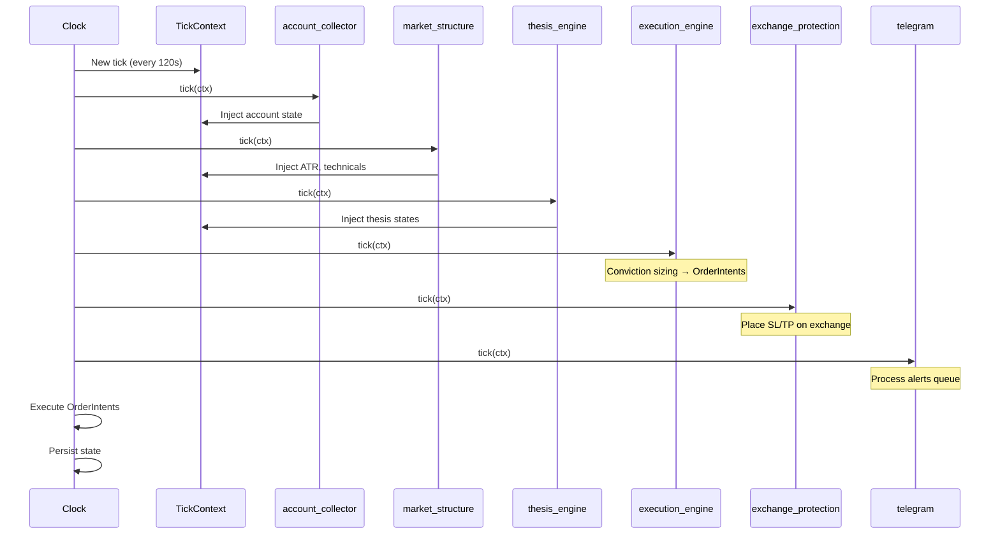

## Overview

The daemon is the system's backbone — a tick-based engine that fires every ~120 seconds, builds a live context snapshot, and runs each active iterator in sequence. It enforces risk rules, manages positions, and routes alerts without human intervention.

**42 iterators** live in `cli/daemon/iterators/`. The daemon activates a subset based on the current [tier](/architecture/tiers/).

**Production status:** Running in WATCH tier on mainnet via launchd.

Source: `cli/daemon/clock.py` (Clock), `cli/daemon/context.py` (TickContext)

---

## Tick Sequence



Each tick runs this sequence:

1. **Control file check** — reads runtime commands (pause, stop, tier change)
2. **Iterator set rebuild** — activates the correct iterator set for the current tier
3. **Iterator loop** — calls `iterator.tick(ctx)` for each active iterator in order
4. **Order execution** — executes queued `OrderIntent`s (REBALANCE+ tiers only)
5. **State persistence** — writes state via `StateStore`

The `TickContext` (`ctx`) is the hub object rebuilt each tick. It carries live account state, market snapshots, thesis states, and everything iterators need. Iterators read from and write to `ctx` — they never call the exchange directly.

---

## Iterator Lifecycle

Every iterator implements three methods:

| Method | When | Purpose |
|--------|------|---------|
| `on_start(ctx)` | Daemon startup | One-time initialization |
| `tick(ctx)` | Every tick | Core logic |
| `on_stop()` | Daemon shutdown | Cleanup |

---

## Key Iterators by Function

### Data Collection

| Iterator | Purpose |
|----------|---------|
| `account_collector` | Always runs first. Fetches live account state from both clearinghouses (native + xyz) |
| `connector` | Market data connection. Failure aborts the tick |
| `market_structure` | Computes `MarketSnapshot` (ATR, indicators) for all watchlist markets |

### Thesis & Conviction

| Iterator | Purpose |
|----------|---------|
| `thesis_engine` | Reads AI thesis files into `ctx.thesis_states`, applies staleness taper |
| `execution_engine` | Conviction-based Druckenmiller sizing. Generates `OrderIntent`s (REBALANCE+) |

### Protection & Risk

| Iterator | Purpose |
|----------|---------|
| `protection_audit` | **Read-only** verifier. Checks every position has SL/TP, alerts if missing. Does NOT place orders |
| `exchange_protection` | **Writes to exchange.** Places missing SL/TP, enforces ruin floor (REBALANCE+ only) |
| `liquidation_monitor` | Tiered cushion alerts (info/warning/critical based on margin cushion %) |
| `brent_rollover_monitor` | Detects Brent contract rollovers, alerts to avoid expiry traps |
| `risk` | Wires the `ProtectionChain` into the tick loop |

### Alerts & Communication

| Iterator | Purpose |
|----------|---------|
| `telegram` | Severity-aware alert routing with dedup cooldowns |

### Oil Bot-Pattern

| Iterator | Purpose |
|----------|---------|
| `news_ingest` | Sub-system 1: RSS/iCal catalyst ingestion. Kill switch: `data/config/news_ingest.json` |

### Self-Improvement Chain

| Iterator | Purpose |
|----------|---------|
| `shadow_eval` | Paper-trades signals without real execution for backtesting |
| `self_tune` | Proposes parameter adjustments based on performance data |
| `lesson_author` | Extracts trade lessons for the FTS5 lesson corpus |

---

## Tier System

Three tiers control which iterators are active. The daemon can only run in one tier at a time.

| Tier | Iterators | Capability |
|------|-----------|------------|
| **WATCH** | 37 iterators | Read-only monitoring. No autonomous entries or order placement |
| **REBALANCE** | Adds execution iterators | Active position management: sizing, SL/TP placement, rebalancing |
| **OPPORTUNISTIC** | Everything | Full autonomous trading: opportunity scanners, radar, pulse |

The active set is defined in `TIER_ITERATORS` in `cli/daemon/tiers.py`. See [Tier Architecture](/architecture/tiers/) for promotion/rollback checklists and per-asset tier assignments.

---

## Health Monitoring

### HealthWindow Circuit Breaker

`HealthWindow` (from `common/telemetry.py`) tracks errors in a 15-minute sliding window:

- **Error budget:** 10 errors per window
- **Budget exceeded:** Daemon auto-downgrades tier (e.g., REBALANCE falls back to WATCH)
- **Iterator circuit-break:** After 5 consecutive failures, the Clock skips that iterator
- **Graceful degradation:** Failed iterators are skipped, never crash the tick

### Process Management

- **Single instance:** PID file at `data/daemon/daemon.pid`. On startup, sends SIGTERM to any existing process, waits, then SIGKILL if needed
- **launchd plist:** `com.hyperliquid.daemon` with `KeepAlive=true`

---

## Start / Stop

```bash
# Production (launchd):
launchctl bootstrap gui/$(id -u) ~/Library/LaunchAgents/com.hyperliquid.daemon.plist

# Testing (mock data, 10 ticks):
python -m cli.main daemon start --tier watch --mock --max-ticks 10

# Direct (mainnet, 120s ticks):
python -m cli.main daemon start --tier watch --tick 120
```
