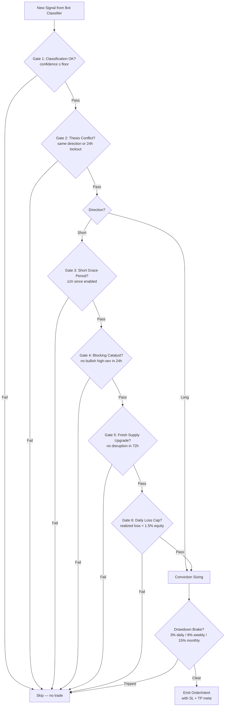
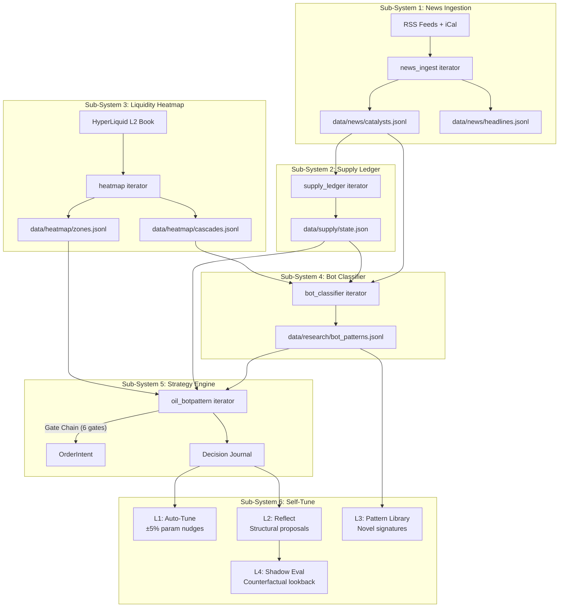

The Oil Bot-Pattern is a complete strategy framework built around BRENTOIL and CL (WTI crude). It runs six subsystems that feed into each other: news ingestion surfaces catalysts, the supply ledger tracks disruptions, the heatmap maps liquidity, the bot classifier filters noise, the strategy engine makes decisions, and the self-tune harness learns from results.

All kill switches are OFF by default. Each subsystem activates independently through staged promotion.

## Sub-system 1: News Ingestion

Polls RSS feeds and iCal calendars for oil-relevant events. Raw headlines are filtered and structured into catalysts with timestamps, categories, and sentiment scores.

| | |
|---|---|
| **Iterator** | `news_ingest` |
| **Config** | `data/config/news_ingest.json` |
| **Commands** | `/news`, `/catalysts` |
| **Output** | `data/news/headlines.jsonl`, `data/news/catalysts.jsonl` |

The `catalyst_deleverage` system consumes catalysts to reduce leverage ahead of known high-impact events (OPEC meetings, EIA reports, geopolitical deadlines). This is a protective mechanism, not a trading signal.

Spec: `agent-cli/docs/plans/OIL_BOT_PATTERN_01_NEWS_INGESTION.md`

## Sub-system 2: Supply Ledger

Automatically extracts supply disruptions from catalysts and maintains a running state of global oil supply impacts: outages, sanctions, pipeline shutdowns, and recovery events.

| | |
|---|---|
| **Iterator** | `supply_ledger` |
| **Config** | `data/config/supply_ledger.json` |
| **Commands** | `/supply`, `/disruptions`, `/disrupt` |
| **Output** | `data/supply/state.json` |

## Sub-system 3: Liquidity Heatmap

Polls the L2 order book (`l2Book`), clusters resting liquidity into zones, and detects cascade conditions where thin liquidity could amplify a move.

| | |
|---|---|
| **Iterator** | `heatmap` |
| **Config** | `data/config/heatmap.json` |
| **Command** | `/heatmap` |
| **Output** | `data/heatmap/zones.jsonl`, `data/heatmap/cascades.jsonl` |

## Sub-system 4: Bot Classifier

Classifies price moves as bot-driven, informed, or mixed using heuristic rules. This helps distinguish mechanical wash trading and algorithmic noise from genuine institutional flow.

| | |
|---|---|
| **Iterator** | `bot_classifier` |
| **Config** | `data/config/bot_classifier.json` |
| **Command** | `/botpatterns` |
| **Output** | `data/research/bot_patterns.jsonl` |

Heuristic only — no ML, no LLM. ML/LLM enhancement is parked until the system accumulates 100+ closed trades for training data.

## Sub-system 5: Strategy Engine

The decision-maker. This is **the only place in the entire system where shorting BRENTOIL or CL is legal**. Everywhere else, the rule is LONG or NEUTRAL only on oil.

### Gate Chain

Shorts must pass through a 6-gate chain before execution:

1. Bot classifier confirms bot-driven move
2. Supply ledger shows no genuine disruption
3. Heatmap confirms thin liquidity above
4. Catalyst calendar is clear
5. Funding rate supports the direction
6. Drawdown brakes are not engaged

Longs require only 2 gates (catalyst alignment + conviction threshold).

### Conviction Sizing

Position size scales with conviction score from the thesis engine. Higher conviction = larger allocation, following a predefined ladder. This is Druckenmiller-style sizing: bet big when the thesis is strong, small when uncertain.

### Drawdown Brakes

Hard circuit breakers that halt new entries:

| Brake | Threshold |
|-------|-----------|
| Daily | 3% |
| Weekly | 8% |
| Monthly | 15% |

When a brake triggers, the engine stops opening new positions until the period resets. Existing positions and their SL/TP orders remain active.

### Kill Switches

The strategy engine has a double kill switch in `data/config/oil_botpattern.json`:

- `enabled` — master switch for the entire strategy engine
- `short_legs_enabled` — independent switch for short-side execution only

Both are OFF by default.

### Commands

| Command | Description |
|---------|-------------|
| `/oilbot` | Current strategy state, gate status, brake levels |
| `/oilbotjournal` | Trade journal for Oil Bot-Pattern entries |
| `/oilbotreviewai` | AI-powered review of recent strategy performance (AI suffix) |

### Tier Requirement

The strategy engine requires **REBALANCE tier or higher** to place orders. At WATCH tier, it runs in read-only shadow mode — computing signals but never touching the exchange.

## Sub-system 6: Self-Tune Harness

Four layers of self-improvement, from fully automatic parameter nudges to human-approved structural changes.

### L1: Bounded Auto-Tune

Nudges 5 whitelisted parameters by up to +/-5% based on recent performance. Rate-limited to one adjustment per 24 hours. Fully automatic within its bounds.

| | |
|---|---|
| **Config** | `data/config/oil_botpattern_tune.json` |

### L2: Reflect Proposals

Weekly structural proposals generated from performance review. These are suggestions — they are **never auto-applied**. A human must explicitly approve or reject each proposal.

| | |
|---|---|
| **Config** | `data/config/oil_botpattern_reflect.json` |
| **Commands** | `/selftuneproposals`, `/selftuneapprove`, `/selftunereject` |

### L3: Pattern Library

Detects novel price/volume signatures that repeat. New patterns enter as candidates and must be promoted (accepted as valid) or rejected (discarded as noise) by the operator.

| | |
|---|---|
| **Config** | `data/config/oil_botpattern_patternlib.json` |
| **Commands** | `/patterncatalog`, `/patternpromote`, `/patternreject` |

### L4: Shadow Eval

Counterfactual look-back analysis. Asks "what would have happened if we had used different parameters?" by replaying historical data. This is retrospective evaluation, not forward paper-trading.

| | |
|---|---|
| **Config** | `data/config/oil_botpattern_shadow.json` |
| **Command** | `/shadoweval` |

## Data Flow

Each subsystem writes its output to disk. The next subsystem reads it on its own cycle. There is no direct coupling — the file system is the message bus.
